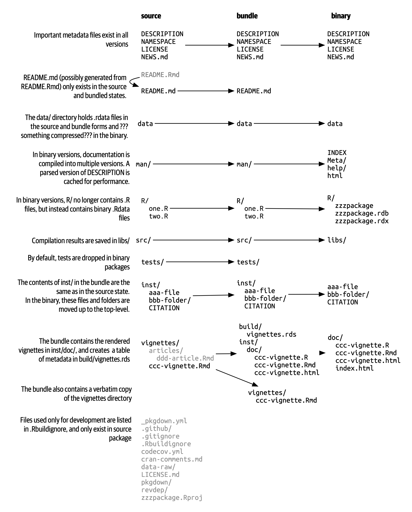
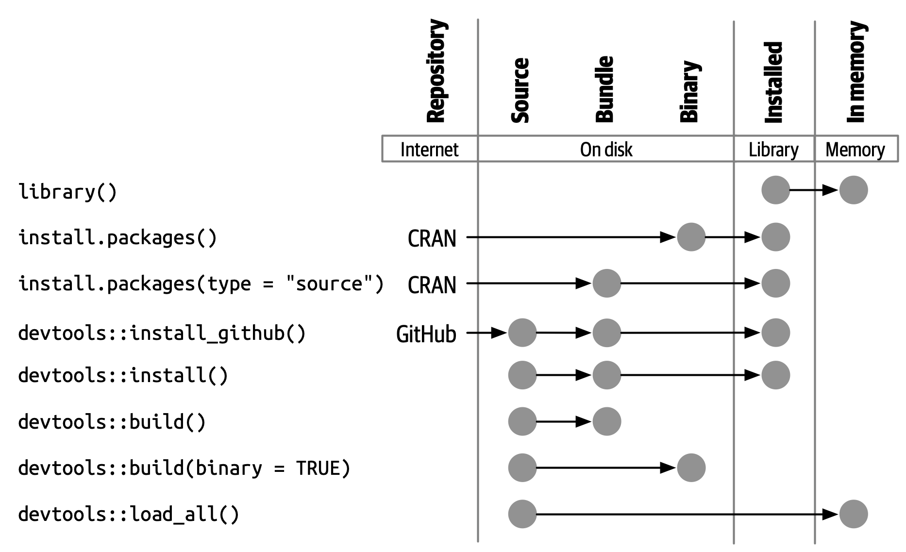

# Package structure and state {#sec-package-structure-state}

```{r, echo = FALSE}
source("common.R")
```

This chapter will start you on the road to package development by converting the implicit knowledge you've gained from *using* R packages into the explicit knowledge needed to *create and modify* them.
You'll learn about the various states a package can be in and the difference between a package and library (and why you should care).

## Package states {#sec-package-states}

When you create or modify a package, you work on its "source code" or "source files".
You interact with the in-development package in its **source** form.
This is NOT the package form you are most familiar with from day-to-day usage.
Package development workflows make much more sense if you understand the five states an R package can be in:

-   source
-   bundled
-   binary
-   installed
-   in-memory

You already know some of the functions that put packages into these states.
For example, `install.packages()` can move a package from the source, bundled, or binary states into the installed state.
`devtools::install_github()` takes a source package on GitHub and moves it into the installed state.
The `library()` function loads an installed package into memory, making it available for immediate and direct use.

## Source package {#sec-source-package}

A **source** package is just a directory of files with a specific structure.
It includes particular components, such as a `DESCRIPTION` file, an `R/` directory containing `.R` files, and so on.
Most of the remaining chapters in this book are dedicated to detailing these components.

If you are new to package development, you may have never seen a package in source form!
You might not even have any source packages on your computer.
The easiest way to see a package in source form right away is to browse around its code on the web.

Many R packages are developed in the open on GitHub (or GitLab or similar).
The best case scenario is that you visit the package's CRAN landing page, e.g.:

-   forcats: <https://cran.r-project.org/package=forcats>
-   readxl: <https://cran.r-project.org/package=readxl>

and one of its URLs links to a repository on a public hosting service, e.g.:

-   forcats: <https://github.com/tidyverse/forcats>
-   readxl: <https://github.com/tidyverse/readxl>

Some maintainers forget to list this URL, even though the package is developed in a public repository, but you still might be able to discover it via search.

Even if a package is not developed on a public platform, you can visit its source in the [unofficial, read-only mirror maintained by R-hub](https://docs.r-hub.io/#cranatgh).
Examples:

-   MASS: <https://github.com/cran/MASS>
-   car: <https://github.com/cran/car>

Note that exploring a package's source and history within the `cran` GitHub organisation is not the same as exploring the package's true development venue, because this source and its evolution is just reverse-engineered from the package's CRAN releases.
This presents a redacted view of the package and its history, but, by definition, it includes everything that is essential.

## Bundled package {#sec-bundled-package}

A **bundled** package is a package that's been compressed into a single file.
By convention (from Linux), package bundles in R use the extension `.tar.gz` and are sometimes referred to as "source tarballs".
This means that multiple files have been reduced to a single file (`.tar`) and then compressed using gzip (`.gz`).
While a bundle is not that useful on its own, it's a platform-agnostic, transportation-friendly intermediary between a source package and an installed package.

In the rare case that you need to make a bundle from a package you're developing locally, use `devtools::build()`.
Under the hood, this calls `pkgbuild::build()` and, ultimately, `R CMD build`, which is described further in the [Building package tarballs](https://cran.r-project.org/doc/manuals/R-exts.html#Building-package-tarballs) section of [Writing R Extensions](https://cran.r-project.org/doc/manuals/R-exts.html).

This should tip you off that a package bundle or "source tarball" is not simply the result of making a tar archive of the source files, then compressing with gzip.
By convention, in the R world, a few more operations are carried out when making the `.tar.gz` file and this is why we've elected to refer to this form as a package **bundle**, in this book.

Every CRAN package is available in bundled form, via the "Package source" field of its landing page.
Continuing our examples from above, you could download the bundles `forcats_0.4.0.tar.gz` and `readxl_1.3.1.tar.gz` (or whatever the current versions may be).
You could unpack such a bundle in the shell (not the R console) like so:

``` bash
tar xvf forcats_0.4.0.tar.gz
```

If you decompress a bundle, you'll see it looks almost the same as a source package.
@fig-package-files shows the files present in the source, bundled, and binary forms of a fictional package named zzzpackage.
We've deliberately crafted this example to include most of the package parts covered in this book.
Not every package will include every file seen here, nor does this diagram include every possible file that might appear in a package.

```{r}
#| label: fig-package-files
#| echo: false
#| out-width: ~
#| fig-cap: >
#|   Package forms: source vs. bundled vs. binary.
#| fig-alt: >
#|   Side-by-side comparison of source, bundled, and binary package. 
#|   The flow of files (location and format) from package source to 
#|   bundled to binary state is shown. This is described in
#|   detail in the appropriately named sections of this chapter.

```

The main differences between a source package and an uncompressed bundle are:

-   Vignettes have been built, so rendered outputs, such as HTML, appear below `inst/doc/` and a vignette index appears in the `build/` directory.

-   A local source package might contain temporary files used to save time during development, like compilation artefacts in `src/`.
    These are never found in a bundle.

-   Any files listed in `.Rbuildignore` are not included in the bundle.
    These are typically files that facilitate your development process, but that should be excluded from the distributed product.

### `.Rbuildignore` {#sec-rbuildignore}

You won't need to contemplate the exact structure of package `.tar.gz` files very often, but you do need to understand the `.Rbuildignore` file.
It controls which files from the source package make it into the downstream forms.

Each line of `.Rbuildignore` is a Perl-compatible regular expression that is matched, without regard to case, against the path to each file in the source package[^structure-1].
If the regular expression matches, that file or directory is excluded.
Note there are some default exclusions implemented by R itself, mostly relating to classic version control systems and editors, such as SVN, Git, and Emacs.

[^structure-1]: To see the set of filepaths that should be on your radar, execute `dir(full.names = TRUE, recursive = TRUE, include.dirs = TRUE, all.files = TRUE)` in the package's top-level directory.

We usually modify `.Rbuildignore` with the `usethis::use_build_ignore()` function, which takes care of easy-to-forget details, such as regular expression anchoring and escaping.
To exclude a specific file or directory (the most common use case), you **MUST** anchor the regular expression.
For example, to exclude a directory called "notes", the `.Rbuildignore` entry must be `^notes$`, whereas the unanchored regular expression `notes` will match any file name containing "notes", e.g.
`R/notes.R`, `man/important-notes.R`, `data/endnotes.Rdata`, etc.
We find that `use_build_ignore()` helps us get more of our `.Rbuildignore` entries right the first time.

`.Rbuildignore` is a way to resolve some of the tension between the practices that support your development process and CRAN's requirements for submission and distribution (@sec-release).
Even if you aren't planning to release on CRAN, following these conventions will allow you to make the best use of R's built-in tooling for package checking and installation.
The files you should `.Rbuildignore` fall into two broad, semi-overlapping classes:

-   Files that help you generate package contents programmatically. Examples:
    -   Using `README.Rmd` to generate an informative and current `README.md` (@sec-readme).
    -   Storing `.R` scripts to create and update internal or exported data (@sec-data-data-raw).
-   Files that drive package development, checking, and documentation, outside of CRAN's purview. Examples:
    -   Files relating to the RStudio IDE (@sec-workflow101-rstudio-projects).
    -   Using the [pkgdown package](https://pkgdown.r-lib.org) to generate a website (@sec-website).
    -   Configuration files related to continuous integration/deployment (@sec-sw-dev-practices-ci).

Here is a non-exhaustive list of typical entries in the `.Rbuildignore` file for a package in the tidyverse:

```         
^.*\.Rproj$         # Designates the directory as an RStudio Project
^\.Rproj\.user$     # Used by RStudio for temporary files
^README\.Rmd$       # An Rmd file used to generate README.md
^LICENSE\.md$       # Full text of the license
^cran-comments\.md$ # Comments for CRAN submission
^data-raw$          # Code used to create data included in the package
^pkgdown$           # Resources used for the package website
^_pkgdown\.yml$     # Configuration info for the package website
^\.github$          # GitHub Actions workflows
```

Note that the comments above must not appear in an actual `.Rbuildignore` file; they are included here only for exposition.

We'll mention when you need to add files to `.Rbuildignore` whenever it's important.
Remember that `usethis::use_build_ignore()` is an attractive way to manage this file.
Furthermore, many usethis functions that add a file that should be listed in `.Rbuildignore` take care of this automatically.
For example, `use_readme_rmd()` adds "\^README\\.Rmd\$" to `.Rbuildignore`.

## Binary package {#sec-structure-binary}

If you want to distribute your package to an R user who doesn't have package development tools, you'll need to provide a **binary** package.
The primary maker and distributor of binary packages is CRAN, not individual maintainers.
But even if you delegate the responsibility of distributing your package to CRAN, it's still important for a maintainer to understand the nature of a binary package.

Like a package bundle, a binary package is a single file.
Unlike a bundled package, a binary package is platform specific and there are two basic flavors: Windows and macOS.
(Linux users are generally required to have the tools necessary to install from `.tar.gz` files, although the emergence of resources like [Posit Public Package Manager](https://packagemanager.posit.co/) is giving Linux users the same access to binary packages as their colleagues on Windows and macOS.)

Binary packages for macOS are stored as `.tgz`, whereas Windows binary packages end in `.zip`.
If you need to make a binary package, use `devtools::build(binary = TRUE)` on the relevant operating system.
Under the hood, this calls `pkgbuild::build(binary = TRUE)` and, ultimately, `R CMD INSTALL --build`, which is described further in the [Building binary packages](https://cran.r-project.org/doc/manuals/R-exts.html#Building-binary-packages) section of [Writing R Extensions](https://cran.r-project.org/doc/manuals/R-exts.html).
If you choose to release your package on CRAN (@sec-release), you submit your package in bundled form, then CRAN creates and distributes the package binaries.

CRAN packages are usually available in binary form, for both macOS and Windows, for the current, previous, and (possibly) development versions of R.
Continuing our examples from above, you could download binary packages such as:

-   forcats for macOS: `forcats_0.4.0.tgz`
-   readxl for Windows: `readxl_1.3.1.zip`

and this is, indeed, part of what's usually going on behind the scenes when you call `install.packages()`.

If you uncompress a binary package, you'll see that the internal structure is rather different from a source or bundled package.
@fig-package-files includes this comparison, so this is a good time to revisit that diagram.
Here are some of the most notable differences:

-   There are no `.R` files in the `R/` directory - instead there are three files that store the parsed functions in an efficient file format.
    This is basically the result of loading all the R code and then saving the functions with `save()`.
    (In the process, this adds a little extra metadata to make things as fast as possible).

-   A `Meta/` directory contains a number of `.rds` files.
    These files contain cached metadata about the package, like what topics the help files cover and a parsed version of the `DESCRIPTION` file.
    (You can use `readRDS()` to see exactly what's in those files).
    These files make package loading faster by caching costly computations.

-   The actual help content appears in `help/` and `html/` (no longer in `man/`).

-   If you had any code in the `src/` directory, there will now be a `libs/` directory that contains the results of compiling the code.

-   If you had any objects in `data/`, they have now been converted into a more efficient form.

-   The contents of `inst/` are moved to the top-level directory.
    For example, vignette files are now in `doc/`.

-   Some files and folders have been dropped, such as `README.md`, `build/`, `tests/`, and `vignettes/`.

## Installed package {#sec-installed-package}

An **installed** package is a binary package that's been decompressed into a package library (described in @sec-library).
@fig-installation illustrates the many ways a package can be installed, along with a few other functions for converting a package from one state to another.
This diagram is complicated!
In an ideal world, installing a package would involve stringing together a set of simple steps: source -\> bundle, bundle -\> binary, binary -\> installed.
In the real world, it's not this simple because there are often (faster) shortcuts available.

```{r}
#| label: fig-installation
#| echo: false
#| out-width: ~
#| fig-cap: >
#|   Many methods for converting between package states.
#| fig-alt: > 
#|   A chart showing different ways to go from one package state to another:
#|   1. library() puts an installed package into memory.
#|   2. Functions such as install.packages(),
#|      devtools::install_github(), and devtools::install()
#|      can install a package starting variously in the source,
#|      bundle, or binary forms.
#|   3. devtools::build() can create a bundle or a binary.
#|   4. devtools::load_all() puts a source package into memory.

```

The built-in command line tool `R CMD INSTALL` powers all package installation.
It can install a package from source files, a bundle (a.k.a. a source tarball), or a binary package.
Details are available in the [Installing packages section](https://cran.r-project.org/doc/manuals/R-admin.html#Installing-packages) of [R Installation and Administration](https://cran.r-project.org/doc/manuals/R-admin.html).
Just like with `devtools::build()`, devtools provides a wrapper function, `devtools::install()`, that makes this tool available from within an R session.

::: callout-tip
## RStudio

RStudio can also help you install your in-development package via the *Install* and *More* drop-downs in the *Build* pane and with *Install Package* in the *Build* menu.
:::

Most useRs understandably like to install packages from the comfort of an R session and directly from CRAN.
The built-in function `install.packages()` meets this need.
It can download the package, in various forms, install it, and optionally attend to the installation of dependencies.

There is a price, however, for the convenience of installing R packages from within an R session.
As you might expect, it can be a bit tricky to re-install a package that is already in use in the current session.
This actually works most of the time, but sometimes it does not, especially when installing an R package with compiled code on Windows.
Due to how file handles are locked on Windows, an attempt to install a new version of a package that's in use can result in a corrupt installation where the package's R code has been updated, but its compiled code has not.
When troubleshooting, Windows users should strive to install packages in a clean R session, with as few packages loaded as possible.

The pak package (<https://pak.r-lib.org/>) is a relative newcomer (at the time of writing) and provides a promising alternative to `install.packages()`, as well as other more specialized functions such as `devtools::install_github()`.
It's too early to make a blanket recommendation for using pak for all of your package installation needs, but we are certainly using it more and more in our personal workflows.
One of pak's flagship features is that it nicely solves the "locked DLL" problem described above, i.e. updating a package with compiled code on Windows.
As you get deeper into package development, you will find yourself doing a whole new set of tasks, such as installing a dependency from an in-development branch or scrutinizing package dependency trees.
pak provides a rich toolkit for this and many other related tasks.
We predict that pak will soon become our official recommendation for how to install packages (and more).

However, in the meantime, we describe the *status quo*.
devtools has long offered a family of `install_*()` functions to address some needs beyond the reach of `install.packages()` or to make existing capabilities easier to access.
These functions are actually maintained in the [remotes package](https://remotes.r-lib.org) and are re-exported by devtools.
(Given what we said above, it is likely that remotes will essentially become superseded, in favor of pak, but we're not quite there yet.)

```{r}
library(remotes)

funs <- as.character(lsf.str("package:remotes"))
grep("^install_.+", funs, value = TRUE)
```

`install_github()` is the most useful of these functions and is also featured in @fig-installation.
It is the flagship example of a family of functions that can download a package from a remote location that is not CRAN and do whatever is necessary to install it and its dependencies.
The rest of the devtools/remotes `install_*()` functions are aimed at making things that are technically possible with base tooling a bit easier or more explicit, such as `install_version()` which installs a specific version of a CRAN package.

Analogous to `.Rbuildignore`, described in section @sec-rbuildignore, `.Rinstignore` lets you keep files present in a package bundle out of the installed package.
However, in contrast to `.Rbuildignore`, this is rather obscure and rarely needed.

## In-memory package

We finally arrive at a command familiar to everyone who uses R:

```{r, eval = FALSE}
library(usethis)
```

Assuming usethis is installed, this call makes its functions available for use, i.e. now we can do:

```{r, eval = FALSE}
create_package("/path/to/my/coolpackage")
```

The usethis package has been loaded into memory and, in fact, has also been attached to the search path.
The distinction between loading and attaching packages is not important when you're writing scripts, but it's very important when you're writing packages.
You'll learn more about the difference and why it's important in @sec-dependencies-attach-vs-load.

`library()` is not a great way to iteratively tweak and test drive a package you're developing, because it only works for an installed package.
In @sec-workflow101-load-all, you'll learn how `devtools::load_all()` accelerates development by allowing you to load a source package directly into memory.

## Package libraries {#sec-library}

We just discussed the `library()` function, whose name is inspired by what it does.
When you call `library(somepackage)`, R looks through the current **libraries** for an installed package named "somepackage" and, if successful, it makes somepackage available for use.

In R, a **library** is a directory containing installed packages, sort of like a library for books.
Unfortunately, in the R world, you will frequently encounter confused usage of the words "library" and "package".
It's common for someone to refer to dplyr, for example, as a library when it is actually a package.
There are a few reasons for the confusion.
First, R's terminology arguably runs counter to broader programming conventions, where the usual meaning of "library" is closer to what we mean by "package".
The name of the `library()` function itself probably reinforces the wrong associations.
Finally, this vocabulary error is often harmless, so it's easy for R users to fall into the wrong habit and for people who point out this mistake to look like insufferable pedants.
But here's the bottom line:

> We use the `library()` function to load [^structure-2] a **package**.

[^structure-2]: Well, actually, `library()` loads and attaches a package, but that's a topic for @sec-dependencies-attach-vs-load.

The distinction between the two is important and useful as you get involved in package development.

You can have multiple libraries on your computer.
In fact, many of you already do, especially if you're on Windows.
You can use `.libPaths()` to see which libraries are currently active.
Here's how this might look on Windows:

```{r, eval = FALSE}
# on Windows
.libPaths()
#> [1] "C:/Users/jenny/AppData/Local/R/win-library/4.2"
#> [2] "C:/Program Files/R/R-4.2.2/library"

lapply(.libPaths(), list.dirs, recursive = FALSE, full.names = FALSE)
#> [[1]]
#>   [1] "abc"           "anytime"       "askpass"       "assertthat"   
#>  ...
#> [145] "zeallot"      
#> 
#> [[2]]
#>  [1] "base"         "boot"         "class"        "cluster"     
#>  [5] "codetools"    "compiler"     "datasets"     "foreign"     
#>  [9] "graphics"     "grDevices"    "grid"         "KernSmooth"  
#> [13] "lattice"      "MASS"         "Matrix"       "methods"     
#> [17] "mgcv"         "nlme"         "nnet"         "parallel"    
#> [21] "rpart"        "spatial"      "splines"      "stats"       
#> [25] "stats4"       "survival"     "tcltk"        "tools"       
#> [29] "translations" "utils"
```

Here's a similar look on macOS (but your results may vary):

```{r, eval = FALSE}
# on macOS
.libPaths()
#> [1] "/Users/jenny/Library/R/arm64/4.2/library"
#> [2] "/Library/Frameworks/R.framework/Versions/4.2-arm64/Resources/library"

lapply(.libPaths(), list.dirs, recursive = FALSE, full.names = FALSE)
#> [[1]]
#>    [1] "abc"                  "abc.data"             "abind"                
#>  ...
#> [1033] "Zelig"                "zip"                  "zoo"                 
#> 
#> [[2]]
#>  [1] "base"         "boot"         "class"        "cluster"     
#>  [5] "codetools"    "compiler"     "datasets"     "foreign"     
#>  [9] "graphics"     "grDevices"    "grid"         "KernSmooth"  
#> [13] "lattice"      "MASS"         "Matrix"       "methods"     
#> [17] "mgcv"         "nlme"         "nnet"         "parallel"    
#> [21] "rpart"        "spatial"      "splines"      "stats"       
#> [25] "stats4"       "survival"     "tcltk"        "tools"       
#> [29] "translations" "utils"
```

In both cases we see two active libraries, consulted in this order:

1.  A user library
2.  A system-level or global library

This setup is typical on Windows, but is something you usually need to opt into on macOS and Linux[^structure-3].
With this setup, add-on packages installed from CRAN (or elsewhere) or under local development are kept in the user library.
Above, the macOS system is used as a primary development machine and has many packages here (\~1000), whereas the Windows system is only used occasionally and is much more spartan.
The core set of base and recommended packages that ship with R live in the system-level library and are the same on all operating systems.
This separation appeals to many developers and makes it easy to, for example, clean out your add-on packages without disturbing your base R installation.

[^structure-3]: For more details, see the [Maintaining R section](https://rstats.wtf/maintaining-r#how-to-transfer-your-library-when-updating-r) in *What They Forgot To Teach You About R*, [Managing Libraries](https://rstudio.github.io/r-manuals/r-admin/Add-on-packages.html#managing-libraries) in *R Installation and Administration* and the R help files for `?Startup` and `?.libPaths`.

If you're on macOS or Linux and only see one library, there is no urgent need to change anything.
But next time you upgrade R, consider creating a user-level library.
By default, R looks for a user library found at the path stored in the environment variable `R_LIBS_USER`, which itself defaults to `~/Library/R/m/x.y/library,` on macOS, and `~/R/m-library/x.y` on Linux (where `m` is a concise description of your CPU architecture, and `x.y` is the R version).
You can see this path with `Sys.getenv("R_LIBS_USER")`.
These directories do not exist by default, and the use of them must be enabled by creating the directory.
When you install a new version of R, and prior to installing any add-on packages, use `dir.create(Sys.getenv("R_LIBS_USER"), recursive = TRUE)` to create a user library in the default location.
Now you will have the library setup seen above.
Alternatively, you could set up a user library elsewhere and tell R about that by setting the `R_LIBS_USER` environment variable in `.Renviron`.
The simplest way to edit your `.Renviron` file is with `usethis::edit_r_environ()`, which will create the file if it doesn't exist, and open it for editing.

The filepaths for these libraries also make it clear they are associated with a specific version of R (4.2.x at the time of writing), which is also typical.
This reflects and enforces the fact that you need to reinstall your add-on packages when you update R from, say, 4.1 to 4.2, which is a change in the **minor** version.
You generally do not need to re-install add-on packages for a **patch** release, e.g., going from R 4.2.1 to 4.2.2.

As your R usage grows more sophisticated, it's common to start managing package libraries with more intention.
For example, tools like [renv](https://rstudio.github.io/renv/) (and its predecessor [packrat](https://rstudio.github.io/packrat/)) automate the process of managing project-specific libraries.
This can be important for making data products reproducible, portable, and isolated from one another.
A package developer might prepend the library search path with a temporary library, containing a set of packages at specific versions, in order to explore issues with backwards and forwards compatibility, without affecting other day-to-day work.
Reverse dependency checks are another example where we explicitly manage the library search path.

Here are the main levers that control which libraries are active, in order of scope and persistence:

-   Environment variables, like `R_LIBS` and `R_LIBS_USER`, which are consulted at startup.
-   Calling `.libPaths()` with one or more filepaths.
-   Executing small snippets of code with a temporarily altered library search path via `withr::with_libpaths()`.
-   Arguments to individual functions, like `install.packages(lib =)` and `library(lib.loc =)`.

Finally, it's important to note that `library()` should NEVER be used *inside a package*.
Packages and scripts rely on different mechanisms for declaring their dependencies and this is one of the biggest adjustments you need to make in your mental model and habits.
We explore this topic fully in @sec-description-imports-suggests and @sec-dependencies-in-practice.
