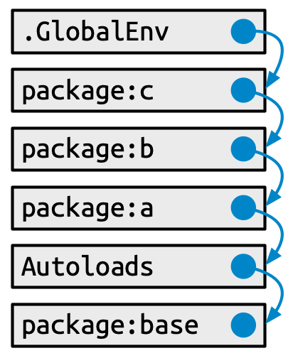
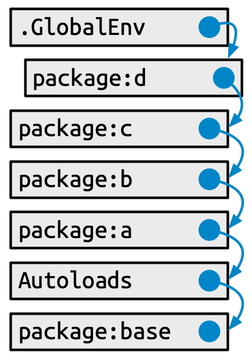
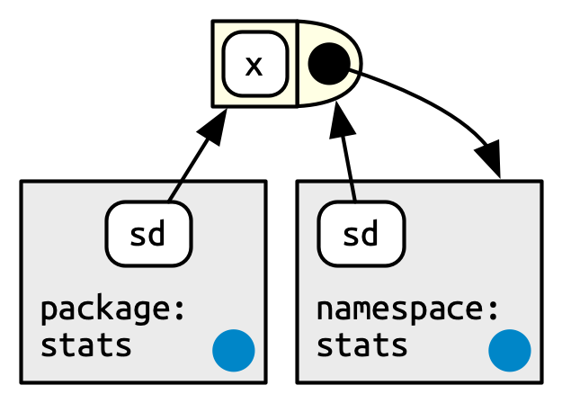
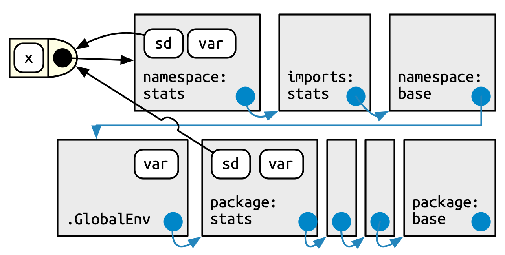

# Dependencies: Mindset and Background {#sec-dependencies-mindset-background}

```{r, echo = FALSE}
source("common.R")
```

You take a dependency when your package uses functionality from another package (or other external tool).
In @sec-description-imports-suggests, we explained how to declare a dependency on another package by listing it in `DESCRIPTION`, usually in `Imports` or `Suggests`.
But that still leaves many issues for you to think about:

-   When should you take a dependency?
    What are the risk and rewards?
    In @sec-dependencies-pros-cons we provide a framework for deciding whether a dependency is worth it.
    This chapter also includes specific sections for deciding between `Imports` and `Suggests` (@sec-dependencies-imports-vs-suggests) and between `Imports` and `Depends` (@sec-dependencies-imports-vs-depends).

-   How should you use different kinds of dependencies in different contexts?
    I.e. imported vs. suggested packages, used inside your functions vs tests vs documentation.
    We have to defer this to the next chapter (@sec-dependencies-in-practice), because the justification for those recommendations relies on some additional technical background that we develop here.

A key concept for understanding how packages are meant to work together is that of a namespace (@sec-dependencies-namespace).
Although it can be a bit confusing, R's namespace system is vital for the package ecosystem.
It is what ensures that other packages won't interfere with your code, that your code won't interfere with other packages, and that your package works regardless of the environment in which it's run.
We will show how the namespace system works alongside and in concert with the user's search path (@sec-dependencies-search).

This chapter contains material that could be skipped (or skimmed) when making your first package, when you're probably happy just to make a package that works!
But you'll want to revisit the material in this chapter as your packages get more ambitious and sophisticated.

## When should you take a dependency? {#sec-dependencies-pros-cons}

*This section is adapted from the "It Depends" [blog post](https://www.tidyverse.org/blog/2019/05/itdepends/) and [talk](https://www.rstudio.com/resources/rstudioconf-2019/it-depends-a-dialog-about-dependencies/) authored by Jim Hester.*

Software dependencies are a double-edged sword.
On one hand, they let you take advantage of others' work, giving your software new capabilities and making its behaviour and interface more consistent with other packages.
By using a pre-existing solution, you avoid re-implementing functionality, which eliminates many opportunities for you to introduce bugs.
On the other hand, your dependencies will likely change over time, which could require you to make changes to your package, potentially increasing your maintenance burden.
Your dependencies can also increase the time and disk space needed when users install your package.
These downsides have led some to suggest a 'dependency zero' mindset.
We feel that this is bad advice for most projects, and is likely to lead to lower functionality, increased maintenance, and new bugs.

### Dependencies are not equal

One problem with simply minimizing the absolute number of dependencies is that it treats all dependencies as equivalent, as if they all have the same costs and benefits (or even, infinite costs and no benefits).
However, in reality, this is far from the truth.
There are many axes upon which dependencies can differ, but some of the most important include:

-   The type of the dependency.
    Some dependencies come bundled with R itself (e.g. base, utils, stats) or are one of the 'Recommended' packages (e.g. Matrix, survival).
    These packages are very low cost to depend on, as they are (nearly) universally installed on all users' systems, and mostly change only with new R versions.
    In contrast, there is a higher cost for a dependency that comes from, e.g., a non-CRAN repository, which requires users to configure additional repositories before installation.

-   The number of upstream dependencies, i.e. recursive dependencies.
    For example, the [rlang](https://rlang.r-lib.org) package is intentionally managed as a low-level package and has no upstream dependencies apart from R itself.
    At the other extreme, there are packages on CRAN with \~250 recursive dependencies.

-   Already fulfilled dependencies.
    If your package depends on dplyr then taking a dependency on tibble does not change the dependency footprint, as dplyr itself already depends on tibble.
    Additionally, some of the most popular packages (e.g. ggplot2) will already be installed on the majority of users' machines.
    So adding a ggplot2 dependency is unlikely to incur additional installation costs in most cases.

-   The burden of installing the package.
    Various factors make a package more costly to install, in terms of time, space, and human aggravation:

    -   Time to compile: Packages that contain C/C++ can take very different amounts of time to install depending on the complexity of the code.
        For example, the [glue](https://glue.tidyverse.org) package takes \~5 seconds to compile on CRAN's build machines, whereas the [readr](https://readr.tidyverse.org) package takes \~100 seconds to install on the same machines.

    -   Binary package size: Users installing binary packages need to download them, so the size of the binary is relevant, particularly for those with slow internet connections.
        This also varies a great deal across packages.
        The smallest packages on CRAN are around 1 Kb in size, while the [h2o](https://cran.r-project.org/package=h2o) package is 170 Mb, and there are Bioconductor binaries that are over 4 Gb!

    -   System requirements: Some packages require additional system dependencies in order to be used.
        For instance, the [rjags](https://cran.r-project.org/package=rjags) package requires a matching installation of the JAGS library.
        Another example is [rJava](https://cran.r-project.org/package=rJava) which requires a Java SDK and also has additional steps needed to configure R for the proper Java installation, which has caused [installation issues for many people](https://stackoverflow.com/questions/tagged/rjava).

-   Maintenance capacity.
    It is reasonable to have higher confidence in a package that is well-established and that is maintained by developers or teams with a long track record and that maintain many other packages.
    This increases the likelihood that the package will remain on CRAN without interruptions and that the maintainer has an intentional approach to the software life cycle (@sec-lifecycle).

-   Functionality.
    Some packages implement a critical piece of functionality that is used across many packages.
    In the tidyverse, broadly defined, the rlang, tidyselect, vctrs, and tibble packages are all examples of this.
    By using these packages for tricky tasks like non-standard evaluation or manipulation of vectors and data frames, package authors can avoid re-implementing basic functionality.
    It's easy to think "how hard can it be to write my own X?" when you are focused on the Happy Path[^dependencies-mindset-background-1].
    But a huge part of the value brought by packages like vctrs or tibble is letting someone else worry about edge cases and error handling[^dependencies-mindset-background-2]
    . There is also value in having shared behaviour with other packages, e.g. the tidyverse rules for [name repair](https://vctrs.r-lib.org/reference/vec_as_names.html) or [recycling](https://vctrs.r-lib.org/reference/vector_recycling_rules.html).

[^dependencies-mindset-background-1]: In programming, the Happy Path is the scenario where all the inputs make sense and are exactly how things "should be".
    The Unhappy Path is everything else (objects of length or dimension zero, objects with missing data or dimensions or attributes, objects that don't exist, etc.).

[^dependencies-mindset-background-2]: Before writing your own version of X, have a good look at the bug tracker and test suite for another package that implements X.
    This can be useful for appreciating what is actually involved.

The specifics above hopefully make it clear that package dependencies are not equal.

### Prefer a holistic, balanced, and quantitative approach

Instead of striving for a minimal number of dependencies, we recommend a more holistic, balanced, and quantitative approach.

A holistic approach looks at the project as a whole and asks "who is the primary audience?".
If the audience is other package authors, then a leaner package with fewer dependencies may be more appropriate.
If, instead, the target user is a data scientist or statistician, they will likely already have many popular dependencies installed and would benefit from a more feature-full package.

A balanced approach understands that adding (or removing) dependencies comes with trade-offs.
Adding a dependency gives you additional features, bug fixes, and real-world testing, at the cost of increased installation time, disk space, and maintenance, if the dependency has breaking changes.
In some cases, it makes sense to *increase* dependencies for a package, even if an implementation already exists.
For instance, base R has a number of different implementations of non-standard evaluation with varying semantics across its functions.
The same used to be true of tidyverse packages as well, but now they all depend on the implementations in the [tidyselect](https://tidyselect.r-lib.org) and [rlang](https://rlang.r-lib.org) packages.
Users benefit from the improved consistency of this feature and individual package developers can let the maintainers of tidyselect and rlang worry about the technical details.

In contrast, removing a dependency lowers installation time, disk space, and avoids potential breaking changes.
However, it means your package will have fewer features or that you must re-implement them yourself.
That, in turn, takes development time and introduces new bugs.
One advantage of using an existing solution is that you'll get the benefit of all the bugs that have already been discovered and fixed.
Especially if the dependency is relied on by many other packages, this is a gift that keeps on giving.

Similar to optimizing performance, if you are worried about the burden of dependencies, it makes sense to address those concerns in a specific and quantitative way.
The experimental [itdepends](https://github.com/r-lib/itdepends) package was created for the [talk](https://www.rstudio.com/resources/rstudioconf-2019/it-depends-a-dialog-about-dependencies/) and [blog post](https://www.tidyverse.org/blog/2019/05/itdepends/) this section is based on.
It is still a useful source of concrete ideas (and code) for analyzing how heavy a dependency is.
The [pak](https://pak.r-lib.org/) package also has several functions that are useful for dependency analysis:

```{r}
#| eval: false
pak::pkg_deps_tree("tibble")
#> tibble 3.1.8 ✨
#> ├─fansi 1.0.3 ✨
#> ├─lifecycle 1.0.3 ✨
#> │ ├─cli 3.4.1 ✨ ⬇ (1.28 MB)
#> │ ├─glue 1.6.2 ✨
#> │ └─rlang 1.0.6 ✨ ⬇ (1.81 MB)
#> ├─magrittr 2.0.3 ✨
#> ├─pillar 1.8.1 ✨ ⬇ (673.95 kB)
#> │ ├─cli
#> │ ├─fansi
#> │ ├─glue
#> │ ├─lifecycle
#> │ ├─rlang
#> │ ├─utf8 1.2.2 ✨
#> │ └─vctrs 0.5.1 ✨ ⬇ (1.82 MB)
#> │   ├─cli
#> │   ├─glue
#> │   ├─lifecycle
#> │   └─rlang
#> ├─pkgconfig 2.0.3 ✨
#> ├─rlang
#> └─vctrs
#>
#> Key:  ✨ new |  ⬇ download

pak::pkg_deps_explain("tibble", "rlang")
#> tibble -> lifecycle -> rlang
#> tibble -> pillar -> lifecycle -> rlang
#> tibble -> pillar -> rlang
#> tibble -> pillar -> vctrs -> lifecycle -> rlang
#> tibble -> pillar -> vctrs -> rlang
#> tibble -> rlang
#> tibble -> vctrs -> lifecycle -> rlang
#> tibble -> vctrs -> rlang
```

### Dependency thoughts specific to the tidyverse {#sec-dependencies-tidyverse}

The packages maintained by the tidyverse team play different roles in the ecosystem and are managed accordingly.
For example, the tidyverse and devtools packages are essentially meta-packages that exist for the convenience of an end-user.
Consequently, it is recommended that other packages **should not depend** on tidyverse[^dependencies-mindset-background-3] or devtools (@sec-setup-usage), i.e. these two packages should almost never appear in `Imports`. Instead, a package maintainer should identify and depend on the specific package that actually implements the desired functionality.

[^dependencies-mindset-background-3]: There is a blog post that warns people away from depending on the tidyverse package: <https://www.tidyverse.org/blog/2018/06/tidyverse-not-for-packages/>.

In the previous section, we talked about different ways to gauge the weight of a dependency.
Both the tidyverse and devtools can be seen as heavy due to the very high number of recursive dependencies:

```{r}
n_hard_deps <- function(pkg) {
  deps <- tools::package_dependencies(pkg, recursive = TRUE)
  sapply(deps, length)
}

n_hard_deps(c("tidyverse", "devtools"))
```

In contrast, several packages are specifically conceived as low-level packages that implement features that should work and feel the same across the whole ecosystem.
At the time of writing, this includes:

-   rlang, to support tidy eval and throw errors
-   cli and glue, for creating a rich user interface (which includes errors)
-   withr, for managing state responsibly
-   lifecycle, for managing the life cycle of functions and arguments

These are basically regarded as free dependencies and can be added to `DESCRIPTION` via `usethis::use_tidy_dependencies()` (which also does a few more things).
It should come as no surprise that these packages have a very small dependency footprint.

```{r}
tools::package_dependencies(c("rlang", "cli", "glue", "withr", "lifecycle"))
```

::: callout-warning
## Submitting to CRAN

Under certain configurations, including those used for incoming CRAN submissions, `R CMD check` issues a `NOTE` if there are 20 or more "non-default" packages in `Imports`:

```         
N  checking package dependencies (1.5s)
   Imports includes 29 non-default packages.
   Importing from so many packages makes the package vulnerable to any of
   them becoming unavailable.  Move as many as possible to Suggests and
   use conditionally.
```

Our best advice is to try hard to comply, as it should be rather rare to need so many dependencies and it's best to eliminate any `NOTE` that you can.
Of course, there are exceptions to every rule, and perhaps your package is one of them.
In that case, you may need to argue your case.
It is certainly true that many CRAN packages violate this threshold.
:::

### Whether to Import or Suggest {#sec-dependencies-imports-vs-suggests}

The [withr package](https://withr.r-lib.org) is a good case study for deciding whether to list a dependency in `Imports` or `Suggests`.
Withr is very useful for writing tests that clean up after themselves.
Such usage is compatible with listing withr in `Suggests`, since regular users don't need to run the tests.
But sometimes a package might also use withr in its own functions, perhaps to offer its own `with_*()` and `local_*()` functions.
In that case, withr should be listed in `Imports`.

`Imports` and `Suggests` differ in the strength and nature of dependency:

-   `Imports`: packages listed here *must* be present for your package to work.
    Any time your package is installed, those packages will also be installed, if not already present.
    `devtools::load_all()` also checks that all packages in `Imports` are installed.

    It's worth pointing out that adding a package to `Imports` ensures it will be installed and **that is all it does**.
    It has nothing to do with actually importing functions from that package.
    See @sec-dependencies-in-imports for more about how to use a package in `Imports`.

-   `Suggests`: your package can use these packages, but doesn't require them.
    You might use suggested packages for example datasets, to run tests, build vignettes, or maybe there's only one function that needs the package.

    Packages listed in `Suggests` are not automatically installed along with your package.
    This means that you can't assume that your users have installed all the suggested packages, but you can assume that developers have.
    See @sec-dependencies-in-suggests for how to check whether a suggested package is installed.

`Suggests` isn't terribly relevant for packages where the user base is approximately equal to the development team or for packages that are used in a very predictable context.
In that case, it's reasonable to just use `Imports` for everything.
Using `Suggests` is mostly a courtesy to external users or to accommodate very lean installations.
It can free users from downloading rarely-needed packages (especially those that are tricky to install) and lets them get started with your package as quickly as possible.

## Namespace {#sec-dependencies-namespace}

So far, we've explained the mechanics of declaring a dependency in `DESCRIPTION` (@sec-description-imports-suggests) and how to analyze the costs and benefits of dependencies (@sec-dependencies-pros-cons).
Before we explain how to use your dependencies in various parts of your package in @sec-dependencies-in-practice, we need to establish the concepts of a package namespace and the search path.

### Motivation {#sec-dependencies-namespace-motivation}

As the name suggests, namespaces provide "spaces" for "names".
They provide a context for looking up the value of an object associated with a name.

Without knowing it, you've probably already used namespaces.
Have you ever used the `::` operator?
It disambiguates functions with the same name.
For example, both the lubridate and here packages provide a `here()` function.
If you attach lubridate, then here, `here()` will refer to the here version, because the last package attached wins.
But if you attach the packages in the opposite order, `here()` will refer to the lubridate version.

```{r}
#| eval: FALSE
library(lubridate)    |  library(here)
library(here)         |  library(lubridate)

here() # here::here() |  here() # lubridate::here()
```

This can be confusing.
Instead, you can qualify the function call with a specific namespace: `lubridate::here()` and `here::here()`.
Then the order in which the packages are attached won't matter[^dependencies-mindset-background-4].

[^dependencies-mindset-background-4]: We're going to stay focused on packages in this book, but there are other ways than using `::` to address conflicts in end-user code: the [conflicted package](https://conflicted.r-lib.org) and the [`"conflicts.policy"` option](https://developer.r-project.org/Blog/public/2019/03/19/managing-search-path-conflicts/) introduced in base R v3.6.0.

```{r}
#| eval: FALSE
lubridate::here() # always gets lubridate::here()
here::here()      # always gets here::here()
```

As you will see in @sec-dependencies-in-imports, the `package::function()` calling style is also our default recommendation for how to use your dependencies in the code below `R/`, because it eliminates all ambiguity.

But, in the context of package code, the use of `::` is not really our main line of defense against the confusion seen in the example above.
In packages, we rely on namespaces to ensure that every package works the same way regardless of what packages are attached by the user.

Consider the `sd()` function from the stats package that is part of base R:

```{r}
sd
```

It's defined in terms of another function, `var()`, also from the stats package.
So what happens if we override `var()` with our own definition?
Does it break `sd()`?

```{r}
var <- function(x) -5
var(1:5)

sd(1:5)
```

Surprisingly, it does not!
That's because when `sd()` looks for an object called `var()`, it looks first in the stats package namespace, so it finds `stats::var()`, not the `var()` we created in the global environment.
It would be chaos if functions like `sd()` could be broken by a user redefining `var()` or by attaching a package that overrides `var()`.
The package namespace system is what saves us from this fate.

### The `NAMESPACE` file {#sec-dependencies-NAMESPACE-file}

The `NAMESPACE` file plays a key role in defining your package's namespace.
Here are selected lines from the `NAMESPACE` file in the testthat package:

```         
# Generated by roxygen2: do not edit by hand

S3method(compare,character)
S3method(print,testthat_results)
export(compare)
export(expect_equal)
import(rlang)
importFrom(brio,readLines)
useDynLib(testthat, .registration = TRUE)
```

The first line announces that this file is not written by hand, but rather is generated by the roxygen2 package.
We'll return to this topic soon, after we discuss the remaining lines.

You can see that the `NAMESPACE` file looks a bit like R code (but it is not).
Each line contains a **directive**: `S3method()`, `export()`, `importFrom()`, and so on.
Each directive describes an R object, and says whether it's exported from this package to be used by others, or it's imported from another package to be used internally.

These directives are the most important in our development approach, in order of frequency:

-   `export()`: export a function (including S3 and S4 generics).
-   `S3method()`: export an S3 method.
-   `importFrom()`: import selected object from another namespace (including S4 generics).
-   `import()`: import all objects from another package's namespace.
-   `useDynLib()`: registers routines from a DLL (this is specific to packages with compiled code).

There are other directives that we won't cover here, because they are explicitly discouraged or they just rarely come up in our development work.

-   `exportPattern()`: exports all functions that match a pattern. We feel it's safer to always use explicit exports and we avoid the use of this directive.
-   `exportClasses()`, `exportMethods()`, `importClassesFrom()`, `importMethodsFrom()`: export and import S4 classes and methods. We only work in the S4 system when necessary for compatibility with another package, i.e. we generally don't implement methods or classes that we own with S4. Therefore the S4 coverage in this book is very minimal.

In the devtools workflow, the `NAMESPACE` file is not written by hand!
Instead, we prefer to generate `NAMESPACE` with the roxygen2 package, using specific tags located in a roxygen comment above each function's definition in the `R/*.R` files (@sec-dependencies-NAMESPACE-workflow).
We will have much more to say about roxygen comments and the roxygen2 package when we discuss package documentation in @sec-man.
For now, we just lay out the reasons we prefer this method of generating the `NAMESPACE` file:

-   Namespace tags are integrated into the source code, so when you read the code it's easier to see what's being exported and imported and why.

-   Roxygen2 abstracts away some of the details of `NAMESPACE`.
    You only need to learn one tag, `@export`, and roxygen2 will figure out which specific directive to use, based on whether the associated object is a regular function, S3 method, S4 method, or S4 class.

-   Roxygen2 keeps `NAMESPACE` tidy.
    No matter how many times `@importFrom foo bar` appears in your roxygen comments, you'll only get one `importFrom(foo, bar)` in your `NAMESPACE`.
    Roxygen2 also keeps NAMESPACE organised in a principled order, sorting first by the directive type and then alphabetically.
    Roxygen2 takes away the burden of writing NAMESPACE, while also trying to keep the file as readable as possible.
    This organization also makes Git diffs much more informative.

Note that you can choose to use roxygen2 to generate just `NAMESPACE`, just `man/*.Rd` (@sec-man), or both (as is our practice).
If you don't use any namespace-related tags, roxygen2 won't touch `NAMESPACE`.
If you don't use any documentation-related tags, roxygen2 won't touch `man/`.

## Search path {#sec-dependencies-search}

To understand why namespaces are important, you need a solid understanding of search paths.
To call a function, R first has to find it.
This search unfolds differently for user code than for package code and that is because of the namespace system.

### Function lookup for user code {#sec-dependencies-search-path-user}

The first place R looks for an object is the global environment.
If R doesn't find it there, it looks in the search path, the list of all the packages you have **attached**.
You can see this list by running `search()`.
For example, here's the search path for the code in this book:

```{r}
search()
```

This has a specific form (see @fig-search-path-baseline):

1.  The global environment.
2.  The packages that have been attached, e.g. via `library()`, from most-recently attached to least.
3.  `Autoloads`, a special environment that uses delayed bindings to save memory by only loading package objects (like big datasets) when needed.
4.  The base environment, by which we mean the package environment of the base package.

```{r}
#| label: fig-search-path-baseline
#| echo: false
#| out.width: 50%
#| fig.cap: Typical state of the search path.
#| fig-alt: >
#|   A chain of labelled environments. Each environment has an arrow pointing to
#|   its parent environment.

```

Each element in the search path has the next element as its parent, i.e. this is a chain of environments that is searched in order.
In the diagram, this relationship is shown as a small blue circle with an arrow that points to the parent.
The first environment (the global environment) and the last two (`Autoloads` and the base environment) are special and maintain their position.

But the middle section of attached packages is more dynamic.
When a new package is attached, it is inserted right after and becomes the parent of the global environment.
When you attach another package with `library()`, it changes the search path, as shown in @fig-search-path-insertion:

```{r}
#| label: fig-search-path-insertion
#| echo: false
#| out.width: 50%
#| fig.cap: A newly attached package is inserted into the search path.
#| fig-alt: >
#|   A chain of labelled environments, with a newly attached package being
#|   inserted as the parent of the global environment.

```

The main gotcha around how the user's search path works is the scenario we explored in @sec-dependencies-namespace-motivation, where two packages (lubridate and here) offer competing functions by the same name (`here()`).
It should be very clear now why a user's call to `here()` can produce a different result, depending on the order in which they attached the two packages.

This sort of confusion would be even more damaging if it applied to package code, but luckily it does not.
Now we can explain how the namespace system designs this problem away.

### Function lookup inside a package

In @sec-dependencies-namespace-motivation, we proved that a user's definition of a function named `var()` does *not* break `stats::sd()`.
Somehow, to our immense relief, `stats::sd()` finds `stats::var()` when it should.
How does that work?

This section is somewhat technical and you can absolutely develop a package with a well-behaved namespace without fully understanding these details.
Consider this optional reading that you can consult when and if you're interested.
You can learn even more in [Advanced R](https://adv-r.hadley.nz), especially in the chapter on environments, from which we have adapted some of this material.

Every function in a package is associated with a pair of environments: the package environment, which is what appears in the user's search path, and the **namespace** environment.

-   The package environment is the external interface to the package.
    It's how a regular R user finds a function in an attached package or with `::`.
    Its parent is determined by the search path, i.e. the order in which packages have been attached.
    The package environment only exposes exported objects.

-   The namespace environment is the internal interface of the package.
    It includes all objects in the package, both exported and non-exported.
    This ensures that every function can find every other function in the package.
    Every binding in the package environment also exists in the namespace environment, but not *vice versa*.

@fig-function-environment depicts the `sd()` function as a rectangle with a rounded end.
The arrows from `package:stats` and `namespace:stats` show that `sd()` is bound in both.
But the relationship is not symmetric.
The black circle with an arrow pointing back to `namespace:stats` indicates where `sd()` will look for objects that it needs: in the namespace environment, not the package environment.

```{r}
#| label: fig-function-environment
#| echo: false
#| out.width: 60%
#| fig.cap: >
#|   An exported function is bound in the package environment and in the
#|   namespace, but only binds the namespace.
#| fig-alt: >
#|   A function that is bound to the name `sd()` by two environments, the
#|   package environment and the namespace environment, indicated by two arrows.
#|   But the function itself only binds the namespace environment, indicated
#|   a single arrow.

```

> The package environment controls how users find the function; the namespace controls how the function finds its variables.

Every namespace environment has the same set of ancestors, as depicted in @fig-namespace-environment:

-   Each namespace has an **imports** environment that can contain bindings to functions used by the package that are defined in another package.
    The imports environment is controlled by the package developer with the `NAMESPACE` file.
    Specifically, directives such as `importFrom()` and `imports()` populate this environment.

-   Explicitly importing every base function would be tiresome, so the parent of the imports environment is the base **namespace**.
    The base namespace contains the same bindings as the base environment, but it has a different parent.

-   The parent of the base namespace is the global environment.
    This means that if a binding isn't defined in the imports environment the package will look for it in the usual way.
    This is usually a bad idea (because it makes code depend on other loaded packages), so `R CMD check` automatically warns about such code.
    It is needed primarily for historical reasons, particularly due to how S3 method dispatch works.

```{r}
#| label: fig-namespace-environment
#| echo: false
#| out.width: 100%
#| fig.cap: >
#|   The namespace environment has the imports environment as parent, which
#|   inherits from the namespace environment of the base package and,
#|   ultimately, the global environment.
#| fig-alt: >
#|   A chain of labelled environments. Each environment has an arrow pointing to
#|   its parent environment.
knitr::include_graphics("diagrams/namespace/namespace-env.png")
```

Finally, we can put it all together in this last diagram, @fig-search-path-and-namespace.
This shows the user's search path, along the bottom, and the internal stats search path, along the top.

```{r}
#| label: fig-search-path-and-namespace
#| echo: false
#| out.width: 100%
#| fig.cap: >
#|   For user code, objects are found using the search path, whereas package
#|   code uses the namespace.
#| fig-alt: >
#|   Two chains of labelled environments, one is the user's search path and the
#|   other is the package namespace (and its parents).

```

A user (or some package they are using) is free to define a function named `var()`.
But when that user calls `sd()`, it will always call `stats::var()` because `sd()` searches in a sequence of environments determined by the stats package, not by the user.
This is how the namespace system ensures that package code always works the same way, regardless of what's been defined in the global environment or what's been attached.

## Attaching versus loading {#sec-dependencies-attach-vs-load}

It's common to hear something like "we use `library(somepackage)` to load somepackage".
But technically `library()` *attaches* a package to the search path.
This casual abuse of terminology is often harmless and can even be beneficial in some settings.
But sometimes it's important to be precise and pedantic and this is one of those times.
Package developers need to know the difference between attaching and loading a package and when to care about this difference.

If a package is installed,

-   **Loading** will load code, data, and any DLLs; register S3 and S4 methods; and run the `.onLoad()` function.
    After loading, the package is available in memory, but because it's not in the search path, you won't be able to access its components without using `::`.
    Confusingly, `::` will also load a package automatically if it isn't already loaded.

-   **Attaching** puts the package in the search path (@sec-dependencies-search-path-user).
    You can't attach a package without first loading it, so both `library()` (or `require()`) load then attach the package.
    This also runs the `.onAttach()` function.

There are four functions that make a package available, shown in @tbl-load-vs-attach.
They differ based on whether they load or attach, and what happens if the package is not found (i.e., throws an error or returns `FALSE`).

|        | Throws error         | Returns `FALSE`                         |
|--------|----------------------|-----------------------------------------|
| Load   | `loadNamespace("x")` | `requireNamespace("x", quietly = TRUE)` |
| Attach | `library(x)`         | `require(x, quietly = TRUE)`            |

: Functions that load or attach a package. {#tbl-load-vs-attach}

Of the four, these two functions are by far the most useful:

-   Use `library(x)` in, e.g., a data analysis script or a vignette.
    It will throw an error if the package is not installed, and will terminate the script.
    You want to attach the package to save typing.
    Never use `library()` in package code below `R/` or `tests/`.

-   Use `requireNamespace("x", quietly = TRUE)` inside a package if you want to specify different behaviour depending on whether or not a suggested package is installed.
    Note that this also loads the package.
    We give examples in @sec-dependencies-in-suggests-r-code.

`loadNamespace()` is somewhat esoteric and is really only needed for internal R code.

`require(pkg)` is almost never a good idea[^dependencies-mindset-background-5] and, we suspect, may come from people projecting certain hopes and dreams onto the function name.
Ironically, `require(pkg)` does not actually require success in attaching pkg and your function or script will soldier on even in the case of failure.
This, in turn, often leads to a very puzzling error much later.
If you want to "attach or fail", use `library()`. If you want to check whether pkg is available and proceed accordingly, use `requireNamespace("pkg", quietly = TRUE)`.

[^dependencies-mindset-background-5]: The classic blog post ["`library()` vs `require()` in R"](https://yihui.org/en/2014/07/library-vs-require/) by Yihui Xie is another good resource on this.

One reasonable use of `require()` is in an example that uses a package your package `Suggests`, which is further discussed in @sec-dependencies-in-suggests-in-examples-and-vignettes.

The `.onLoad()` and `.onAttach()` functions mentioned above are two of several hooks that allow you to run specific code when your package is loaded or attached (or, even, detached or unloaded).
Most packages don't need this, but these hooks are useful in certain situations.
See @sec-code-onLoad-onAttach for some use cases for `.onLoad()` and `.onAttach()`.

### Whether to Import or Depend {#sec-dependencies-imports-vs-depends}

We are now in a position to lay out the difference between `Depends` and `Imports` in the `DESCRIPTION`.
Listing a package in either `Depends` or `Imports` ensures that it's installed when needed.
The main difference is that a package you list in `Imports` will just be *loaded* when you use it, whereas a package you list in `Depends`will be *attached* when your package is attached.

Unless there is a good reason otherwise, you should always list packages in `Imports` not `Depends`.
That's because a good package is self-contained, and minimises changes to the global landscape, including the search path.[^dependencies-mindset-background-6]

[^dependencies-mindset-background-6]: Thomas Leeper created several example packages to demonstrate the puzzling behaviour that can arise when packages use `Depends` and shared the work at <https://github.com/leeper/Depends>.
    This demo also underscores the importance of using `::` (or `importFrom()`) when using external functions in your package, as recommended in @sec-dependencies-in-practice.

Users of devtools are actually regularly exposed to the fact that devtools `Depends` on usethis:

```{r}
#| eval: false
library(devtools)
#> Loading required package: usethis

search()
#>  [1] ".GlobalEnv"        "package:devtools"  "package:usethis"  
#>  ...
```

This choice is motivated by backwards compatibility.
When devtools was split into several smaller packages (@sec-setup-usage), many of the user-facing functions moved to usethis.
Putting usethis in Depends was a pragmatic choice to insulate users from keeping track of which function ended up where.

A more classic example of `Depends` is how the [censored package](https://censored.tidymodels.org) depends on the [parsnip](https://parsnip.tidymodels.org) and [survival](https://cran.r-project.org/package=survival) packages.
Parsnip provides a unified interface for fitting models, and censored is an extension package for survival analysis.
Censored is not useful without parsnip and survival, so it makes sense to list them in `Depends`.
