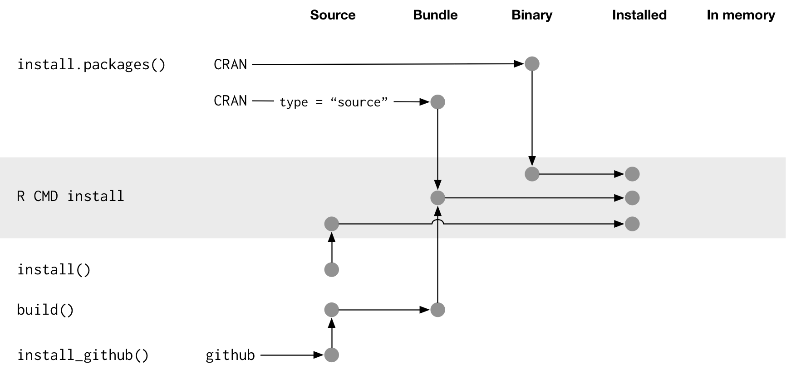
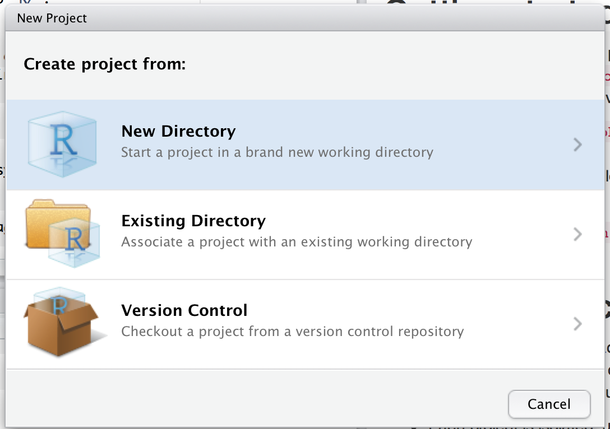

# Package structure and state {#package-structure-state}

```{r, include = FALSE}
source("common.R")
```

This chapter will start you on the road to package development by converting the implicit knowledge you've gained from *using* R packages into the explicit knowledge needed to *create and modify* them. You'll learn about the various states a package can be in and the difference between a package and library (and why you should care). Finally, you'll get an orientation on the how and why of moving your own package through these states.

## What is a package? {#package}

When you create or modify a package, you work on its "source code" or "source files". You interact with the in-development package in its __source__ form. This is NOT the package form you are most familiar with from day-to-day usage. Package development workflows make much more sense if you understand the five states an R package can be in:

  * source
  * bundled
  * binary
  * installed
  * in-memory
  
You already know some of the functions that put packages into these states. For example, `install.packages()` and `devtools::install_github()` move a package from source, bundled, or binary states into the installed state. The `library()` function loads an installed package into memory, making it available for immediate and direct use.

### Source package

A __source__ package is just a directory of files with a specific structure. It includes particular components, such as a `DESCRIPTION` file, an `R/` directory containing `.R` files, and so on. Most of the remaining chapters in this book are dedicated to detailing these components.

If you are new to package development, you may have never seen a package in source form! You might not even have any source packages on your computer. The easiest way to see a package in source form right away is to browse around its code on the web.

Many R packages are developed in the open on GitHub (or GitLab or similar). The best case scenario is that you visit the package's CRAN landing page, e.g.:

  * forcats: <https://cran.r-project.org/package=forcats>
  * readxl: <https://cran.r-project.org/package=readxl>
    
and one of its URLs links to a repository on a public hosting service, e.g.:

  * forcats: <https://github.com/tidyverse/forcats>
  * readxl: <https://github.com/tidyverse/readxl>
  
Some maintainers forget to list this URL, even though the package is developed in a public repository, but you still might be able to discover it via search.
    
Even if a package is not developed on a public platform, you can visit its source in the unofficial, read-only mirror maintained by [METACRAN](https://r-pkg.org/about). Examples:

  - MASS: <https://github.com/cran/MASS>
  - car: <https://github.com/cran/car>
  
Note that this is not the same as exploring the package's true development venue, because this source and its evolution is just reverse-engineered from the package's CRAN releases. This presents a redacted view of the package and its history, but, by definition, it includes everything that is essential.

### Bundled package

A __bundled__ package is a package that's been compressed into a single file. By convention (from Linux), package bundles in R use the extension `.tar.gz` and are sometimes referred to as "source tarballs". This means that multiple files have been reduced to a single file (`.tar`) and then compressed using gzip (`.gz`). While a bundle is not that useful on its own, it's a platform-agnostic, transportation-friendly intermediary between a source package and an installed package.

In the rare case that you need to make a bundle from a package you're developing locally, use `devtools::build()`. Under the hood, this calls `pkgbuild::build()` and, ultimately, `R CMD build`, which is described further in the [Building package tarballs][wre-tarball] section of [Writing R Extensions][wre].

This should tip you off that a package bundle or "source tarball" is not simply the result of making a tar archive of the source files, then compressing with gzip. By convention, in the R world, a few more operations are carried out when making the `.tar.gz` file and this is why we've elected to refer to this as a package bundle.

Every CRAN package is available in bundled form, via the "Package source" field of individual landing pages. Continuing our examples from above, you could download the bundles `forcats_0.4.0.tar.gz` and `readxl_1.3.1.tar.gz` (or whatever the current versions may be). You could unpack such a bundle in the shell (not the R console) like so:

```bash
tar xvf forcats_0.4.0.tar.gz
```

If you decompress a bundle, you'll see it looks almost the same as a source package. This diagram summarises the files present in the top-level directory for source, bundled, and binary versions of devtools.

*TODO: Remake this, possibly with a different (fictional or deliberately crafted?) package. Things I want to address: README.Rmd, .github/, CI config, pkgdown, LICENSE.md, data-raw/, updated treatment of NEWS.md, existence of vignettes/ in tarball, presence of build/ in tarball, absence of README.md in binary form.*

```{r package-files, echo = FALSE, out.width = "100%", fig.cap = "Side-by-side comparison of source, bundled, and binary package."}
knitr::include_graphics("diagrams/package-files.png")
```

The main differences between a source package and an uncompressed bundle are:

* Vignettes have been built, so rendered outputs, such as HTML, appear below
  `inst/doc/` and a vignette index appears in the `build/` directory, usually
  alongside a PDF package manual.

* A local source package might contain temporary files used to save time during
  development, like compilation artefacts in `src/`. These are never found in 
  a bundle.

* Any files listed in `.Rbuildignore` are not included in the bundle. These are
  typically files that facilitate your development process, but that should be
  excluded from the distributed product.

#### `.Rbuildignore` {#rbuildignore}

You won't need to contemplate the exact structure of package `.tar.gz` files very often, but you do need to understand the `.Rbuildignore` file. It controls which files from the source package make it into the downstream forms.

Each line of `.Rbuildignore` is a Perl-compatible regular expression that is matched, without regard to case, against the path to each file in the source package ^[To see the set of filepaths that should be on your radar, execute `dir(full.names = TRUE, recursive = TRUE, include.dirs = TRUE, all.files = TRUE)` in the package's top-level directory.]. If the regular expression matches, that file or directory is excluded. Note there are some default exclusions implemented by R itself, mostly relating to classic version control systems and editors, such as SVN, Git, and Emacs.

To exclude a specific file or directory (the most common use case), you __MUST__ anchor the regular expression. For example, to exclude a directory called "notes", use `^notes$`. The regular expression `notes` will match any file name containing notes, e.g. `R/notes.R`, `man/important-notes.R`, `data/endnotes.Rdata`, etc. The safest way to exclude a specific file or directory is to use `usethis::use_build_ignore("notes")`, which does the escaping for you.

`.Rbuildignore` is a way to resolve some of the tension between the practices that support your development process and CRAN's requirements for submission and distribution. Even if you aren't planning to release on CRAN, following these conventions will allow you to make the best use of R's built-in tooling for package checking and installation. The affected files fall into two broad, semi-overlapping classes:

  * Files that help you generate package contents programmatically. Examples:
    - Using `README.Rmd` to generate an informative and current `README.md`.
    - Storing `.R` scripts to create and update internal or exported data.
  * Files that drive package development, checking, and documentation, outside
    of CRAN's purview. Examples:
    - Files relating to the RStudio IDE.
    - Using the [pkgdown package](https://pkgdown.r-lib.org) to generate a
      website.
    - Configuration files related to continuous integration/deployment and 
      monitoring test coverage.

Here is a non-exhaustive list of typical entries in the `.Rbuildignore` file for a package in the tidyverse:

```
^.*\.Rproj$         # Designates the directory as an RStudio Project
^\.Rproj\.user$     # Used by RStudio for temporary files
^README\.Rmd$       # An Rmd file used to generate README.md
^LICENSE\.md$       # Full text of the license
^cran-comments\.md$ # Comments for CRAN submission
^\.travis\.yml$     # Used by Travis-CI for continuous integration testing
^data-raw$          # Code used to create data included in the package
^pkgdown$           # Resources used for the package website
^_pkgdown\.yml$     # Configuration info for the package website
^\.github$          # Contributing guidelines, CoC, issue templates, etc.
```

Note that the comments above must not appear in an actual `.Rbuildignore` file; they are included here only for exposition.

We'll mention when you need to add files to `.Rbuildignore` whenever it's important. Remember that `usethis::use_build_ignore()` is an attractive way to manage this file.

### Binary package

If you want to distribute your package to an R user who doesn't have package development tools, you'll need to provide a __binary__ package. Like a package bundle, a binary package is a single file. Unlike a bundled package, a binary package is platform specific and there are two basic flavors: Windows and macOS. (Linux users are generally required to have the tools necessary to install from `.tar.gz` files.)

Binary packages for macOS are stored as `.tgz`, whereas Windows binary packages end in `.zip`. If you need to make a binary package, use `devtools::build(binary = TRUE)` on the relevant operating system. Under the hood, this calls `pkgbuild::build(binary = TRUE)` and, ultimately, `R CMD INSTALL --build`, which is described further in the [Building binary packages][wre-binary] section of [Writing R Extensions][wre].

To be clear, the primary maker and distributor of binary packages is CRAN, not individual maintainers. If your package is intended for public use, the most effective way to make it broadly available is to release it on CRAN. You submit a package bundle and CRAN makes and distributes the package binaries.

CRAN packages are usually available in binary form, for both macOS and Windows, for the current, previous, and (possibly) development versions of R. Continuing our examples from above, you could download binary packages such as:

  * forcats for macOS: `forcats_0.4.0.tgz`
  * readxl for Windows: `readxl_1.3.1.zip`

and this is, indeed, part of what's usually going on behind the scenes when you call `install.packages()`.

If you uncompress a binary package, you'll see that the internal structure is rather different from a source or bundled package. Here are some of the most notable differences:

* There are no `.R` files in the `R/` directory - instead there are three
  files that store the parsed functions in an efficient file format. This is
  basically the result of loading all the R code and then saving the
  functions with `save()`. (In the process, this adds a little extra metadata to 
  make things as fast as possible).

* A `Meta/` directory contains a number of `.rds` files. These files contain 
  cached metadata about the package, like what topics the help files cover and
  a parsed version of the `DESCRIPTION` file. (You can use `readRDS()` to see 
  exactly what's in those files). These files make package loading faster
  by caching costly computations.

* The actual help content appears in `help/` and `html/` (no longer in `man/`).

* If you had any code in the `src/` directory, there will now be a `libs/`
  directory that contains the results of compiling the code. On Windows, there
  are subdirectories for 32 bit (`i386/`) and 64 bit (`x64/`) environments.

* If you had any objects in `data/`, they have now been converted into a more
  efficient form.
  
* The contents of `inst/` are moved to the top-level directory. For example,
  vignette files are now in `doc/`.

* Some files and folders have been dropped, such as `README`, `build/`, `tests/`,
  and `vignettes/`.

### Installed package

An __installed__ package is a binary package that's been decompressed into a package library (described in \@ref(library)). The following diagram illustrates the many ways a package can be installed. This diagram is complicated! In an ideal world, installing a package would involve stringing together a set of simple steps: source -> bundle, bundle -> binary, binary -> installed. In the real world, it's not this simple because there are often (faster) shortcuts available.

```{r installation, echo = FALSE, out.width = "100%", fig.cap = "Many methods for converting between package states."}

```

The built-in command line tool `R CMD INSTALL` powers all package installation. It can install a package from source files, a bundle (a.k.a. a source tarball), or a binary package. Details are available in the [Installing packages section][ria-install] of [R Installation and Administration][ria]. Just like with `devtools::build()`, devtools provides a wrapper function, `devtools::install()`, that makes this tool available from within an R session.

Most useRs understandably like to install packages from the comfort of an R session and directly from CRAN. The built-in function `install.packages()` meets this need. It can download the package, in various forms, install it, and optionally attend to the installation of dependencies.

devtools exposes a family of `install_*()` functions to address some needs beyond the reach of `install.packages()` or to make existing capabilities easier to access. These functions are actually maintained in the [remotes package](https://remotes.r-lib.org) and are re-exported by devtools.

```{r}
library(remotes)

funs <- as.character(lsf.str("package:remotes"))
grep("^install_.+", funs, value = TRUE)
```

`install_github()` is the flagship example of a sub-family of functions that can download a package from a remote location that is not CRAN and do whatever is necessary to install it. The rest of the devtools/remotes `install_*()` functions are aimed at making things that are technically possible with base tooling a bit easier or more explicit, such as `install_version()` which installs a specific version of a CRAN package.

 Analogous to `.Rbuildignore`, described in section \@ref(rbuildignore), `.Rinstignore` lets you keep files present in a package bundle out of the installed package. However, in contrast to `.Rbuildignore`, this is rather obscure and rarely needed.
 
*TODO: Revisit this section later with respect to pak <https://pak.r-lib.org>.*

### In-memory package

We finally arrive at a command familiar to everyone who uses R:

```{r, eval = FALSE}
library(usethis)
```

Assuming usethis is installed, this call makes its functions available for use, i.e. now we can do:

```{r, eval = FALSE}
create_package("/path/to/my/coolpackage")
```

The usethis package has been loaded into memory and, in fact, has also been attached to the search path. The distinction between loading and attaching packages is not important when you're writing scripts, but it's very important when you're writing packages. You'll learn more about the difference and why it's important in [search path](#search-path).

`library()` is not a great way to iteratively tweak and test drive a package you're developing, because it only works for an installed package. In REPLACE WITH REF, you'll learn how `devtools::load_all()` accelerates development by allowing you to load a source package directly into memory.

## What is a library? {#library}

We just discussed the `library()` function, whose name is inspired by what it does. When you call `library(foo)`, R looks through the current __libraries__ for an installed package named "foo" and, if successful, it makes foo available for use.

In R, a __library__ is a directory containing installed packages, sort of like a library for books. Unfortunately, in the R world, you will frequently encounter confused usage of the words "library" and "package". It's common for someone to refer to dplyr, for example, as a library when it is actually a package. There are a few reasons for the confusion. First, R's terminology arguably runs counter to broader programming conventions, where the usual meaning of "library" is closer to what we mean by "package". The name of the `library()` function itself probably reinforces the wrong associations. Finally, this vocabulary error is often harmless, so it's easy for R users to fall into the wrong habit and for people who point out this mistake to look like insufferable pedants. But here's the bottom line:

> We use the `library()` function to load a __package__. ^[Well, actually, `library()` loads and attaches a package, but that's a topic for another section (\@ref(search-path)).]

The distinction between the two is important and useful as you get involved in package development.

You can have multiple libraries on your computer. In fact, many of you already do, especially if you're on Windows. You can use `.libPaths()` to see which libraries are currently active. Here's how this might look on Windows:

```{r, eval = FALSE}
# on Windows
.libPaths()
#> [1] "C:/Users/jenny/Documents/R/win-library/3.6"
#> [2] "C:/Program Files/R/R-3.6.0/library"

lapply(.libPaths(), list.dirs, recursive = FALSE, full.names = FALSE)
#> [[1]]
#>   [1] "abc"           "anytime"       "askpass"       "assertthat"   
#>  ...
#> [145] "zeallot"      
#> 
#> [[2]]
#>  [1] "base"         "boot"         "class"        "cluster"     
#>  [5] "codetools"    "compiler"     "datasets"     "foreign"     
#>  [9] "graphics"     "grDevices"    "grid"         "KernSmooth"  
#> [13] "lattice"      "MASS"         "Matrix"       "methods"     
#> [17] "mgcv"         "nlme"         "nnet"         "parallel"    
#> [21] "rpart"        "spatial"      "splines"      "stats"       
#> [25] "stats4"       "survival"     "tcltk"        "tools"       
#> [29] "translations" "utils"
```

Here's a similar look on macOS (but your results may vary):
```{r, eval = FALSE}
# on macOS
.libPaths()
#> [1] "/Users/jenny/resources/R/library_3.6"                          
#> [2] "/Library/Frameworks/R.framework/Versions/3.6/Resources/library"

lapply(.libPaths(), list.dirs, recursive = FALSE, full.names = FALSE)
#> [[1]]
#>    [1] "abc"                  "abc.data"             "abind"                
#>  ...
#> [1033] "Zelig"                "zip"                  "zoo"                 
#> 
#> [[2]]
#>  [1] "base"         "boot"         "class"        "cluster"     
#>  [5] "codetools"    "compiler"     "datasets"     "foreign"     
#>  [9] "graphics"     "grDevices"    "grid"         "KernSmooth"  
#> [13] "lattice"      "MASS"         "Matrix"       "methods"     
#> [17] "mgcv"         "nlme"         "nnet"         "parallel"    
#> [21] "rpart"        "spatial"      "splines"      "stats"       
#> [25] "stats4"       "survival"     "tcltk"        "tools"       
#> [29] "translations" "utils"
```

In both cases we see two active libraries, consulted in this order:

  1. A user library
  2. A system-level or global library

This setup is typical on Windows, but is something you usually need to opt into on macOS, for example, by specifying `R_LIBS_USER` in `.Renviron`. With this setup, add-on packages installed from CRAN (or elsewhere) or under local development are kept in the user library. Above, the macOS system is used as a primary development machine and has many packages here (~1000), whereas the Windows system is only used occasionally and is much more spartan. The core set of base and recommended packages that ship with R live in the system-level library and are the same on macOS and Windows. This separation appeals to many developers and makes it easy to, for example, clean out your add-on packages without disturbing your base R installation. If you're on macOS and only see one library, there is no urgent need to change anything, but it's something to consider next time you upgrade R.

The filepaths for these libraries also make it clear they are associated with a specific version of R (3.6.x at the time of writing), which is also typical. This reflects and enforces the fact that you need to reinstall your add-on packages when you update R from, say, 3.5 to 3.6, which is a change in the **minor** version. You generally do not need to re-install add-on packages for a patch release, e.g., going from R 3.6.0 to 3.6.1.

As your R usage grows more sophisticated, it's common to start managing package libraries with more intention. For example, tools like [renv](https://rstudio.github.io/renv/) (and its predecessor [packrat](https://rstudio.github.io/packrat/)) automate the process of managing project-specific libraries. This can be important for making data products reproducible, portable, and isolated from one another. A package developer might prepend the library search path with a temporary library, containing a set of packages at specific versions, in order to explore issues with backwards and forwards compatibility, without affecting other day-to-day work. Reverse dependency checks are another example where we explicitly manage the library search path.

Here are the main levers for controlling which libraries are active, in order of scope and persistence:

  * Environment variables, like `R_LIBS` and `R_LIBS_USER`, which are consulted
    at startup.
  * Calling `.libPaths()` with one or more filepaths.
  * `withr::with_libpaths()` to execute small snippets of code with an altered
    search path.
  * Arguments to individual functions, like `install.packages(lib =)` and
    `library(lib.loc =)`.
    
Finally, it's important to note that `library()` should NEVER be used *inside a package*. Packages and scripts rely on different mechanisms for declaring their dependencies and this is one of the biggest adjustments you need to make in your mental model and habits. We explore this topic fully in Chapter \@ref(namespace).

## Naming your package {#naming}

> "There are only two hard things in Computer Science: cache invalidation and 
> naming things." 
>
> --- Phil Karlton

Before you can create your first package, you need to come up with a name for it. I think this is the hardest part of creating a package! (Not least because devtools can't automate it for you.)

### Requirements for a name

There are three formal requirements: the name can only consist of letters, numbers and periods, i.e., `.`; it must start with a letter; and it cannot end with a period. Unfortunately, this means you can't use either hyphens or underscores, i.e., `-` or `_`, in your package name. I recommend against using periods in package names because it has confusing connotations (i.e., file extension or S3 method).

### Strategies for creating a name

If you're planning on releasing your package, I think it's worth spending a few minutes to come up with a good name. Here are some recommendations for how to go about it:

* Pick a unique name you can easily Google. This makes it easy for potential users to 
  find your package (and associated resources) and for you to see who's using it. 
  You can also check if a name is already used on CRAN by loading <http://cran.r-project.org/web/packages/[PACKAGE_NAME]>.

* Avoid using both upper and lower case letters: doing so makes the package name
  hard to type and even harder to remember. For example, I can never remember if it's
  Rgtk2 or RGTK2 or RGtk2.

* Find a word that evokes the problem and modify it so that it's unique:

    * plyr is generalisation of the apply family, and evokes pliers.
    * lubridate makes dates and times easier.
    * knitr (knit + r) is "neater" than sweave (s + weave).
    * testdat tests that data has the correct format.

* Use abbreviations: 

    * Rcpp = R + C++ (plus plus)
    * lvplot = letter value plots. 

* Add an extra R: 

    * stringr provides string tools.
    * tourr implements grand tours (a visualisation method).
    * gistr lets you programmatically create and modify GitHub gists.

If you're creating a package that talks to a commercial service, make sure you check the branding guidelines to avoid problems down the line. For example, rDrop isn't called rDropbox because Dropbox prohibits any applications from using the full trademarked name.

## Creating a package {#getting-started}

Once you've come up with a name, there are two ways to create the package. You can use RStudio:

1. Click File | New Project.

2. Choose "New Directory":

    ```{r, echo = FALSE}
    
    ```
   
2. Then "R Package":

    ```{r, echo = FALSE}
    knitr::include_graphics("images/create-2.png")
    ```

2. Then give your package a name and click "Create Project":

    ```{r, echo = FALSE}
    knitr::include_graphics("images/create-3.png")
    ```
    
Alternatively, you can create a new package from within R by running

```{r, eval = FALSE}
usethis::create_package("path/to/package/pkgname")
```
    
Either route gets you to the same place: the smallest usable package, one with three components:

1. An `R/` directory, which you'll learn about in [R code](#r).

1. A basic `DESCRIPTION` file, which you'll learn about in 
   [package metadata](#description).

1. A basic `NAMESPACE` file, which you'll learn about in 
   [the namespace](#namespace).

It will also include an RStudio project file, `pkgname.Rproj`, that makes your package easy to use with RStudio, as described below.

Don't use `package.skeleton()` to create a package. Following that workflow actually creates more work for you because it creates extra files that you'll have to delete or modify before you can have a working package.

## RStudio projects {#projects}

To get started with your new package in RStudio, double-click the `pkgname.Rproj` file that `create()` just made. This will open a new RStudio project for your package. Projects are a great way to develop packages because:

*   Each project is isolated; code run in one project does not affect any 
    other project.

*   You get handy code navigation tools like `F2` to jump to a function
    definition and `Ctrl + .` to look up functions by name.

*   You get useful keyboard shortcuts for common package development tasks.
    You'll learn about them throughout the book. But to see them all, press 
    Alt + Shift + K or use the Help | Keyboard shortcuts menu.
    
    ```{r, echo = FALSE}
    knitr::include_graphics("images/keyboard-shortcuts.png")
    ```
   
(If you want to learn more RStudio tips and tricks, follow @[rstudiotips](https://twitter.com/rstudiotips) on twitter.)

Both RStudio and `usethis::create_package()` will make an `.Rproj` file for you. If you have an existing package that doesn't have an `.Rproj` file, you can use `usethis::use_rstudio("path/to/package")` to add it. If you don't use RStudio, you can get many of the benefits by starting a new R session and ensuring the working directory is set to the package directory. 

### What is an RStudio project file?

An `.Rproj` file is just a text file. The project file created by devtools looks like this:

```
Version: 1.0

RestoreWorkspace: No
SaveWorkspace: No
AlwaysSaveHistory: Default

EnableCodeIndexing: Yes
Encoding: UTF-8

AutoAppendNewline: Yes
StripTrailingWhitespace: Yes

BuildType: Package
PackageUseDevtools: Yes
PackageInstallArgs: --no-multiarch --with-keep.source
PackageRoxygenize: rd,collate,namespace
```

You don't need to modify this file by hand. Instead, use the friendly project options dialog box, accessible from the projects menu in the top-right corner of RStudio.

```{r, echo = FALSE, out.width="30%"}
knitr::include_graphics("images/project-options-1.png")
```
```{r, echo = FALSE, out.width="70%"}
knitr::include_graphics("images/project-options-2.png")
```
    
*TODO: re-integrate this diagram*    
    
```{r, echo = FALSE}
knitr::include_graphics("diagrams/loading.png")
```


[wre]:https://cran.r-project.org/doc/manuals/R-exts.html
[wre-tarball]:https://cran.r-project.org/doc/manuals/R-exts.html#Building-package-tarballs
[wre-binary]:https://cran.r-project.org/doc/manuals/R-exts.html#Building-binary-packages
[ria]:https://cran.r-project.org/doc/manuals/R-admin.html
[ria-install]:https://cran.r-project.org/doc/manuals/R-admin.html#Installing-packages
