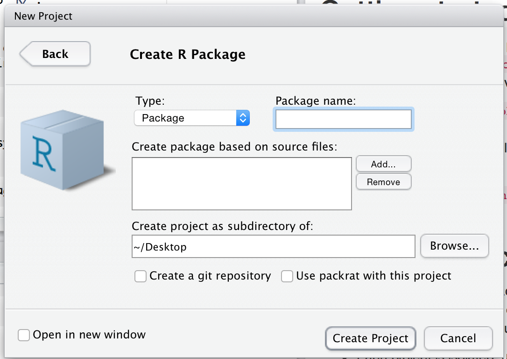

# Package structure {#package-structure}

This chapter will start you on the road to package development by showing you how to create your first package. You'll also learn about the various states a package can be in, including what happens when you install a package. Finally, you'll learn about the difference between a package and a library and why you should care.

## Naming your package {#naming}

> "There are only two hard things in Computer Science: cache invalidation and 
> naming things." 
>
> --- Phil Karlton

Before you can create your first package, you need to come up with a name for it. I think this is the hardest part of creating a package! (Not least because devtools can't automate it for you.)

### Requirements for a name

There are three formal requirements: the name can only consist of letters, numbers and periods, i.e., `.`; it must start with a letter; and it cannot end with a period. Unfortunately, this means you can't use either hyphens or underscores, i.e., `-` or `_`, in your package name. I recommend against using periods in package names because it has confusing connotations (i.e., file extension or S3 method).

### Strategies for creating a name

If you're planning on releasing your package, I think it's worth spending a few minutes to come up with a good name. Here are some recommendations for how to go about it:

* Pick a unique name you can easily Google. This makes it easy for potential users to 
  find your package (and associated resources) and for you to see who's using it. 
  You can also check if a name is already used on CRAN by loading <http://cran.r-project.org/web/packages/[PACKAGE_NAME]>.

* Avoid using both upper and lower case letters: doing so makes the package name
  hard to type and even harder to remember. For example, I can never remember if it's
  Rgtk2 or RGTK2 or RGtk2.

* Find a word that evokes the problem and modify it so that it's unique:

    * plyr is generalisation of the apply family, and evokes pliers.
    * lubridate makes dates and times easier.
    * knitr (knit + r) is "neater" than sweave (s + weave).
    * testdat tests that data has the correct format.

* Use abbreviations: 

    * Rcpp = R + C++ (plus plus)
    * lvplot = letter value plots. 

* Add an extra R: 

    * stringr provides string tools.
    * tourr implements grand tours (a visualisation method).
    * gistr lets you programmatically create and modify GitHub gists.

If you're creating a package that talks to a commercial service, make sure you check the branding guidelines to avoid problems down the line. For example, rDrop isn't called rDropbox because Dropbox prohibits any applications from using the full trademarked name.

## Creating a package {#getting-started}

Once you've come up with a name, there are two ways to create the package. You can use RStudio:

1. Click File | New Project.

2. Choose "New Directory":

    ```{r, echo = FALSE}
    knitr::include_graphics("images/create-1.png")
    ```
   
2. Then "R Package":

    ```{r, echo = FALSE}
    knitr::include_graphics("images/create-2.png")
    ```

2. Then give your package a name and click "Create Project":

    ```{r, echo = FALSE}
    
    ```
    
Alternatively, you can create a new package from within R by running

```{r, eval = FALSE}
devtools::create("path/to/package/pkgname")
```
    
Either route gets you to the same place: the smallest usable package, one with three components:

1. An `R/` directory, which you'll learn about in [R code](#r).

1. A basic `DESCRIPTION` file, which you'll learn about in 
   [package metadata](#description).

1. A basic `NAMESPACE` file, which you'll learn about in 
   [the namespace](#namespace).

It will also include an RStudio project file, `pkgname.Rproj`, that makes your package easy to use with RStudio, as described below.

Don't use `package.skeleton()` to create a package. Following that workflow actually creates more work for you because it creates extra files that you'll have to delete or modify before you can have a working package.

## RStudio projects {#projects}

To get started with your new package in RStudio, double-click the `pkgname.Rproj` file that `create()` just made. This will open a new RStudio project for your package. Projects are a great way to develop packages because:

*   Each project is isolated; code run in one project does not affect any 
    other project.

*   You get handy code navigation tools like `F2` to jump to a function
    definition and `Ctrl + .` to look up functions by name.

*   You get useful keyboard shortcuts for common package development tasks.
    You'll learn about them throughout the book. But to see them all, press 
    Alt + Shift + K or use the Help | Keyboard shortcuts menu.
    
    ```{r, echo = FALSE}
    knitr::include_graphics("images/keyboard-shortcuts.png")
    ```
   
(If you want to learn more RStudio tips and tricks, follow @[rstudiotips](https://twitter.com/rstudiotips) on twitter.)

Both RStudio and `devtools::create()` will make an `.Rproj` file for you. If you have an existing package that doesn't have an `.Rproj` file, you can use `devtools::use_rstudio("path/to/package")` to add it. If you don't use RStudio, you can get many of the benefits by starting a new R session and ensuring the working directory is set to the package directory. 

### What is an RStudio project file?

An `.Rproj` file is just a text file. The project file created by devtools looks like this:

```
Version: 1.0

RestoreWorkspace: No
SaveWorkspace: No
AlwaysSaveHistory: Default

EnableCodeIndexing: Yes
Encoding: UTF-8

AutoAppendNewline: Yes
StripTrailingWhitespace: Yes

BuildType: Package
PackageUseDevtools: Yes
PackageInstallArgs: --no-multiarch --with-keep.source
PackageRoxygenize: rd,collate,namespace
```

You don't need to modify this file by hand. Instead, use the friendly project options dialog box, accessible from the projects menu in the top-right corner of RStudio.


## What is a package? {#package}

To make your first package, all you need to know is what you've learnt above. To master package development, particularly when you're distributing a package to others, it really helps to understand the five states a package can be in across its lifecycle: source, bundled, binary, installed and in-memory. Understanding the differences between these states will help you form a better mental model of what `install.packages()` and `devtools::install_github()` do, and will make it easier to debug problems when they arise.

### Source packages

So far, we've just worked with a __source__ package: the development version of a package that lives on your computer. A source package is just a directory with components like `R/`, `DESCRIPTION`, and so on.

### Bundled packages

A __bundled__ package is a package that's been compressed into a single file. By convention (from Linux), package bundles in R use the extension `.tar.gz`. This means that multiple files have been reduced to a single file (`.tar`) and then compressed using gzip (`.gz`). While a bundle is not that useful on its own, it's a useful intermediary between the other states. In the rare case that you do need a bundle, call `devtools::build()` to make it. 

If you decompress a bundle, you'll see it looks almost the same as your source package. The main differences between an uncompressed bundle and a source package are:

* Vignettes are built so that you get HTML and PDF output instead of 
  Markdown or LaTeX input.

* Your source package might contain temporary files used to save time during
  development, like compilation artefacts in `src/`. These are never found in 
  a bundle.
  
* Any files listed in `.Rbuildignore` are not included in the bundle.

`.Rbuildignore` prevents files in the source package from appearing in the bundled package. It allows you to have additional directories in your source package that will not be included in the package bundle. This is particularly useful when you generate package contents (e.g. data) from other files. Those files should be included in the source package, but only the results need to be distributed. This is particularly important for CRAN packages (where the set of allowed top-level directories is fixed). Each line gives a Perl-compatible regular expression that is matched, without regard to case, against the path to each file (i.e. `dir(full.names = TRUE)` run from the package root directory) - if the regular expression matches, the file is excluded. 

If you wish to exclude a specific file or directory (the most common use case), you __MUST__ anchor the regular expression. For example, to exclude a directory called notes, use `^notes$`. The regular expression `notes` will match any file name containing notes, e.g. `R/notes.R`, `man/important-notes.R`, `data/endnotes.Rdata`, etc. The safest way to exclude a specific file or directory is to use `devtools::use_build_ignore("notes")`, which does the escaping for you.

Here's a typical `.Rbuildignore` file from one of my packages:

```
^.*\.Rproj$         # Automatically added by RStudio,
^\.Rproj\.user$     # used for temporary files. 
^README\.Rmd$       # An Rmarkdown file used to generate README.md
^cran-comments\.md$ # Comments for CRAN submission
^NEWS\.md$          # A news file written in Markdown
^\.travis\.yml$     # Used for continuous integration testing with travis
```

I'll mention when you need to add files to `.Rbuildignore` whenever it's important.

### Binary packages

If you want to distribute your package to an R user who doesn't have package development tools, you'll need to make a __binary__ package. Like a package bundle, a binary package is a single file. But if you uncompress it, you'll see that the internal structure is rather different from a source package: 

* There are no `.R` files in the `R/` directory - instead there are three
  files that store the parsed functions in an efficient file format. This is
  basically the result of loading all the R code and then saving the
  functions with `save()`. (In the process, this adds a little extra metadata to 
  make things as fast as possible).

* A `Meta/` directory contains a number of `Rds` files. These files contain 
  cached metadata about the package, like what topics the help files cover and
  parsed versions of the `DESCRIPTION` files. (You can use `readRDS()` to see 
  exactly what's in those files). These files make package loading faster
  by caching costly computations.

* An `html/` directory contains files needed for HTML help.

* If you had any code in the `src/` directory there will now be a `libs/`
  directory that contains the results of compiling 32 bit (`i386/`) and 64 bit 
  (`x64/`) code.
  
* The contents of `inst/` are moved to the top-level directory.

Binary packages are platform specific: you can't install a Windows binary package on a Mac or vice versa. Also, while Mac binary packages end in `.tgz`, Windows binary packages end in `.zip`. You can use `devtools::build(binary = TRUE)` to make a binary package. 

The following diagram summarises the files present in the root directory for source, bundled and binary versions of devtools.

```{r, echo = FALSE}
knitr::include_graphics("diagrams/package-files.png")
```

### Installed packages {#install}

An __installed__ package is just a binary package that's been decompressed into a package library (described below). The following diagram illustrates the many ways a package can be installed. This diagram is complicated! In an ideal world, installing a package would involve stringing together a set of simple steps: source -> bundle, bundle -> binary, binary -> installed. In the real world, it's not this simple because there are often (faster) shortcuts available.

```{r, echo = FALSE}
knitr::include_graphics("diagrams/installation.png")
```

The tool that powers all package installation is the command line tool `R CMD INSTALL` - it can install a source, bundle or a binary package. Devtools functions provide wrappers that allow you to access this tool from R rather than from the command line. `devtools::install()` is effectively a wrapper for `R CMD INSTALL`. `devtools::build()` is a wrapper for `R CMD build` that turns source packages into bundles. `devtools::install_github()` downloads a source package from GitHub, runs `build()` to make vignettes, and then uses `R CMD INSTALL` to do the install. `devtools::install_url()`, `devtools::install_gitorious()`, `devtools::install_bitbucket()` work similarly for packages found elsewhere on the internet.

`install.packages()` and `devtools::install_github()` allow you to install a remote package. Both work by downloading and then installing the package. This makes installation very speedy. `install.packages()` is used to download and install binary packages built by CRAN. `install_github()` works a little differently - it downloads a source package, builds it and then installs it.

You can prevent files in the package bundle from being included in the installed package using `.Rinstignore`. This works the same way as `.Rbuildignore`, described above. It's rarely needed.

### In memory packages

To use a package, you must load it into memory. To use it without providing the package name (e.g. `install()` instead of `devtools::install()`), you need to attach it to the search path. R loads packages automatically when you use them. `library()` (and the later discussed `require()`) load, then attach an installed package.

```{r, eval = FALSE}
# Automatically loads devtools
devtools::install()
    
# Loads and _attaches_ devtools to the search path
library(devtools)
install()
```

The distinction between loading and attaching packages is not important when you're writing scripts, but it's very important when you're writing packages. You'll learn more about the difference and why it's important in [search path](#search-path).

`library()` is not useful when you're developing a package because you have to install the package first. In future chapters you'll learn about `devtools::load_all()` and RStudio's "Build and reload", which allows you to skip install and load a source package directly into memory:

```{r, echo = FALSE}
knitr::include_graphics("diagrams/loading.png")
```

## What is a library? {#library}

A library is simply a directory containing installed packages. You can have multiple libraries on your computer. In fact, almost every one has at least two: one for packages you’ve installed, and one for the packages that come with every R installation (like base, stats, etc). Normally, the directories with user-installed packages vary based on the version of R that you’re using. That's why it seems like you lose all of your packages when you reinstall R --- they're still on your hard drive, but R can't find them. 

You can use `.libPaths()` to see which libraries are currently active. Here are mine:

```{r, eval = FALSE}
.libPaths()
#> [1] "/Users/hadley/R"                                               
#> [2] "/Library/Frameworks/R.framework/Versions/3.1/Resources/library"
lapply(.libPaths(), dir)
#> [[1]]
#>   [1] "AnnotationDbi"   "ash"             "assertthat"     
#>   ...      
#> [163] "xtable"          "yaml"            "zoo"            
#> 
#> [[2]]
#>  [1] "base"         "boot"         "class"        "cluster"     
#>  [5] "codetools"    "compiler"     "datasets"     "foreign"     
#>  [9] "graphics"     "grDevices"    "grid"         "KernSmooth"  
#> [13] "lattice"      "MASS"         "Matrix"       "methods"     
#> [17] "mgcv"         "nlme"         "nnet"         "parallel"    
#> [21] "rpart"        "spatial"      "splines"      "stats"       
#> [25] "stats4"       "survival"     "tcltk"        "tools"       
#> [29] "translations" "utils"
```

The first lib path is for the packages I've installed (I've installed at lot!). The second is for so-called "recommended" packages that come with every installation of R.

When you use `library(pkg)` or `require(pkg)` to load a package, R looks through each path in `.libPaths()` to see if a directory called `pkg` exists. If it doesn't exist, you'll get an error message:

```{r, error = TRUE}
library(blah)
# or:
require(blah)
```

The main difference between `library()` and `require()` is what happens if a package isn't found. While `library()` throws an error, `require()` prints a warning message and returns FALSE. In practice, this distinction isn't important because when building a package you should __NEVER__ use either inside a package. See [package dependencies](#dependencies) for what you should do instead.

When you start learning R, it's easy to get confused between libraries and packages because you use `library()` function to load a _package_. However, the distinction between the two is important and useful. For example, one important application is packrat, which automates the process of managing project-specific libraries. With packrat, when you upgrade a package in one project, it only affects that project, not every project on your computer. This is useful because it allows you to play around with cutting-edge packages without affecting other projects' use of older, more reliable packages. This is also useful when you're both developing and using a package.
t