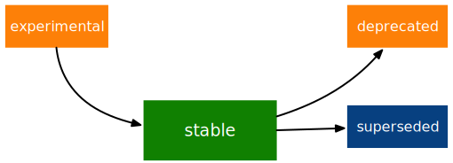

# Lifecycle {#sec-lifecycle}

```{r, echo = FALSE}
source("common.R")
```

This chapter is about managing the evolution of your package.
The trickiest part of managing change is balancing the interests of various stakeholders:

-   The maintainer(s), which includes you and possibly others, especially in the future.

-   The existing users, which could be just you or a small group of colleagues or it could be tens or hundreds of thousands of people.

-   The future users, which hopefully includes the existing users, but could potentially include many more people.

It's impossible to optimize for all of these folks, all of the time, all at once.
So we'll describe how we think about various trade-offs.
Even if your priorities differ from those of the tidyverse team, this chapter should still help you identify issues you want to consider.

Very few users complain when a package gains features or gets a bug fix.
Instead, we're mostly going to talk about so-called breaking changes, such as removing a function or narrowing the acceptable inputs for a function.
In @sec-lifecycle-breaking-change-definition, we explore how to determine whether something is a breaking change or, more realistically, to gauge where it lies on a spectrum of "breakingness".
Even though it can be painful, sometimes a breaking change is beneficial for the long-term health of a package (@sec-lifecycle-breaking-change-pros-cons).

Since change is inevitable, the kindest thing you can do for your users is to communicate clearly and help them adapt to change.
Several practices work together to achieve this:

-   Package version number: The main form of user-facing change is a package release (@sec-lifecycle-evolution).
    Be intentional about what sort of changes are included in, e.g., a patch release versus a major release (@sec-lifecycle-version-number, @sec-lifecycle-release-type).

-   Lifecycle stage: be explicit when a function or argument is regarded as experimental, superseded, or deprecated, as opposed to stable (the assumed default) (@sec-lifecycle-stages-and-package).

-   Deprecation process: enact change in a phased way, which makes it easier for users to adjust their code (@sec-lifecycle-stages-and-package).

## Package evolution {#sec-lifecycle-evolution}

First we should establish a working definition of what it means for your package to change.
Technically, you could say that the package has changed every time any file in its source changes.
This level of pedantry isn't terribly useful, though.
The smallest increment of change that's meaningful is probably a Git commit.
This represents a specific state of the source package that can be talked about, installed from, compared to, subjected to `R CMD check`, reverted to, and so on.
This level of granularity is really only of interest to developers.
But the package states accessible via the Git history are genuinely useful for the maintainer, so if you needed any encouragement to be more intentional with your commits, let this be it.

The primary signal of meaningful change is to increment the package version number and release it, for some definition of release, such as releasing on CRAN (@sec-release).
Recall that this important piece of metadata lives in the `Version` field of the `DESCRIPTION` file:

``` yaml
Package: usethis
Title: Automate Package and Project Setup
Version: 2.1.6
...
```

If you visit the CRAN landing page for usethis, you can access its history via *Downloads \> Old sources \> [usethis archive](https://cran.r-project.org/src/contrib/Archive/usethis/)*.
That links to a folder of package bundles (@sec-bundled-package), reflecting usethis's source for each version released on CRAN, presented in @tbl-usethis-versions:

```{r R.options = list(tidyverse.quiet = TRUE)}
#| echo: false
#| label: tbl-usethis-versions
#| tbl-cap: Releases of the usethis package.
library(tidyverse)
library(pkgsearch)
cran_package_history("usethis") |> 
  select(Version, Date = `Date/Publication`) |> 
  knitr::kable(row.names = FALSE)
```

This is the type of package evolution we're going to address in this chapter.
In @sec-lifecycle-version-number, we'll delve into the world of software version numbers, which is a richer topic than you might expect.
R also has some specific rules and tools around package version numbers.
Finally, we'll explain the conventions we use for the version numbers of tidyverse packages (@sec-lifecycle-version-number-tidyverse).

But first, this is a good time to revisit a resource we first pointed out in @sec-source-package, when introducing the different states of an R package.
Recall that the (unofficial) `cran` organization on GitHub provides a read-only history of all CRAN packages.
For example, you can get a different view of usethis's released versions at <https://github.com/cran/usethis/>.

The archive provided by CRAN itself allows you to download older versions of usethis as `.tar.gz` files, which is useful if you truly want to get your hands on the source of an older version.
However, if you just want to quickly check something about a version or compare two versions of usethis, the read-only GitHub mirror is much more useful.
Each commit in this repo's history represents a CRAN release, which makes it easy to see exactly what changed: <https://github.com/cran/usethis/commits/HEAD>.
Furthermore, you can browse the state of all the package's source files at any specific version, such as [usethis's initial release at version 1.0.0](https://github.com/cran/usethis/tree/1.0.0)[^lifecycle-1].

[^lifecycle-1]: It's unusual for an initial release to be version 1.0.0, but remember that usethis was basically carved out of a very mature package (devtools).

This information is technically available from the repository where usethis is actually developed (<https://github.com/r-lib/usethis>).
But you have to work much harder to zoom out to the level of CRAN releases, amid the clutter of the small incremental steps in which development actually unfolds.
These three different views of usethis's evolution are all useful for different purposes:

-   <https://cran.r-project.org/src/contrib/Archive/usethis/>: the official CRAN package bundles.

-   <https://github.com/cran/usethis/commits/HEAD>: the unofficial read-only CRAN mirror, obtained by unpacking CRAN's bundles.

-   <https://github.com/r-lib/usethis/commits/HEAD>: the official development home for usethis.

## Package version number {#sec-lifecycle-version-number}

Formally, an R package version is a sequence of at least two integers separated by either `.` or `-`.
For example, `1.0` and `0.9.1-10` are valid versions, but `1` and `1.0-devel` are not.
Base R offers the `package_version()` function to parse a package version string into a proper S3 class by the same name.
This class makes it easier to do things like compare versions.

```{r}
#| error: true
package_version(c("1.0", "0.9.1-10"))
class(package_version("1.0"))

# these versions are not allowed for an R package
package_version("1")
package_version("1.0-devel")

# comparing package versions
package_version("1.9") == package_version("1.9.0")
package_version("1.9") < package_version("1.9.2")
package_version(c("1.9", "1.9.2")) < package_version("1.10")
```

The last examples above make it clear that R considers version `1.9` to be equal to `1.9.0` and to be less than `1.9.2`.
And both `1.9` and `1.9.2` are less than `1.10`, which you should think of as version "one point ten", not "one point one zero".

If you're skeptical that the `package_version` class is really necessary, check out this example:

```{r}
"2.0" > "10.0"
package_version("2.0") > package_version("10.0")
```

The string `2.0` is considered to be greater than the string `10.0`, because the character `2` comes after the character `1`.
By parsing version strings into proper `package_version` objects, we get the correct comparison, i.e. that version `2.0` is less than version `10.0`.

R offers this support for working with package versions, because it's necessary, for example, to determine whether package dependencies are satisfied (@sec-description-imports-suggests-minium-version).
Under-the-hood, this tooling is used to enforce minimum versions recorded like this in `DESCRIPTION`:

``` yaml
Imports:
    dplyr (>= 1.0.0),
    tidyr (>= 1.1.0)
```

In your own code, if you need to determine which version of a package is installed, use `utils::packageVersion()`[^lifecycle-3]:

[^lifecycle-3]: As with `package_version()`, in package code, you should use the `utils::packageVersion()` form and list the utils package in `Imports`.

```{r}
packageVersion("usethis")
str(packageVersion("usethis"))

packageVersion("usethis") > package_version("10.0")
packageVersion("usethis") > "10.0"
```

The return value of `packageVersion()` has the `package_version` class and is therefore ready for comparison to other version numbers.
Note the last example where we seem to be comparing a version number to a string.
How can we get the correct result without explicitly converting `10.0` to a package version?
It turns out this conversion is automatic as long as one of the comparators has the `package_version` class.

## Tidyverse package version conventions {#sec-lifecycle-version-number-tidyverse}

R considers `0.9.1-10` to be a valid package version, but you'll never see a version number like that for a tidyverse package.
Here is our recommended framework for managing the package version number:

-   Always use `.` as the separator, never `-`.

-   A released version number consists of three numbers, `<major>.<minor>.<patch>`.
    For version number `1.9.2`, `1` is the major number, `9` is the minor number, and `2` is the patch number.
    Never use versions like `1.0`.
    Always spell out the three components, `1.0.0`.

-   An in-development package has a fourth component: the development version.
    This should start at 9000.
    The number 9000 is arbitrary, but provides a clear signal that there's something different about this version number.
    There are two reasons for this practice: First, the presence of a fourth component makes it easy to tell if you're dealing with a released or in-development version.
    Also, the use of the fourth place means that you're not limited to what the next released version will be.
    `0.0.1`, `0.1.0`, and `1.0.0` are all greater than `0.0.0.9000`.

    Increment the development version, e.g. from `9000` to `9001`, if you've added an important feature and you (or others) need to be able to detect or require the presence of this feature.
    For example, this can happen when two packages are developing in tandem.
    This is generally the only reason that we bother to increment the development version.
    This makes in-development versions special and, in some sense, degenerate.
    Since we don't increment the development component with each Git commit, the same package version number is associated with many different states of the package source, in between releases.

The advice above is inspired in part by [Semantic Versioning](https://semver.org) and by the [X.Org](https://www.x.org/releases/X11R7.7/doc/xorg-docs/Versions.html) versioning schemes.
Read them if you'd like to understand more about the standards of versioning used by many open source projects.
But we should underscore that our practices are inspired by these schemes and are somewhat less regimented.
Finally, know that other maintainers follow different philosophies on how to manage the package version number.

## Backward compatibility and breaking change {#sec-lifecycle-breaking-change-definition}

The version number of your package is always increasing, but it's more than just an incrementing counter -- the way the number changes with each release can convey information about the nature of the changes.
The transition from 0.3.1 to 0.3.2, which is a patch release, has a very different vibe from the transition from 0.3.2 to 1.0.0, which is a major release.
A package version number can also convey information about where the package is in its lifecycle.
For example, the version 1.0.0 often signals that the public interface of a package is considered stable.

How do you decide which type of release to make, i.e. which component(s) of the version should you increment?
A key concept is whether the associated changes are backward compatible, meaning that pre-existing code will still "work" with the new version.
We put "work" in quotes, because this designation is open to a certain amount of interpretation.
A hardliner might take this to mean "the code works in exactly the same way, in all contexts, for all inputs".
A more pragmatic interpretation is that "the code still works, but could produce a different result in some edge cases".
A change that is not backward compatible is often described as a *breaking* change.
Here we're going to talk about how to assess whether a change is breaking.
In @sec-lifecycle-breaking-change-pros-cons we'll talk about how to decide if a breaking change is worth it.

In practice, backward compatibility is not a clear-cut distinction.
It is typical to assess the impact of a change from a few angles:

-   Degree of change in behaviour.
    The most extreme is to make something that used to be possible into an error, i.e. impossible.

-   How the changes fit into the design of the package.
    A change to low-level infrastructure, such as a utility that gets called in all user-facing functions, is more fraught than a change that only affects one parameter of a single function.

-   How much existing usage is affected.
    This is a combination of how many of your users will perceive the change and how many existing users there are to begin with.

Here are some concrete examples of breaking change:

-   Removing a function

-   Removing an argument

-   Narrowing the set of valid inputs to a function

Conversely, these are usually not considered breaking:

-   Adding a function.
    Caveat: there's a small chance this could introduce a conflict in user code.

-   Adding an argument.
    Caveat: this could be breaking for some usage, e.g. if a user is relying on position-based argument matching.
    This also requires some care in a function that accepts `…`.

-   Increasing the set of valid inputs.

-   Changing the text of a print method or error.
    Caveat: This can be breaking if other packages depend on yours in fragile ways, such as building logic or a test that relies on an error message from your package.

-   Fixing a bug.
    Caveat: It really can happen that users write code that "depends" on a bug.
    Sometimes such code was flawed from the beginning, but the problem went undetected until you fixed your bug.
    Other times this surfaces code that uses your package in an unexpected way, i.e. it's not necessarily *wrong*, but neither is it *right*.

If reasoning about code was a reliable way to assess how it will work in real life, the world wouldn't have so much buggy software.
The best way to gauge the consequences of a change in your package is to try it and see what happens.
In addition to running your own tests, you can also run the tests of your reverse dependencies and see if your proposed change breaks anything.
The tidyverse team has a fairly extensive set of tools for running so-called reverse dependency checks (@sec-release-revdep-checks), where we run `R CMD check` on all the packages that depend on ours.
Sometimes we use this infrastructure to study the impact of a potential change, i.e. reverse dependency checks can be used to guide development, not only as a last-minute, pre-release check.
This leads to yet another, deeply pragmatic definition of a breaking change:

> A change is breaking if it causes a CRAN package that was previously passing `R CMD check` to now fail AND the package's original usage and behavior is correct.

This is obviously a narrow and incomplete definition of breaking change, but at least it's relatively easy to get solid data.

Hopefully we've made the point that backward compatibility is not always a clearcut distinction.
But hopefully we've also provided plenty of concrete criteria to consider when thinking about whether a change could break someone else's code.

## Major vs minor vs patch release {#sec-lifecycle-release-type}

Recall that a version number will have one of these forms, if you're following the conventions described in @sec-lifecycle-version-number-tidyverse:

``` text
<major>.<minor>.<patch>        # released version
<major>.<minor>.<patch>.<dev>  # in-development version
```

If the current package version is `0.8.1.9000`, here's our advice on how to pick the version number for the next release:

-   Increment `patch`, e.g. `0.8.2` for a **patch release**: you've fixed bugs, but you haven't added any significant new features and there are no breaking changes.
    For example, if we discover a show-stopping bug shortly after a release, we would make a quick patch release with the fix.
    Most releases will have a patch number of 0.

-   Increment `minor`, e.g. `0.9.0`, for a **minor release**.
    A minor release can include bug fixes, new features, and changes that are backward compatible[^lifecycle-4].
    This is the most common type of release.
    It's perfectly fine to have so many minor releases that you need to use two (or even three!) digits, e.g. `1.17.0`.

-   Increment `major`, e.g. `1.0.0`, for a **major release**.
    This is the most appropriate time to make changes that are not backward compatible and that are likely to affect many users.
    The `1.0.0` release has special significance and typically indicates that your package is feature complete with a stable API.

[^lifecycle-4]: For some suitably pragmatic definition of "backward compatible".

The trickiest decision you are likely to face is whether a change is "breaking" enough to deserve a major release.
For example, if you make an API-incompatible change to a rarely-used part of your code, it may not make sense to increase the major number.
But if you fix a bug that many people depend on (it happens!), it will feel like a breaking change to those folks.
It's conceivable that such a bug fix could merit a major release.

We're mostly dwelling on breaking change, but let's not forget that sometimes you also add exciting new features to your package.
From a marketing perspective, you probably want to save these for a major release, because your users are more likely to learn about the new goodies, from reading a blog post or `NEWS`.

Here are a few tidyverse blog posts that have accompanied different types of package releases:

-   Major release: [dplyr 1.0.0](https://www.tidyverse.org/blog/2020/06/dplyr-1-0-0/), [purrr 1.0.0](https://www.tidyverse.org/blog/2022/12/purrr-1-0-0/), [pkgdown 2.0.0](https://www.tidyverse.org/blog/2021/12/pkgdown-2-0-0/), [readr 2.0.0](https://www.tidyverse.org/blog/2021/07/readr-2-0-0/)

-   Minor release: [stringr 1.5.0](https://www.tidyverse.org/blog/2022/12/stringr-1-5-0/), [ggplot2 3.4.0](https://www.tidyverse.org/blog/2022/11/ggplot2-3-4-0/)

-   Patch release: These are usually not considered worthy of a blog post.

### Package version mechanics

Your package should start with version number `0.0.0.9000`.
`usethis::create_package()` starts with this version, by default.

From that point on, you can use `usethis::use_version()` to increment the package version.
When called interactively, with no argument, it presents a helpful menu:

```{r}
#| eval: false
usethis::use_version()
#> Current version is 0.1.
#> What should the new version be? (0 to exit) 
#> 
#> 1: major --> 1.0
#> 2: minor --> 0.2
#> 3: patch --> 0.1.1
#> 4:   dev --> 0.1.0.9000
#> 
#> Selection: 
```

In addition to incrementing `Version` in `DESCRIPTION` (@sec-description), `use_version()` also adds a new heading in `NEWS.md` (@sec-news).

## Pros and cons of breaking change {#sec-lifecycle-breaking-change-pros-cons}

The big difference between major and minor releases is whether or not the code is backward compatible.
In the general software world, the idea is that a major release signals to users that it may contain breaking changes and they should only upgrade when they have the capacity to deal with any issues that emerge.

Reality is a bit different in the R community, because of the way most users manage package installation.
If we're being honest, most R users don't manage package versions in a very intentional way.
Given the way `update.packages()` and `install.packages()` work, it's quite easy to upgrade a package to a new major version without really meaning to, especially for dependencies of the target package.
This, in turn, can lead to unexpected exposure to breaking changes in code that previously worked.
This unpleasantness has implications both for users and for maintainers.

If it's important to protect a data product against change in its R package dependencies, we recommend the use of a project-specific package library.
In particular, we like to implement this approach using the [renv package](https://rstudio.github.io/renv/).
This supports a lifestyle where a user's default package library is managed in the usual, somewhat haphazard way.
But any project that has a specific, higher requirement for reproducibility is managed with renv.
This keeps package updates triggered by work in project A from breaking the code in project B and also helps with collaboration and deployment.

We suspect that project-specific libraries and tools like renv are currently under-utilized in the R world.
That is, lots of R users still use just one package library.
Therefore, package maintainers still need to exercise considerable caution and care when they introduce breaking changes, regardless of what's happening with the version number.
In @sec-lifecycle-stages-and-package, we describe how tidyverse packages approach this, supported by tools in the lifecycle package.

As with dependencies (@sec-dependencies-pros-cons), we find that extremism isn't a very productive stance.
Extreme resistance to breaking change puts a significant drag on ongoing development and maintenance.
Backward compatible code tends to be harder to work with because of the need to maintain multiple paths to support functionality from previous versions.
The harder you strive to maintain backward compatibility, the harder it is to develop new features or fix old mistakes.
This, in turn, can discourage adoption by new users and can make it harder to recruit new contributors.
On the other hand, if you constantly make breaking changes, users will become very frustrated with your package and will decide they're better off without it.
Find a happy medium.
Be concerned about backward compatibility, but don't let it paralyze you.

The importance of backward compatibility is directly proportional to the number of people using your package: you are trading your time and pain for that of your users.
There are good reasons to make backward incompatible changes.
Once you've decided it's necessary, your main priority is to use a humane process that is respectful of your users.

## Lifecycle stages and supporting tools {#sec-lifecycle-stages-and-package}

The tidyverse team's approach to package evolution has become more structured and deliberate over the years.
The associated tooling and documentation lives in the lifecycle package ([lifecycle.r-lib.org](https://lifecycle.r-lib.org/index.html)).
The approach relies on two major components:

-   Lifecycle stages, which can be applied at different levels, i.e. to an individual argument or function or to an entire package.

-   Conventions and functions to use when transitioning a function from one lifecycle stage to another.
    The deprecation process is the one that demands the most care.

We won't duplicate too much of the lifecycle documentation here.
Instead, we highlight the general principles of lifecycle management and present specific examples of successful lifecycle "moves".

### Lifecycle stages and badges

```{r}
#| label: fig-lifecycle-stages
#| echo: false
#| out.width: 75%
#| fig.cap: >
#|   The four primary stages of the tidyverse lifecycle: stable, deprecated,
#|   superseded, and experimental.
#| fig-alt: >
#|   A diagram showing the transitions between the four main stages:
#|   experimental can become stable and stable can become deprecated or
#|   superseded.

```

The four lifecycle stages are:

-   Stable.
    This is the default stage and signals that users should feel comfortable relying on a function or package.
    Breaking changes should be rare and should happen gradually, giving users sufficient time and guidance to adapt their usage.

-   Experimental.
    This is appropriate when a function is first introduced and the maintainer reserves the right to change it without much of a deprecation process.
    This is the implied stage for any package with a major version of `0`, i.e. that hasn't had a `1.0.0` release yet.

-   Deprecated.
    This applies to functionality that is slated for removal.
    Initially, it still works, but triggers a deprecation warning with information about preferred alternatives.
    After a suitable amount of time and with an appropriate version change, such functions are typically removed.

-   Superseded.
    This is a softer version of deprecated, where legacy functionality is preserved as if in a time capsule.
    Superseded functions receive only minimal maintenance, such as critical bug fixes.

You can get much more detail in `vignette("stages", package = "lifecycle")`.

The lifecycle stage is often communicated through a badge.
If you'd like to use lifecycle badges, call `usethis::use_lifecycle()` to do some one-time setup:

```{r}
#| include: false
#| cache: false
temp_pkg <- fs::path_temp("somepackage")
withr::with_options(
  list(usethis.description = NULL),
  usethis::create_package(
    temp_pkg, open = FALSE, rstudio = TRUE, check_name = FALSE
  )
)
op <- usethis::proj_get()
usethis::proj_set(temp_pkg)
usethis::use_package_doc(open = FALSE)
```

```{r}
usethis::use_lifecycle()
```

```{r}
#| include: false
usethis::proj_set(op)
unlink(temp_pkg)
```

This leaves you in a position to use lifecycle badges in help topics and to use lifecycle functions, as described in the remainder of this section.

For a function, include the badge in its `@description` block.
Here's how we indicate that `dplyr::top_n()` is superseded:

```{r}
#' Select top (or bottom) n rows (by value)
#'
#' @description
#' `r lifecycle::badge("superseded")`
#' `top_n()` has been superseded in favour of ...
```

For a function argument, include the badge in the `@param` tag.
Here's how the deprecation of `readr::write_file(path =)` is documented:

```{r}
#' @param path `r lifecycle::badge("deprecated")` Use the `file` argument
#'   instead.
```

Call `usethis::use_lifecycle_badge()` if you want to use a badge in `README` to indicate the lifecycle of an entire package (@sec-readme).

If the lifecycle of a package is stable, it's not really necessary to use a badge, since that is the assumed default stage.
Similarly, we typically only use a badge for a function if its stage differs from that of the associated package and likewise for an argument and the associated function.

### Deprecating a function

If you're going to remove or make significant changes to a function, it's usually best to do so in phases.
Deprecation is a general term for the situation where something is explicitly discouraged, but it has not yet been removed.
Various deprecation scenarios are explored in `vignette("communicate", package = "lifecycle")`; we're just going to cover the main idea here.

The `lifecycle::deprecate_warn()` function can be used inside a function to inform your user that they're using a deprecated feature and, ideally, to let them know about the preferred alternative.
In this example, the `plus3()` function is being replaced by `add3()`:

```{r R.options = list("lifecycle:::calling_package" = "somepackage", "lifecycle_verbosity" = "warning")}
# new function
add3 <- function(x, y, z) {
  x + y + z
}

# old function
plus3 <- function(x, y, z) {
  lifecycle::deprecate_warn("1.0.0", "plus3()", "add3()")
  add3(x, y, z)
}

plus3(1, 2, 3)
```

At this point, a user who calls `plus3()` sees a warning explaining that the function has a new name, but we go ahead and call `add3()` with their inputs.
Pre-existing code still "works".
In some future major release, `plus3()` could be removed entirely.

`lifecycle::deprecate_warn()` and friends have a few features that are worth highlighting:

-   The warning message is built up from inputs like `when`, `what`, `with`, and `details`, which gives deprecation warnings a predictable form across different functions, packages, and time.
    The intent is to reduce the cognitive load for users who may already be somewhat stressed.

-   By default, a specific warning is only issued once every 8 hours, in an effort to cause just the right amount of aggravation.
    The goal is to be just annoying enough to motivate the user to update their code before the function or argument goes away, but not so annoying that they fling their computer into the sea.
    Near the end of the deprecation process, the `always` argument can be set to `TRUE` to warn on every call.

-   If you use `lifecycle::deprecate_soft()` (instead of `deprecate_warn()`), a warning is only issued if the person reading it is the one who can actually do something about it, i.e. update the offending code.
    If a user calls a deprecated function indirectly, i.e. because they are using a package that's using a deprecated function, by default that user doesn't get a warning.
    (But the maintainer of the guilty package will see these warnings in their test results.)

Here's a hypothetical schedule for removing a function `fun()`:

-   Package version `1.5.0`: `fun()` exists.
    The lifecycle stage of the package is stable, as indicated by its post-`1.0.0` version number and, perhaps, a package-level badge.
    The lifecycle stage of `fun()` is also stable, by extension, since it hasn't been specifically marked as experimental.

-   Package version `1.6.0`: The deprecation process of `fun()` begins.
    We insert a badge in its help topic:

    ```{r, eval = FALSE}
    #' @description
    #' `r lifecycle::badge("deprecated")`
    ```

    In the body of `fun()`, we add a call to `lifecycle::deprecate_warn()` to inform users about the situation.
    Otherwise, `fun()` still works as it always has.

-   Package version `1.7.0` or `2.0.0`: `fun()` is removed.
    Whether this happens in a minor or major release will depend on the context, i.e. how widely used this package and function are.

If you're using base R only, the `.Deprecated()` and `.Defunct()` functions are the closest substitutes for `lifecycle::deprecate_warn()` and friends.

### Deprecating an argument

`lifecycle::deprecate_warn()` is also useful when deprecating an argument.
In this case, it's also handy to use `lifecycle::deprecated()` as the default value for the deprecated argument.
Here we continue an example from above, i.e. the switch from `path` to `file` in `readr::write_file()`:

```{r}
#| eval: false
write_file <- function(x,
                       file,
                       append = FALSE,
                       path = deprecated()) {
  if (is_present(path)) {
    lifecycle::deprecate_warn("1.4.0", "write_file(path)", "write_file(file)")
    file <- path
  }
  ...
}
```

Here's what a user sees if they use the deprecated argument:

```{r}
readr::write_file("hi", path = tempfile("lifecycle-demo-"))
```

The use of `deprecated()` as the default accomplishes two things.
First, if the user reads the documentation, this is a strong signal that an argument is deprecated.
But `deprecated()` also has benefits for the package maintainer.
Inside the affected function, you can use `lifecycle::is_present()` to determine if the user has specified the deprecated argument and proceed accordingly, as shown above.

If you're using base R only, the `missing()` function has substantial overlap with `lifecycle::is_present()`, although it can be trickier to finesse issues around default values.

### Deprecation helpers

Sometimes a deprecation affects code in multiple places and it's clunky to inline the full logic everywhere.
In this case, you might create an internal helper to centralize the deprecation logic.

This happened in googledrive, when we changed how to control the package's verbosity.
The original design let the user specify this in every single function, via the `verbose = TRUE/FALSE` argument.
Later, we decided it made more sense to use a global option to control verbosity at the package level.
This is a case of (eventually) removing an argument, but it affects practically every single function in the package.
Here's what a typical function looks like after starting the deprecation process:

```{r}
#| eval: false
drive_publish <- function(file, ..., verbose = deprecated()) {
  warn_for_verbose(verbose)
  # rest of the function ...
}
```

Note the use of `verbose = deprecated()`.
Here's a slightly simplified version of `warn_for_verbose()`:

```{r}
#| eval: false
warn_for_verbose <- function(verbose = TRUE,
                             env = rlang::caller_env(),
                             user_env = rlang::caller_env(2)) {
  # This function is not meant to be called directly, so don't worry about its
  # default of `verbose = TRUE`.
  # In authentic, indirect usage of this helper, this picks up on whether
  # `verbose` was present in the **user's** call to the calling function.
  if (!lifecycle::is_present(verbose) || isTRUE(verbose)) {
    return(invisible())
  }

  lifecycle::deprecate_warn(
    when = "2.0.0",
    what = I("The `verbose` argument"),
    details = c(
      "Set `options(googledrive_quiet = TRUE)` to suppress all googledrive messages.",
      "For finer control, use `local_drive_quiet()` or `with_drive_quiet()`.",
      "googledrive's `verbose` argument will be removed in the future."
    ),
    user_env = user_env
  )
  # only set the option during authentic, indirect usage
  if (!identical(env, global_env())) {
    local_drive_quiet(env = env)
  }
  invisible()
}
```

The user calls a function, such as `drive_publish()`, which then calls `warn_for_verbose()`.
If the user leaves `verbose` unspecified or if they request `verbose = TRUE` (default behavior), `warn_for_verbose()` does nothing.
But if they explicitly ask for `verbose = FALSE`, we throw a warning with advice on the preferred way to suppress googledrive's messaging.
We also go ahead and honor their wishes for the time being, via the call to `googledrive::local_drive_quiet()`.
In the next major release, the `verbose` argument can be removed everywhere and this helper can be deleted.

### Dealing with change in a dependency

What if you want to use functionality in a new version of another package?
Or the less happy version: what if changes in another package are going to break your package?
There are a few possible scenarios, depending on whether the other package has been released and the experience you want for your users.
We'll start with the simple, happier case of using features newly available in a dependency.

If the other package has already been released, you could bump the minimum version you declare for it in `DESCRIPTION` and use the new functionality unconditionally.
This also means that users who update your package will be forced to update the other package, which you should at least contemplate.
Note, also, that this only works for a dependency in `Imports`.
While it's a good idea to record a minimum version for a suggested package, it's not generally enforced the same as for `Imports`.

If you don't want to require your users to update this other package, you could make your package work with both new and old versions.
This means you'll check its version at run-time and proceed accordingly.
Here is a sketch of how that might look in the context of an existing or new function:

```{r}
#| eval: false
your_existing_function <- function(..., cool_new_feature = FALSE) {
  if (isTRUE(cool_new_feature) && packageVersion("otherpkg") < "1.0.0") {
    message("otherpkg >= 1.0.0 is needed for cool_new_feature")
    cool_new_feature <- FALSE
  }
  # the rest of the function
}

your_new_function <- function(...) {
  if (packageVersion("otherpkg") < "1.0.0") {
    stop("otherpkg >= 1.0.0 needed for this function.")
  }
  # the rest of the function
}
```

Alternatively, this would also be a great place to use `rlang::is_installed()` and `rlang::check_installed()` with the `version` argument (see examples of usage in @sec-dependencies-in-suggests-r-code).

This approach can also be adapted if you're responding to not-yet-released changes that are coming soon in one of your dependencies.
It's helpful to have a version of your package that works both before and after the change.
This allows you to release your package at any time, even before the other package.
Sometimes you can refactor your code to make it work with either version of the other package, in which case you don't need to condition on the other package's version at all.
But sometimes you might really need different code for the two versions.
Consider this example:

```{r}
#| eval: false
your_function <- function(...) {
  if (packageVersion("otherpkg") >= "1.3.9000") {
    otherpkg::their_new_function()
  } else {
    otherpkg::their_old_function()
  }
  # the rest of the function
}
```

The hypothetical minimum version of `1.3.9000` suggests a case where the development version of otherpkg already has the change you're responding to, which is a new function in this case.
Assuming `their_new_function()` doesn't exist in the latest release of otherpkg, you'll get a note from `R CMD check` stating that `their_new_function()` doesn't exist in otherpkg's namespace.
If you're submitting such a version to CRAN, you can explain that you're doing this for the sake of backward and forward compatibility with otherpkg and they are likely to be satisfied.

### Superseding a function

The last lifecycle stage that we'll talk about is superseded.
This is appropriate when you feel like a function is no longer the preferred solution to a problem, but it has enough usage and history that you don't want to initiate the process of removing it.
Good examples of this are `tidyr::spread()` and `tidyr::gather()`.
Those functions have been superseded by `tidyr::pivot_wider()` and `tidyr::pivot_longer()`.
But some users still prefer the older functions and it's likely that they've been used a lot in projects that are not under active development.
Thus `spread()` and `gather()` are marked as superseded, they don't receive any new innovations, but they aren't at risk of removal.

A related phenomenon is when you want to change some aspect of a package, but you also want to give existing users a way to opt-in to the legacy behaviour.
The idea is to provide users a band-aid they can apply to get old code working quickly, until they have the bandwidth to do a more thorough update (which might not ever happen, in some cases).
Here are some examples where legacy behaviour was preserved for users who opt-in:

-   In tidyr 1.0.0, the interface of `tidyr::nest()` and `tidyr::unnest()` changed.
    Most authentic usage can be translated to the new syntax, which tidyr does automatically, along with conveying the preferred modern syntax via a warning.
    But the old interface remains available via `tidyr::nest_legacy()` and `tidyr::unnest_legacy()`, which were marked superseded upon creation.

-   dplyr 1.1.0 takes advantage of a much faster algorithm for computing groups.
    But this speedier method also sorts the groups with respect to the C locale, whereas previously the system locale was used.
    The global option `dplyr.legacy_locale` allows a user to explicitly request the legacy behaviour.[^lifecycle-5]

-   The tidyverse packages have been standardizing on a common approach to name repair, which is implemented in `vctrs::vec_as_names()`.
    The vctrs package also offers `vctrs::vec_as_names_legacy()`, which makes it easier to get names repaired with older strategies previously used in packages like tibble, tidyr, and readxl.

-   readr 2.0.0 introduced a so-called second edition, marking the switch to a backend provided by the vroom package.
    Functions like `readr::with_edition(1, ...)` and `readr::local_edition(1)` make it easier for a user to request first edition behaviour for a specific bit of code or for a specific script.

[^lifecycle-5]: You can learn more about the analysis leading up to this change in <https://github.com/tidyverse/tidyups/blob/main/006-dplyr-group-by-ordering.md>.
