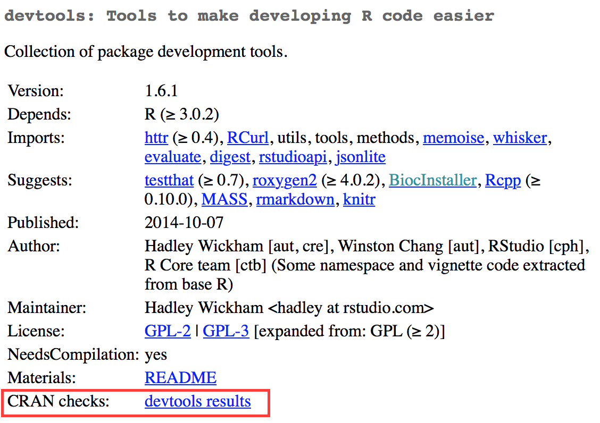

# Releasing to CRAN {#sec-release}

```{r, echo = FALSE}
source("common.R")
status("polishing")
```

## Introduction

We've been calling out CRAN-specific concerns throughout the book, on our journey through the various parts of a package, such as tests and examples.
In this chapter, we focus on the actual process of releasing a package to CRAN, for the first time or as an update.

The most concrete expression of our release process is the checklist produced by `usethis::use_release_issue()`.
This checklist is constantly-evolving and is responsive to a few characteristics of the package, so don't be shocked if you see something a bit different than what we show here.
The main concerns are fairly timeless and we'll use this checklist to help structure this chapter.

But first: note that you will have deep regrets if you approach preparing your package for CRAN as a separate activity that you do *after* completing the planned development for a release.
This advice is extremely relevant here:

> If it hurts, do it more often.
> -- Martin Fowler[^release-1]

[^release-1]: Fowler's blog post "FrequencyReducesDifficulty" is a great read on this topic, <https://martinfowler.com/bliki/FrequencyReducesDifficulty.html>.

In the current context, interpret this to mean that you should be running `R CMD check` regularly, preferably on multiple platforms, and promptly addressing any issues that surface.

Why would you want to do something that is painful more often?
Because it leads to less pain overall.
First, solving 5 problems is more than 5 times as hard as solving 1.
It's demoralizing to be blocked by several errors and the potential for unsavory interactions between them makes each one harder to isolate and fix.
Second, fast feedback tends to reduce your total number of mistakes.
Once you learn some lesson the hard way, you are unlikely to make that same mistake dozens of times elsewhere in your package.
Finally, practice makes perfect!
With greater exposure, you will get better at interpreting and responding to `R CMD check` results.

Another natural reaction is: why don't I eliminate this pain completely by not releasing my package on CRAN at all?
For certain types of packages, this may be the right call.
One such example is a personal package of helper functions.
Another example is a package that supports a specific organization, coupled with a reasonable method of distributing that package to its users.
The main reason to have your package on CRAN is to give your package greater reach.
The vast majority of R users only install packages from CRAN, either due to personal or company policy or just from a lack of awareness about alternatives.
CRAN provides discoverability, ease of installation, and a stamp of authenticity.
The CRAN submission process can be frustrating, but it has many payoffs, and this chapter aims to make it as painless as possible.

The release process we describe here is best used as a pre-flight checklist, that complements your ongoing efforts to keep your package passing R CMD check cleanly and CRAN-compliant.
There are two big realizations that often come with a CRAN release process:

-   If you've been turning a blind eye to WARNINGs and ERRORs from `R CMD check`, you really do have to study and eliminate those now.
    You should even eliminate as many NOTEs as possible.

-   Even if your package passes `R CMD check` cleanly on your machine, it can be eye-opening when it leaves these cozy, familiar surroundings and is, instead, checked on a remote server, configured by someone else, running an entirely different operating system.
    This is why it is so valuable to use a continuous integration service like GitHub Actions to regularly check your package on macOS, Windows, and Linux.

*TODO: update this list once the rest of the chapter has been revised.*

To get your package ready to release, follow these steps:

1.  Pick a version number.
2.  Run and document `R CMD check`.
3.  Check that you're aligned with CRAN policies.
4.  Update `README.md` and `NEWS.md`.
5.  Submit the package to CRAN.
6.  Prepare for the next version by updating version numbers.
7.  Publicise the new version.

## Decide the release type

When you call `use_release_issue()`, you'll be asked which type of release you intend to make (@sec-lifecycle-release-type).

```{r}
#| eval: false
> use_release_issue()
✔ Setting active project to '/Users/jenny/rrr/usethis'
Current version is 2.1.6.9000.
What should the release version be? (0 to exit) 

1: major --> 3.0.0
2: minor --> 2.2.0
3: patch --> 2.1.7
4:   dev --> 2.1.6.9001

Selection: 
```

This really boils down to which component of the version number is going to be incremented.
In our workflow, this planned version number is recorded in the GitHub issue that holds the release checklist, but we don't actually increment the version in `DESCRIPTION` until later in the process.

## Initial CRAN release: Special considerations

Every new package receives a higher level of scrutiny from CRAN.
In addition to the usual automated checks, new packages are also reviewed by a human, which inevitably introduces a certain amount of subjectivity and randomness.
There are many packages on CRAN that would not be accepted in their current form, if submitted today as a completely new package.
This isn't meant to discourage you.
But you should be aware that, just because you see some practice in an established package (or even in base R), that doesn't mean you can do the same in your new package.
There's a reason the community maintains lists of common "gotchas" for new packages; we have all learned the hard way.

```{r}
#| eval: false
usethis:::release_checklist("0.0.1", on_cran = FALSE)
```

If your package is not yet on CRAN, the checklist begins with a special section that looks something like this:

First release

-   [ ] `usethis::use_cran_comments()`
-   [ ] Update (aspirational) install instructions in `README`
-   [ ] Proofread `Title:` and `Description:`
-   [ ] Check that all exported functions have `@returns` and `@examples`
-   [ ] Check that `Authors@R:` includes a copyright holder (role 'cph')
-   [ ] Check licensing of included files
-   [ ] Review <https://github.com/DavisVaughan/extrachecks>

`usethis::use_cran_comments()` initiates a file to hold submission comments for your package.
It's very barebones at first, e.g.:

    ## R CMD check results

    0 errors | 0 warnings | 1 note

    * This is a new release.

In subsequent releases, this file becomes less pointless; for example, it is where we report the results of reverse dependency checks.
This is not a place to wax on with long explanations about your submission.
In general, you should eliminate the need for such explanations, especially for an initial submission.

We highly recommend that your package have a README file (@sec-readme).
If it does, this is a good time to check the installation instructions provided there.
You may need to switch from instructions to install it from GitHub, in favor of installing from CRAN, in anticipation of your package's acceptance.

The `Title` and `Description` fields of `DESCRIPTION` are real hotspots for nitpicking during CRAN's human review.
Carefully review the advice given in @sec-description-title-and-description.
Also check that `Authors@R` includes a copyright holder, indicated by the 'cph' role.
The two most common scenarios are that you add 'cph' to your other roles (probably 'cre' and 'aut') or that you add your employer to `Authors@R:` with the 'cph' and, perhaps, 'fnd' role.

Double check that each of your exported functions is documented and, in particular, that it documents its return value (with the `@returns` tag, @sec-man-returns) and has an `@examples` section (@sec-man-examples).
If you have examples that cannot be run on CRAN, you absolutely must use the techniques in @sec-man-examples-dependencies-conditional-execution to express the relevant pre-conditions properly.
Do not take shortcuts, such as having no examples, commenting out your examples, or putting all of your examples inside `\dontrun{}`.

If you have embedded third party code in your package, check that you are correctly abiding by and declaring its license (@sec-code-you-bundle).

Finally, take advantage of any list of *ad hoc* checks that other package developers have recently experienced with CRAN.
At the time of writing, <https://github.com/DavisVaughan/extrachecks> is a good place to find such first-hand reports.
Reading such a list and preemptively modifying your package can often make the difference between a smooth acceptance and a frustrating process requiring multiple attempts.

## Prepare for release

```{r}
#| eval: false
usethis:::release_checklist("0.0.1", on_cran = TRUE)
usethis:::release_checklist("0.1.0", on_cran = TRUE)
usethis:::release_checklist("1.0.0", on_cran = TRUE)
```

Now we'll review the main checklist items for a minor or major release of a package that is already on CRAN.
Many of these items also appear in the checklist for a patch or initial release.

### Keeping up with change

-   [ ] Check current CRAN check results
-   [ ] Check if any deprecation processes should be advanced, as described in [Gradual deprecation](https://lifecycle.r-lib.org/articles/communicate.html#gradual-deprecation)
-   [ ] [Polish NEWS](https://style.tidyverse.org/news.html#news-release)
-   [ ] `urlchecker::url_check()`

These first few items confirm that your package is keeping up with its surroundings and with itself.
The first item, "Check current CRAN check results", will be a hyperlink to the CRAN check results for version of the package that is currently on CRAN.
If there are any WARNINGs or ERRORs (or even NOTEs) there, you should investigate and determine what's going on.
Occasionally there can be an intermittent hiccup at CRAN, but generally speaking, any result other than "OK" is something you should address with the release you are preparing.
You may discover your package is in a dysfunctional state due to changes in base R, CRAN policies, CRAN tooling, or packages you depend on.

If you are in the process of deprecating a function or an argument, a minor or major release is a good time to consider moving that process along as described in @sec-lifecycle-stages-and-package.
This is also a good time to look at all the `NEWS` bullets that have accumulated since the last release ("Polish NEWS").
Even if you've been diligent about jotting down all the news-worthy changes, chances are these bullets will benefit from some re-organization and editing for consistency and clarity (@sec-news).

Another very important check is to run `urlchecker::url_check()`.
CRAN's URL checks are described at <https://cran.r-project.org/web/packages/URL_checks.html> and are implemented by code that ships with R itself.
However, these checks are not exposed in a very usable way.
The urlchecker package was created to address this and exposes CRAN's URL-checking logic in the `url_check()` function.
The main problems that surface tend to be URLs that don't work anymore or URLs that use redirection.
Obviously, you should update or remove any URL that no longer exists.
Redirection, however, is trickier.
If the status code is "301 Moved Permanently", CRAN's view is that your package should use the redirected URL.
The problem is that many folks don't follow [RFC7231](https://www.rfc-editor.org/rfc/rfc7231#section-6.4.2) to the letter and use this sort of redirect even when they have a different intent, i.e. their intent is to publicize a provide a stable, user-friendly URL than then redirects to something less user-friendly or more volatile.
If a legitimate URL you want to use runs afoul of CRAN's checks, you'll have to choose between a couple of less-than-appealing options.
You could try to explain the situation to CRAN, but this requires human review.
Or you can convert such URLs into non-hyperlinked, verbatim text.
Note also that even though urlchecker is using the same *code* as CRAN, your local results may still differ from CRAN's, due to differences in other ambient conditions, such as environment variables and system capabilities.

### Double and triple `R CMD check`ing

-   [ ] `devtools::check(remote = TRUE, manual = TRUE)`
-   [ ] `devtools::check_win_devel()`
-   [ ] `rhub::check_for_cran()`

Next comes a series of items related to `R CMD check`.
Remember that this should not be the first time you've run `R CMD check` since the previous release!
Hopefully, you are running `R CMD check` often during local development and are using a continuous integration service, like GitHub Actions.
This is a last-minute, final reminder to re-check your package:

-   Locally, presumably with the current version of R

-   On CRAN's win-builder service, against a development version of R

-   On r-hub, with its default list of CRAN platforms

Note that this list implicitly reflects that most of the tidyverse team develops primarily on macOS, i.e. that operating system is well-covered with our local checks.
If your primary development machine is not macOS, you may also want to use `devtools::check_mac_release()` to cover that platform.

If a package has compiled code (literally, if it has a `src/` directory), the checklist includes some additional checks on R-hub, such as checking with sanitizers (not shown).

### Reverse dependency checks {#sec-release-revdep-checks}

-   [ ] `revdepcheck::revdep_check(num_workers = 4)`

This innocuous checklist item can actually represent a considerable amount of effort.
At a high-level, checking your reverse dependencies ("revdeps") breaks down into:

-   Form a list of your reverse dependencies.

-   Run `R CMD check` on each one.

-   Make sure you haven't broken someone else's package with the planned changes in your package.

Each of these steps can require considerable work and judgment.
So, if you have no reverse dependencies, you should rejoice that you can skip this step.
If you only have a couple of reverse dependencies, you can probably do this "by hand", i.e. download each package's source and run `R CMD check`.

Here we explain ways to do reverse dependency checks at scale, which is the problem we face.
Some of the packages maintained by our team have thousands of reverse dependencies and even some of the lower-level packages have hundreds.
We have to approach this in an automated fashion and this section will be most useful to other maintainers in the same boat.

All of our reverse dependency tooling is concentrated in the revdepcheck package (<https://revdepcheck.r-lib.org/>).
Do this when you're ready to do revdep checks for the first time:

```{r}
#| eval: false
usethis::use_revdep()
```

This does some one-time setup in your package's `.gitignore` and `.Rbuildignore` files.
You will also see this reminder to actually perform revdep checks like so, as the checklist item suggests:

```{r}
#| eval: false
revdepcheck::revdep_check(num_workers = 4)
```

This runs `⁠R CMD check⁠` on all of your reverse dependencies, with our recommendation to use 4 parallel workers to speed things along.
The output looks something like this:

    > revdepcheck::revdep_check(num_workers = 4)
    ── INIT ───────────────────────────────────── Computing revdeps ──
    ── INSTALL ───────────────────────────────────────── 2 versions ──
    Installing CRAN version of cellranger
    also installing the dependencies 'cli', 'glue', 'utf8', 'fansi', 'lifecycle', 'magrittr', 'pillar', 'pkgconfig', 'rlang', 'vctrs', 'rematch', 'tibble'

    Installing DEV version of cellranger
    Installing 13 packages: rlang, lifecycle, glue, cli, vctrs, utf8, fansi, pkgconfig, pillar, magrittr, tibble, rematch2, rematch
    ── CHECK ─────────────────────────────────────────── 8 packages ──
    ✔ AOV1R 0.1.0                     ── E: 0     | W: 0     | N: 0
    ✔ mschart 0.4.0                   ── E: 0     | W: 0     | N: 0
    ✔ googlesheets4 1.0.1             ── E: 0     | W: 0     | N: 1
    ✔ readODS 1.8.0                   ── E: 0     | W: 0     | N: 0
    ✔ readxl 1.4.2                    ── E: 0     | W: 0     | N: 0
    ✔ readxlsb 0.1.6                  ── E: 0     | W: 0     | N: 0
    ✔ unpivotr 0.6.3                  ── E: 0     | W: 0     | N: 0
    ✔ tidyxl 1.0.8                    ── E: 0     | W: 0     | N: 0                  
    OK: 8                                                                                 
    BROKEN: 0
    Total time: 6 min
    ── REPORT ────────────────────────────────────────────────────────
    Writing summary to 'revdep/README.md'
    Writing problems to 'revdep/problems.md'
    Writing failures to 'revdep/failures.md'
    Writing CRAN report to 'revdep/cran.md'

To avoid false positives, `revdep_check()` runs `⁠R CMD check⁠` twice per revdep: once with the released version of your package currently on CRAN and again with the local development version, i.e. with your release candidate.
Why two checks?
Because sometimes the revdep is already failing `R CMD check` and it would be incorrect to blame your planned release for the breakage.
`revdep_check()` reports the packages that can't be checked and, most importantly, those where there are so-called "changes to the worse", i.e. where your release candidate is associated with new problems.

::: callout-note
## tidyverse team

We actually use a different function for our reverse dependency checks: `revdepcheck::cloud_check()`.
This runs the checks in the cloud, massively in parallel, making it possible to run revdep checks for packages like testthat (with \>10,000 revdeps) in just a few hours!

`cloud_check()` has been a gamechanger for us, allowing us to run revdep checks more often.
For example, we even do this now when assessing the impact of a potential change to a package (@sec-lifecycle-breaking-change-definition), instead of only right before a release.

At the time of writing, `cloud_check()` is only available package maintainers at Posit, but we hope to offer this service for the broader R community in the future.
:::

In addition to some interactive messages, the revdep check results are written to the `revdep/` folder:

-   `revdep/README.md`: This is a high-level summary aimed at maintainers. The filename and Markdown format are very intentional, in order to create a nice landing page for the `revdep/` folder on GitHub.
-   `revdep/problems.md`: This lists the revdeps that appear to be broken by your release candidate.
-   `revdep/failures.md`: This lists the revdeps that could not be checked, usually because of an installation failure, either of the revdep itself or one of its dependencies.
-   `revdep/cran.md`: This is a high-level summary aimed at CRAN. You should copy and paste this into `cran-comments.md` (TODO: forward reference to next section).
-   Other files and folders, such as `checks.noindex`, `data.sqlite`, and `library.noindex`. These are for revdepcheck's internal use and we won't discuss them further.

The easiest way to get a feel for these different files is to look around at the latest revdep results for some tidyverse packages, such as [dplyr](https://github.com/tidyverse/dplyr/tree/main/revdep) or [tidyr](https://github.com/tidyverse/tidyr/tree/main/revdep).

The revdep check results -- local, cloud, or CRAN -- are not perfect, because this is not a simple task.
There are various reasons why a result might be missing, incorrect, or contradictory in different runs.

-   False positives: sometimes revdepcheck reports a package has been broken, but things are actually fine (or, at least, no worse than before).
    This most commonly happens because of flaky tests that fail randomly (@sec-testing-advanced-skip-on-cran), such as HTTP requests.
    This can also happen because the instance runs out of disk space or other resources, so the first check using the CRAN version succeeds and the second check using the dev version fails.
    Sometimes it's obvious that the problem is not related to your package.

-   False negatives: sometimes a package has been broken, but you don't detect that.
    For us, this usually happens when `cloud_check()` can't check a revdep because it can't be installed, typically because of a missing system requirement (e.g. Java).
    These are separately reported as "failed to test" but are still included in `problems.md`, because this could still be direct breakage caused by your package.
    For example, if you remove an exported function that's used by another package, installation will fail.

Generally these differences are less of a worry now that CRAN's own revdep checks are well automated so new failures typically don't involve a human.

### Revdeps and breaking changes

If the revdep check reveals breakages, you need to examine each failure and determine if it's:

-   A false positive.

-   A non-breaking change, i.e. a failure caused by off-label usage of your package.

-   A bug in your package that you need to fix.

-   A deliberate breaking change.

If your update will break another package (regardless of why), you need to inform the maintainer, so they hear it first from you, rather than CRAN.
The nicest way to do so is with a pull request (PR) that fixes the problem.
This can be a decent amount of work, but we think it's generally good practice because it forces you to confront the pain that a breaking change causes.
For the tidyverse team specifically, it also feels appropriate for us as full-time package maintainers to meet other maintainers more than halfway.
If you decide to do this, make a new issue or a new checklist in the release issue that lists all the packages that you need to fix.
For example, [here](https://github.com/tidyverse/dplyr/issues/6262) is the issue where dplyr maintainers tracked hundreds of PRs in the build-up to releasing dplyr v1.1.0.
As you create the PRs, add links to those as well.
As the revdep maintainers merge the PRs, check them off in your list.
You should let the maintainers know when you plan to submit to CRAN, so they can submit their updated version before that.
But their submission is up to them - you can submit to CRAN knowing that you've done your due diligence.
If you explain to CRAN that you gave advance notice and provided patches, they will accept your update, even if it breaks some other packages.

If your update breaks so many packages that it's not feasible to provide PRs for all of them, you need to seriously reconsider whether the benefit of the change is worth it.
If it affects that many packages, it's likely to also affect a lot of code that lives outside of CRAN packages, such as scripts, reports, and Shiny apps.
If you still decide to go ahead (presumably because the change is *really* compelling), you can use `revdepcheck::revdep_email()` (or, in our case, `revdepcheck::cloud_email()`) to notify maintainers *en masse*.
Make sure the email includes a link to documentation that describes the most common breaking changes and how to fix them.

### Update comments for CRAN

-   [ ] Update `cran-comments.md`

We use the `cran-comments.md` file to record comments about a submission, mainly just the results from `R CMD check` and revdep checks.
We like to track this file in Git, so we can see how it changes over time.
It should also be listed in `.Rbuildignore`, since it should not appear in your package bundle.
When you're ready to submit, `devtools::submit_cran()` (TODO: forward reference) incorporates the contents of `cran-comments.md` when it uploads your submission.

The target audience for these comments is the CRAN personnel, although there is no guarantee that they will read the comments (or when in the submission process they read them).
For example, if your package breaks other packages, you will likely receive an automated email about that, even if you've explained that in the comments.
Sometimes a human at CRAN then reads the comments, is satisfied, and accepts your package anyway.
At other times, your package may be stuck in the queue until you copy `cran-comments.md` and paste it into an email exchange to move things along.
In any case, it's worth keeping these comments in its own, version-controlled file.

Here are the `cran-comments.md` from a recent version of httr: TODO: update this, what's a good current example?

``` md
## R CMD check results
There were no ERRORs or WARNINGs. 

There was 1 NOTE:

* checking dependencies in R code ... NOTE
  Namespace in Imports field not imported from: 'R6'

  R6 is a build-time dependency.

## Downstream dependencies
I have also run R CMD check on downstream dependencies of httr 
(https://github.com/wch/checkresults/blob/master/httr/r-release). 
All packages that I could install passed except:

* Ecoengine: this appears to be a failure related to config on 
  that machine. I couldn't reproduce it locally, and it doesn't 
  seem to be related to changes in httr (the same problem exists 
  with httr 0.4).
```

This layout is designed to be easy to skim, and easy to match up to the `R CMD check` results seen by CRAN maintainers.
It includes two sections:

1.  Check results: I always state that there were no errors or warnings.
    Any `NOTE`s go in a bulleted list.
    For each `NOTE`, I include the message from `R CMD check` and a brief description of why I think it's OK.
    If there were no `NOTE`s, I'd say "There were no ERRORs, WARNINGs or NOTEs"

2.  Downstream dependencies: If there are downstream dependencies, I run `R CMD check` on each package and summarise the results.
    If there are no downstream dependencies, keep this section, but say: "There are currently no downstream dependencies for this package".

## The submission process {#sec-release-process}

To manually submit your package to CRAN, you create a package bundle (with `devtools::build()`) then upload it to <https://cran.r-project.org/submit.html>, along with some comments which describe the process you followed.
This section shows you how to make submission as easy as possible by providing a standard structure for those comments.
Later, in @sec-release-submission, you'll see how to actually submit the package with `devtools::release()`.

When submitting to CRAN, remember that CRAN is staffed by volunteers, all of whom have other full-time jobs.
A typical week has over 100 submissions and only three volunteers to process them all.
The less work you make for them the more likely you are to have a pleasant submission experience.

### Test environments {#release-test-env}

When checking your package you need to make sure that it passed with the current development version of R and it works on at least two platforms.
`R CMD check` is continuously evolving, so it's a good idea to check your package with the latest development version, **R-devel**.
You can install R-devel on your own machine:

-   Mac: install from <https://mac.r-project.org/>.

-   Windows: install from <https://cran.r-project.org/bin/windows/base/rdevel.html>

-   Linux: either build it from source, or better, learn about Docker containers and run the R-devel container from <https://github.com/rocker-org/rocker>.

It's painful to manage multiple R versions, especially since you'll need to reinstall all your packages.
Instead, you can run `R CMD check` on CRAN's servers with the `devtools::check_win_*()` family of functions.
They build your package and submit it to the CRAN win-builder.
10-20 minutes after submission, you'll receive an e-mail telling you the check results.

CRAN runs on multiple platforms: Windows, Mac OS X, Linux, and Solaris.
You don't need to run `R CMD check` on every one of these platforms, but it's a really good idea to do it on at least two.
This increases your chances of spotting code that relies on the idiosyncrasies of specific platform.
There are two easy ways to check on different platforms:

-   `rhub::check()` which lets you manually run `R CMD check` on the platform of your choosing.

-   `usethis::use_github_action_check_standard()` which helps you set up GitHub actions to automatically run `R CMD check` every time you push to GitHub.

Debugging code that works on your computer but fails elsewhere is painful.
If that happens to you, either install a virtualisation tool so that you can run another operating system locally, or find a friend to help you figure out the problem.
Don't submit the package and hope CRAN will help you figure out the problem.

### Check results {#release-check}

You've already learned how to use `R CMD check` and why it's important in @sec-workflow101-r-cmd-check.
Compared to running `R CMD check` locally, there are a few important differences when running it for a CRAN submission:

-   You must fix all `ERROR`s and `WARNING`s.
    A package that contains any errors or warnings will not be accepted by CRAN.

-   Eliminate as many `NOTE`s as possible.
    Each `NOTE` requires human oversight, which is a precious commodity.
    If there are notes that you do not believe are important, it is almost always easier to fix them (even if the fix is a bit of a hack) than to persuade CRAN that they're OK.
    See @sec-r-cmd-check for details on how to fix individual problems.

    If you have no `NOTE`s it is less likely that your package will be flagged for additional human checks.
    These are time consuming for both you and CRAN, so are best avoided if possible.

-   If you can't eliminate a `NOTE`, document it in `cran-comments.md`, describing why you think it is spurious.
    Your comments should be easy to scan, and easy to match up with `R CMD check`.
    Provide the CRAN maintainers with everything they need in one place, even if it means repeating yourself.

    NB: There will always be one `NOTE` when you first submit your package.
    This reminds CRAN that this is a new submission and that they'll need to do some extra checks.
    You can't eliminate this, so just mention in `cran-comments.md` that this is your first submission.

### Reverse dependencies {#sec-release-revdepcheck}

Finally, if you're releasing a new version of an existing package, it's your responsibility to check that downstream dependencies (i.e. all packages that list your package in the `Depends`, `Imports`, `Suggests` or `LinkingTo` fields) continue to work.
To help you do this, ~~devtools provides `devtools::revdep_check()`~~.
*This section is slated for revision for the 2nd edition. In the meantime, know that this functionality is now provided by the [revdepcheck](https://r-lib.github.io/revdepcheck/) package.* This:

1.  Sets up a temporary library so it doesn't clobber any existing packages you have installed.

2.  Installs all of the dependencies of the downstream dependencies.

3.  Runs `R CMD check` on each package.

4.  Summarises the results in a single file.

Run `usethis::use_revdep()` to set up your package with a useful template.

If any packages fail `R CMD check`, you should give package authors at least two weeks to fix the problem before you submit your package to CRAN (you can easily get all maintainer e-mail addresses with `revdep_maintainers()`).
After the two weeks is up, re-run the checks, and list any remaining failures in `cran-comments.md`.
Each package should be accompanied by a brief explanation that either tells CRAN that it's a false positive in `R CMD check` (e.g. you couldn't install a dependency locally) or that it's a legitimate change in the API (which the maintainer hasn't fixed yet).

Inform CRAN of your release process: "I advised all downstream package maintainers of these problems two weeks ago".
Here's an example from a recent release of dplyr:

    Important reverse dependency check notes (full details at 
    https://github.com/wch/checkresults/tree/master/dplyr/r-release);

    * COPASutils, freqweights, qdap, simPH: fail for various reasons. All package 
      authors were informed of the upcoming release and shown R CMD check issues 
      over two weeks ago.

    * ggvis: You'll be receiving a submission that fixes these issues very shortly
      from Winston.

    * repra, rPref: uses a deprecated function.

## CRAN policies {#cran-policies}

As well as the automated checks provided by `R CMD check`, there are a number of [CRAN policies](https://cran.r-project.org/web/packages/policies.html) that must be checked manually.
The CRAN maintainers will typically look at this very closely on a package's first submission.

I've summarised the most common problems below:

-   It's vital that the maintainer's e-mail address is stable because this is the only way that CRAN has to contact you, and if there are problems and they can't get in touch with you they will remove your package from CRAN.
    So make sure it's something that's likely to be around for a while, and that it's not heavily filtered.

-   You must have clearly identified the copyright holders in `DESCRIPTION`: if you have included external source code, you must ensure that the license is compatible.
    See @sec-license for more details.

-   You must "make all reasonable efforts" to get your package working across multiple platforms.
    Packages that don't work on at least two will not normally be considered.

-   Do not make external changes without explicit user permission.
    Don't write to the file system, change options, install packages, quit R, send information over the internet, open external software, etc.

-   Do not submit updates too frequently.
    The policy suggests a new version once every 1-2 months at most.

I recommend following the [CRAN Policy Watch](https://twitter.com/CRANPolicyWatch) Twitter account which tweets whenever there's a policy change.
You can also look at the GitHub repository that powers it: <https://github.com/eddelbuettel/crp/commits/master/texi>.

## Release {#sec-release-submission}

You're now ready to submit your package to CRAN.
The easiest way to do this is to run `devtools::release()`.
This:

-   Builds the package and runs `R CMD check` one last time.

-   Asks you a number of yes/no questions to verify that you followed the most common best practices.

-   Allows you to add your own questions to the check process by including an unexported `release_questions()` function in your package.
    This should return a character vector of questions to ask.
    For example, httr has:

    ```{r}
    release_questions <- function() {
      c(
        "Have you run all the OAuth demos?",
        "Is inst/cacert.pem up to date?"
      )
    }
    ```

    This is useful for reminding you to do any manual tasks that can't otherwise be automated.

-   Uploads the package bundle to the [CRAN submission form](https://cran.r-project.org/submit.html) including the comments in `cran-comments.md`.

Within the next few minutes, you'll receive an email notifying you of the submission and asking you to approve it (this confirms that the maintainer address is correct).
Next the CRAN maintainers will run their checks and get back to you with the results.
This normally takes around 24 hours, but occasionally can take up to 5 days.

### On failure

If your package does not pass `R CMD check` or is in violation of CRAN policies, a CRAN maintainer will e-mail you and describe the problem(s).
Failures are frustrating, and the feedback may be curt and may feel downright insulting.
Arguing with CRAN maintainers will likely waste both your time and theirs.
Instead:

-   Breathe.
    A rejected CRAN package is not the end of the world.
    It happens to everyone.
    Even members of R-core have to go through the same process and CRAN is no friendlier to them.
    I have had numerous packages rejected by CRAN.
    I was banned from submitting to CRAN for two weeks because too many of my existing packages had minor problems.

-   If the response gets you really riled up, take a couple of days to cool down before responding.
    Ignore any ad hominem attacks, and strive to respond only to technical issues.

-   If a devtools problem causes a CRAN maintainer to be annoyed with you, I am deeply sorry.
    If you forward me the message along with your address, I'll send you a hand-written apology card.

Unless you feel extremely strongly that discussion is merited, don't respond to the e-mail.
Instead:

-   Fix the identified problems and make recommended changes.
    Re-run `devtools::check()` to make sure you didn't accidentally introduce any new problems.

-   Add a "Resubmission" section at the top of `cran-comments.md`.
    This should clearly identify that the package is a resubmission, and list the changes that you made.

    ``` md
    ## Resubmission
    This is a resubmission. In this version I have:

    * Converted the DESCRIPTION title to title case.

    * More clearly identified the copyright holders in the DESCRIPTION
      and LICENSE files.
    ```

-   If necessary, update the check results and downstream dependencies sections.

-   Run `devtools::submit_cran()` to re-submit the package without working through all the `release()` questions a second time.

### Binary builds

After the package has been accepted by CRAN it will be built for each platform.
It's possible this may uncover further errors.
Wait 48 hours until all the checks for all packages have been run, then go to the check results page for your package:

```{r}
#| echo: false
#| out-width: ~

```

Prepare a patch release that fixes the problems and submit using the same process as above.

## Prepare for next version {#post-release}

Once your package has been accepted by CRAN, you have a couple of technical tasks to do:

-   If you use GitHub, go to the repository release page.
    Create a new release with tag version `v1.2.3` (i.e. "v" followed by the version of your package).
    Copy and paste the contents of the relevant `NEWS.md` section into the release notes.

-   If you use git, but not GitHub, tag the release with `git tag -a v1.2.3`.

-   Add the `.9000` suffix to the `Version` field in the DESCRIPTION to indicate that this is a development version.
    Create a new heading in `NEWS.md` and commit the changes.

## Publicising your package {#promotion}

Now you're ready for the fun part: publicising your package.
This is really important.
No one will use your helpful new package if they don't know that it exists.

Start by writing a release announcement.
This should be an R Markdown document that briefly describes what the package does (so people who haven't used it before can understand why they should care), and what's new in this version.
Start with the contents of `NEWS.md`, but you'll need to modify it.
The goal of `NEWS.md` is to be comprehensive; the goal of the release announcement is to highlight the most important changes.
Include a link at the end of the announcement to the full release notes so people can see all the changes.
Where possible, I recommend showing examples of new features: it's much easier to understand the benefit of a new feature if you can see it in action.

There are a number of places you can include the announcement:

-   If you have a blog, publish it there.
    I now publish all package release announcements on the [RStudio blog](https://blog.rstudio.org/author/hadleywickham/).

-   If you use Twitter, tweet about it with the #rstats hashtag.

-   Send it to the [r-packages mailing list](https://stat.ethz.ch/mailman/listinfo/r-packages).
    Messages sent to this list are automatically forwarded to the R-help mailing list.

## Congratulations!

You have released your first package to CRAN and made it to the end of the book!
