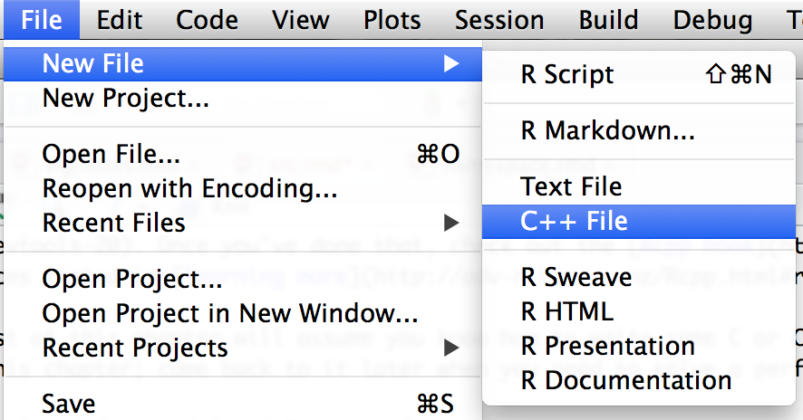

# Compiled code {#src}

R is a high-level, expressive language. But that expressivity comes at a price: speed. That's why incorporating a low-level, compiled language like C or C++ can powerfully complement your R code. While C and C++ often require more lines of code (and more careful thought) to solve the same problem, they can be orders of magnitude faster than R. 

Unfortunately, teaching you how to program in C or C++ is beyond the scope of the book. If you'd like to learn, I recommend starting with C++ and the Rcpp package. Rcpp makes it easy to connect C++ to R. I'd also recommend using RStudio because it has many tools that facilitate the entire process. Start by reading my ["High performance functions with Rcpp"](http://adv-r.had.co.nz/Rcpp.html), a freely available book chapter from [Advanced R](http://amzn.com/1466586966?tag=devtools-20): it gently introduces the language by translating examples of familiar R code into C++. Next, check out the [Rcpp book](http://www.rcpp.org/book) and the other resources listed in [learning more](http://adv-r.had.co.nz/Rcpp.html#rcpp-more).

## C++ {#cpp}

To set up your package with Rcpp, run:

```{r, eval = FALSE}
devtools::use_rcpp()
```

This will:

* Create a `src/` directory to hold your `.cpp` files.

* Add `Rcpp` to the `LinkingTo` and `Imports` fields in the `DESCRIPTION`.

* Set up a `.gitignore` file to make sure you don't accidentally check in
  any compiled files (learn more about this in [git](#git)).

* Tell you the two roxygen tags you need to add to your package:

    ```{r}
    #' @useDynLib your-package-name
    #' @importFrom Rcpp sourceCpp
    NULL
    ```

### Workflow {#cpp-workflow}

Once you're set up, the basic workflow should now be familiar:

1.  Create a new C++ file:

    ```{r, echo = FALSE}
    
    ```

    The default template looks like this:
    
    ```cpp
    #include <Rcpp.h>
    using namespace Rcpp;
    
    // Below is a simple example of exporting a C++ function to R. You can
    // source this function into an R session using the Rcpp::sourceCpp 
    // function (or via the Source button on the editor toolbar)
    
    // For more on using Rcpp click the Help button on the editor toolbar
    
    // [[Rcpp::export]]
    int timesTwo(int x) {
       return x * 2;
    }
    ```
    
    It includes a basic function and some instructions to get started. The
    two most important parts are the header `#include`, and the special
    attribute `// [[Rcpp::export]]`.

1.  Generate the necessary modifications to your `NAMESPACE` by documenting
    them with Ctrl/Cmd + Shift + D.

1.  Click Build & Reload in the build pane, or press Ctrl/Cmd + Shift + B. You can
    continue to use the standard `devtools::load_all()` process but it is more
    risky. Because you're loading and unloading C code, the chances of 
    corrupting memory are high, and you're better off with the safer, but
    slower, "Build & Reload" which installs the package then restarts R.

1.  Run `timesTwo(10)` from the console to check that it works.

Behind the scenes, "Build and reload" is doing a lot of work for you. They:

* Set up your R environment to compile code and warn you if you're missing 
  necessary pieces.
  
* Call `Rcpp::compileAttributes()`. This inspects your `.cpp` functions 
  looking for __attributes__ of the form `// [[Rcpp::export]]`. When it finds 
  one, it generates the code needed to make the function available in 
  R, and creates `src/RcppExports.cpp` and `R/RcppExports.R`. You should never 
  modify these files by hand.
  
* Build a DLL (dynamically linked library) and make it available to R.

### Documentation {#cpp-man}

Each exported C++ function automatically gets a wrapper function (it will be located in `R/RcppExports.R`). For example, the R `timesTwo()` function looks like:

```{r}
timesTwo <- function(x) {
  .Call('timesTwo', PACKAGE = 'mypackage', x)
}
```

This uses the base function `.Call()` to execute the C function `timesTwo` provided by "mypackage". You can use roxygen2 to document this like a regular R function. But instead of using `#'` for comments use `//'`, the C++ convention:

```cpp
//' Multiply a number by two
//' 
//' @param x A single integer.
//' @export
// [[Rcpp::export]]
int timesTwo(int x) {
   return x * 2;
}
```

That generates roxygen comments in `R/RcppExports.R`:

```{r}
#' Multiply a number by two
#' 
#' @param x A single integer.
#' @export
timesTwo <- function(x) {
  .Call('timesTwo', PACKAGE = 'mypackage', x)
}
```

The distinctions between the two export directives is important:

* `[[Rcpp::export]]` makes the C++ function available to R. If you have
  trouble remembering the exact details, note that everything comes in 
  twos: Two `/`, two `[`, two `:` and two `]`.

* `@export` makes the R wrapper function available outside your package by
  adding it to the `NAMESPACE`.

### Exporting C++ code {#cpp-export}

To make your C++ code callable from C++ code in other packages, add:

```cpp
// [[Rcpp::interfaces(r, cpp)]]
```

This will generate a header file, `inst/include/mypackage.h` that can be included by other packages (The low-level details are described in [Exporting C code](#c-export)). See "[Rcpp Attributes](http://dirk.eddelbuettel.com/code/rcpp/Rcpp-attributes.pdf)" for more details, including how to combine hand-written and automatically generated header files.

### Importing C++ code {#cpp-import}

To use C++ code from another package:

1. In `DESCRIPTION`, add `LinkingTo: otherPackage`. Confusingly this has nothing
   to do with the linker. It's called `LinkingTo` because it adds 
   `otherPackage/include` to the include path, allowing you to dynamically
   "link to" other code via the headers.

1. In the C++ file, add:

    ```cpp
    #include <otherPackage.h>
    ```

1. C++ functions from otherPackage will be included in the `otherPackage`
   namespace. Use `otherPackage::foo()` to access functions, or make 
   them available globally with `using namespace otherPackage`.

### Best practices {#cpp-best-practices}

* To print output use `Rcout << ...` (not `cout << ...`). This prints to 
  the right place, which might be a GUI console or a file (if `sink()` 
  is active)

* In long-running loops, regularly run `Rcpp::checkUserInterrupt()`. This 
  aborts your C++ if the user has pressed Ctrl + C or Escape in R.

* Use `.h` extension for headers and include files. (If you don't
  `R CMD check` will complain).
  
* Follow Martyn Plummer's recommendations on 
  [Portable C++ for R packages](http://journal.r-project.org/archive/2011-2/RJournal_2011-2_Plummer.pdf).

* Whenever you use C++ code in your package, you need to clean up after 
  yourself when your package is unloaded. Do this by writing a `.onUnload()` 
  function that unloads the DLL:

    ```{r}
    .onUnload <- function (libpath) {
      library.dynam.unload("mypackage", libpath)
    }
    ```

* Use `clang` instead of `gcc` to compile your C++ code: it gives much 
  better error messages. You can make `clang` the default by creating a
  `.R/Makevars` (linux and mac) or `.R/Makevars.win` (windows) file in 
  your home directory that contains:

    ```bash
    CXX=clang++
    ```
    
    (If you don't know where your home directory is `path.expand("~")` will
    tell you.)

* To speed up compilation on linux or mac, install `ccache`, then replace 
  `~/.R/Makevars` with:

    ```bash
    CC=ccache clang -Qunused-arguments
    CXX=ccache clang++ -Qunused-arguments
    CCACHE_CPP2=yes
    ```

## C {#clang}

If you're writing new compiled code, it's almost always better to use Rcpp. It's less work, more consistent, better documented, and it has better tools. However, there are some reasons to choose C:

* You're working with an older package that already uses the C API.
* You're binding to an existing C library.

There are two ways to call C functions from R: `.C()` and `.Call()`. `.C()` is a quick and dirty way to call an C function that doesn't know anything about R because `.C()` automatically converts between R vectors and the corresponding C types. `.Call()` is more flexible, but more work: your C function needs to use the R API to convert its inputs to standard C data types.

### Getting started with `.Call()`

To call a C function from R, you first need a C function! In an R package, C code lives in `.c` files in `src/`. You'll need to include two header files:

```c
#include <R.h>
#include <Rinternals.h>
```

(Yes, including `<Rinternals.h>` seems like bad form. On top of that, doing so doesn't actually give you access to the "internal" internal API unless you set some additional flags. The default just gives you access to the "public" internal API, which is both necessary and done for safety's sake. Yes, this is confusing.)

These headers allow you to access R's C API. Unfortunately this API is not well documented. I'd recommend starting with my notes at [R's C interface](http://adv-r.had.co.nz/C-interface.html). After that, read "[The R API](http://cran.rstudio.com/doc/manuals/r-devel/R-exts.html#The-R-API)" in "Writing R Extensions". A number of exported functions are not documented, so you'll also need to read the [R source code](https://github.com/wch/r-source) to figure out the details.

Here's the bare minimum you need to know: C functions that talk to R must use the `SEXP` type for both inputs and outputs. `SEXP`, short for S expression, is the C struct used to represent every type of object in R. A C function typically starts by converting `SEXP`s to atomic C objects, and ends by converting C objects back to a `SEXP`. (The R API is designed so that these conversions often don't require copying.) The following table lists the functions that convert length one R vectors to and from C scalars:

R type      | C type      | R -> C            |  C -> R 
------------|-------------|-------------------|-------------------
integer     | int         | `asInteger(x)`    | `ScalarInteger(x)`
numeric     | double      | `asReal(x)`       | `ScalarReal(x)`
logical     | int         | `asLogical(x)`    | `ScalarLogical(x)`
character   | const char* | `CHAR(asChar(x))` | `mkString(x)`

We now have enough information to write a simple C function that can add two numbers:

```c
#include <R.h>
#include <Rinternals.h>

SEXP add_(SEXP x_, SEXP y_) {
  double x = asReal(x_);
  double y = asReal(y_);
  
  double sum = x + y;
  
  return ScalarReal(sum);
}
```

We call this from R with `.Call()`: 

```{r}
#' @useDynLib mypackage add_
add <- function(x, y) .Call(add_, x, y)
```

Where does the first argument to `.Call()`, `add_`, come from? It comes from `@useDynLib`, which creates a line in the NAMESPACE that looks like:

```
useDynLib(mypackage, add_)
```

This directive instructs R to create an object called `add_` which describes a C function pointer:

```{r, eval = FALSE}
mypackage:::add_
#> $name
#> [1] "add_"
#> 
#> $address
#> <pointer: 0x107be3f40>
#> $package
#> NULL
#> 
#> attr(,"class")
#> [1] "NativeSymbolInfo"
```

`.Call()` takes the pointer to a C function and calls it. All R objects have the same C type (the `SEXP`) you need to make sure the arguments are of the type you expect. Either do that in the R function, in the C function, or just accept that R will crash every time you accidentally supply the wrong type of input.

The most complicated part of working with the `.Call()` interface is memory-management. Whenever you create an R-level data structure, you must `PROTECT()` it so the garbage collector doesn't try and free it, then `UNPROTECT()` it at the end of the function. This topic is beyond the scope of this chapter, but you can learn more about it at <http://adv-r.had.co.nz/C-interface.html#c-vectors>.

### Getting started with `.C()`

`.C()` is simpler than `.Call()` and can be useful if you already have standard C code. Since you never create R objects in `.C()`, you never need to worry about memory management. To use it, you first write a void C function, using in-place modification of function parameters to return values:

```c
void add_(double* x, double* y, double* out) {
  out[0] = x[0] + y[0];
}
```

Then like `.Call()` you create an R wrapper:

```{r, eval = FALSE}
#' @useDynLib mypackage add_
add <- function(x, y) {
  .C(add_, x, y, numeric(1))[[3]]
}
```

(Here we extract the 3rd element of the result because that corresponds to the out parameter.)

`.C()` automatically converts back and forth between R vectors and their C equivalents:

R type      | C type   
------------|----------
logical     | `int*`
integer     | `int*`
double	    | `double*`
character	  | `char**`
raw	        | `unsigned char*`

Note that `.C()` assumes your function doesn't know how to deal with missing values and will throw an error if any arguments contain an NA. If it can correctly handle missing values, set `NAOK = TRUE` in the call to `.C()`. 

You can learn more about `.C()` in its help, `?.C` and in [R-extensions](http://cran.rstudio.com/doc/manuals/r-devel/R-exts.html#Interface-functions-_002eC-and-_002eFortran).

### Workflow {#c-workflow}

The usual workflow still applies:

1.  Modify the C code.
1.  Build and reload the package with Ctrl/Cmd + Shift + B
1.  Experiment at the console.

The first time you add `@useDynLib`, you'll also need to run `devtools::document()` (Ctrl/Cmd + Shift + D) and reload the package.

### Exporting C code {#c-export}

R packages need to provide DLLs that can be relocated; DLLs that work regardless of where they live on disk. This is because most R users don't build packages from source. Instead, they get binaries from CRAN that can get installed in many different places. This need for relocatable DLLs adds a few more steps to the job of importing and exporting C code for R packages (the same problem arises for C++, but Rcpp attributes automate the manual steps described below). 

R solves this problem using __function registration__. To export a `.Call()` C function, you register it with `R_RegisterCCallable()`. To import a `.Call()` C function, you get a pointer to it with `R_GetCCallable()`. Similar techniques are available for `.C()` C functions, but are beyond the scope of this book. As we'll see below, a user-friendly package will do both these tasks, so users of the package can ignore the details and simply include a header a file.

[Sidebar: Confusingly, there's another type of function registration. Instead of registering C functions using the namespace (i.e. `@useDynLib pkg fun`), you can register them with `R_registerRoutines()` and `@useDynLib mypackage, .registration = TRUE`. To learn the details read [Registering native extensions](http://cran.r-project.org/doc/manuals/R-exts.html#Registering-native-routines) in "Writing R extensions".]

To register a function, call `R_RegisterCCallable()`, defined in `<R_ext/Rdynload.h>`. Function registration should be done in a function called `R_init_<mypackage>`. This function is called automatically when the "mypackage" DLL is loaded. `R_RegisterCCallable()` has three arguments:

* A pointer to the DLL.
* The name of the function.
* A pointer to the function, cast as `DL_FUNC` (i.e. a **d**ynamically 
  **l**oaded **func**tion).

The following code registers the `add_()` function defined above:

```c
#include "add.h"
#include <R_ext/Rdynload.h>

void R_init_mypackage(DllInfo *info) {
  R_RegisterCCallable("mypackage", "add",  (DL_FUNC) &add_);
}
```

It doesn't matter where this code lives, but it's usually put in a file called `src/mypackage-init.c`. 

To access a registered function from another package, call `R_GetCCallable()`. It has two arguments, the package name and the function name. It returns a function pointer. The function pointer has no type information, so it should always be wrapped in a helper function that defines the inputs:

```c
#include <R_ext/Rdynload.h>
#include <R.h>
#include <Rinternals.h>

SEXP add_(SEXP x, SEXP y) {
  static SEXP(*fun)(SEXP, SEXP) = NULL;
  if (fun == NULL)
    fun = (SEXP(*)(SEXP, SEXP)) R_GetCCallable("mypackage", "add");
  return fun(x, y);
}
```

Rather than relying on each package that imports your C code to do this correctly, you should instead do it for them. Write `inst/include/mypackageAPI.h` which provides a wrapper function for each exported function. A popular package that does that is [xts](http://cran.r-project.org/web/packages/xts/). Download the source package and look in the `include/` directory to see what it does.

### Importing C code {#c-import}

Using C code from another package varies based on how the package is implemented:

* If it uses the system described above, all you need is `LinkingTo: otherPackage` 
  in the `DESCRIPTION`, and `#include otherPackageAPI.h` in the C file. (Remember 
  `LinkingTo` is not about the linker, but actually affects the include path).
   
* If it registers the functions, but doesn't provide a header file, you'll
  need to write the wrapper yourself. Since you're not using any header
  files from the package, use `Imports` and not `LinkingTo`. You also need to 
  make sure the package is loaded. You can do this by importing any function 
  with `@importFrom mypackage foo`, or by adding `requireNamespace("mypackage", 
  quietly = TRUE)` to `.onLoad()`.
  
* If it doesn't register the functions, you can't use them. You'll have to
  ask the maintainer nicely or even provide a pull request.

### Best practices {#c-best-practices}

* Avoid calls to `assert()`, `abort()` and `exit()`: these will kill the 
  R process, not just your C code. Instead, use `error()` which is 
  equivalent to calling `stop()` in R.

* To print output use `Rprintf()`, not `printf()`. Doing so always prints to 
  the right place, whether it's the GUI console or a file (if `sink()` is 
  active).

* In long-running loops, regularly call `R_CheckUserInterrupt()` to allow
  the user to interrupt the C code.

* Don't use C's random number generators (like `rand()` or `random()`), 
  instead use the C API to R's rngs: `unif_rand()`, `norm_rand()`, etc. 
  Note the caveats in ["Random number generation"](http://cran.rstudio.com/doc/manuals/r-devel/R-exts.html#Random-numbers) - you must call `GetRNGstate()` before and 
  `PutRNGstate()` after.

* Use R macros `ISNAN(x)` and `R_FINITE(x)` to check for NaNs and infinite
  values. These work on more platforms than the C99 `isnan()` and `isfinite()`.

* Like with C++, whenever you use C code in your package, you should unload the 
  DLL when the package is unloaded:

    ```{r}
    .onUnload <- function (libpath) {
      library.dynam.unload("mypackage", libpath)
    }
    ```

* Use `clang` instead of `gcc` to compile your C code: it gives much 
  better error messages. You can make `clang` the default by creating a
  `~/.R/Makevars` that contains:

    ```bash
    C=clang
    ```

## Debugging compiled code {#src-debugging}

It's possible, with a little extra work, to use an interactive debugger to debug your C/C++ in the same way that you can use `browser()` and `debug()` to debug your R code. Unfortunately you won't be able to use RStudio, you'll have to run R from the command line. 

Open a shell (e.g. with Tools | Shell...) and start R by typing:

```bash
# If you compile with clang
R --debugger=lldb
# If you compile with gcc
R --debugger=gdb
```

This will start either [lldb](http://lldb.llvm.org) or [gdb](http://www.gnu.org/software/gdb/), the debuggers that work with code produced by `clang` or `gcc` respectively. Like R, `lldb` and `gdb` provide a REPL, a run-eval-print loop where you enter commands and then look at the results. In the examples below I'll show the results of `lldb`, which is what I use (the output from `gdb` is similar). For each interactive command I'll tell you the explicit, but long, `lldb` command and the short, but cryptic, `gdb` command. Because `lldb` understand all `gdb` commands, you can use choose to be explicit of terse.

Once you've started the debugger, start R by typing `process start` (lldb) or `run` (gdb). Now when your C/C++ code crashes you'll be dumped into an interactive debugger instead of getting a cryptic error message and a crash. 

Let's start with a simple C++ function that writes to memory it doesn't "own":

```{r, eval = FALSE}
Rcpp::cppFunction("
bool mistake() {
  NumericVector x(1);
  int n = INT_MAX;
  x[n] = 0;
  return true;
}
", plugins = "debug", verbose = TRUE, rebuild = TRUE)
mistake()
```


Use `devtools::load_all()` to load the current package. Then copy and paste the code that creates the bug. Here's a crash report from a package I was working on:

```
Process 32743 stopped
* thread #1: tid = 0x1f79f6, 0x... gggeom.so...`
   frame #0: 0x0.. gggeom.so`vw_distance(x=..., y=...) + ... at vw-distance.cpp:54
   51        int prev_idx = prev[idx];
   52  	
   53  	    next[prev[idx]] = next_idx;
-> 54  	    prev[next[idx]] = prev_idx;
   55  	    prev[idx] = -1;
   56  	    next[idx] = -1;
   57
```

It tells us that the crash occurred because of a `EXC_BAD_ACCESS` - this is one of the most common types of crash in C/C++ code. Helpfully, lldb shows exactly which line of C++ code caused the problem: `vw-distance.cpp:54`. Often just knowing where the problem occurs is enough to fix it. But we're also now at an interactive prompt. There are many commands you can run here to explore what's going on. The most useful are listed below:

* See a list of all commands: `help`.

* Show your location on the callstack with `thread backtrace`/`bt`. This
  will print a list of calls leading up to the error, much like `traceback()`
  does in R. Navigate the callstack with `frame select <n>`/`frame <n>`, or 
  `up` and `down`.

* Evaluate the next expression with `thread step-over`/`next`, or step into it
  with `thread step-in`/`step`. Continue executing the rest of the code with
  `thread step-out`/`finish`

* Show all variables defined in the current frame with `frame variable`/
  `info locals`, or print the value of a single variable with 
  `frame variable <var>`/`p <var>`.

Instead of waiting for a crash to occur you can also set breakpoints in your code. To do so, start the debugger, run R, then:

1. Press `Ctrl + C`

1. Type `breakpoint set --file foo.c --line 12`/`break foo.c:12`.

1. `process continue`/`c` to go back to the R console. Now run the C code
   you're interested in, and the debugger will stop when it gets to the 
   specified line.

You can also set a breakpoint for any C++ exception: this allows you to figure out exactly where a C++ error occurs:

1. Press `Ctrl + C`

1. Type `breakpoint set -E c++`.

1. `process continue`/`c` to go back to the R console. Now if an exception
   is thrown in C++ code (or by R's C API when wrapped in Rcpp code), the 
   debugger will stop.

Finally, you can also use the debugger if your code is stuck in an infinite loop. Press `Ctrl + C` to break into the debugger and you'll see which line of code is causing the problem.

## Makefiles {#make}

While makefiles are beyond the scope of this book, they are a useful tool. A good, gentle introduction with a focus on reproducible research is Karl Broman's ["Minimal make"](http://kbroman.org/minimal_make/).

Generally, R packages should avoid a custom `Makefile`. Instead, use `Makevars`. `Makevars` is a make file that overrides the default make file generated by R (which is located at `file.path(R.home("etc"), "Makeconf")`). This allows you to take advantage of R's default behaviour (it's over 150 lines, and battle-tested across many years and many systems, so you want to!) while being able to set the flags you need. The most commonly used flags are:

* `PKG_LIBS`: Linker flags. A common use is `PKG_LIBS = $(BLAS_LIBS)`. This
  allows you to use the same BLAS library as R.

* `PKG_CFLAGS` & `PKG_CXXFLAGS`: C and C++ flags. Most commonly used to set 
  define directives with `-D`.

* `PKG_CPPFLAGS`: Pre-processor flags (not C++ flags!). Most commonly used to
  set include directories with `-I`. Any package listed in the `LinkingTo` field
  in the `DESCRIPTION` will be automatically included - you do not need to
  explicitly add it.

To set flags only on Windows, use `Makevars.win`. To build a `Makevars` with `configure`, use `Makevars.in`.

By default, R will use the system make, which is not always GNU compatible (i.e. on Solaris). If you want to use GNU extensions (which are extremely common), add `SystemRequirements: GNU make` to `DESCRIPTION`. If you're not sure if you're using GNU extensions, play it safe and add it to the system requirement.

## Other languages {#src-other}

It is possible to connect R to other languages, but the interfaces are not as nice as the one for C++:

* __Fortran__: It's possible to call Fortran subroutines directly with 
  `.Fortran()`, or via C or C++ with `.Call()`. See `?.Fortran` and 

* __Java__: The [rJava](https://github.com/s-u/rJava) package makes it 
  possible to call Java code from within R. Note that unlike with C and C++,
  passing an R object to a Java call will involve a copy operation, something 
  which has serious performance implications.

## Licensing {#src-licensing}

Because it's common to use other peoples' libraries when writing compiled code, you need to make sure that your package license is compatible with the licenses of all included code:

* The simplest solution is to use the same license as the included code. Since 
  you can't relicense someone else's code, you may need to change your license.

* If you don't want to use the same license, you're best sticking
  with common cases where the interactions are well known. For example, 
  [Various Licenses and Comments about Them](https://www.gnu.org/licenses/license-list.html)
  describes what licenses are compatible with the GPL license.
  
  In this case your description should contain 
  `License: <main license> + FILE license` where `<main license>` is a license 
  that is valid for the entire package (both R and compiled code), and the 
  `license` file describes the licenses of individual components.

* For non-standard cases, you'll need to consult a lawyer.

In all cases, make sure you include copyright and license statements from the original code.

## Development workflow {#src-workflow}

When developing C or C++ code, it's usually better to use RStudio's Build & Reload instead of `devtools::load_all()`. Note this is known as "Install and Restart" in more recent versions of RStudio. If you have C objects that persist between reloads, and you change the data structure, then it's better to use Install and Restart: otherwise there’s a high chance of crashes due to differences between versions of your C code.

## CRAN issues {#src-cran}

Packages with compiled code are much more likely to have difficulties getting on CRAN than those without. The reason? Your package must build from source on all major platforms (Linux, Mac and Windows). This is hard! 

* CRAN provides an automated service for checking R packages on windows: 
  [win-builder](http://win-builder.r-project.org). You can easily access this
  by running `devtools::build_win()`, which builds and uploads a package bundle.
  
* I've tried to include the most important advice in this chapter, but I'd
  recommend reading the entire section on [writing portable C and C++ code](http://cran.rstudio.com/doc/manuals/r-devel/R-exts.html#Portable-C-and-C_002b_002b-code) in "Writing
  R extensions".

* In exceptional circumstances, like binding to Windows-only functionality, 
  you may be able to opt-out of cross-platform requirement, but be prepared    
  to make a strong case for it.

The interface between CRAN's automated and manual checking can be particularly frustrating for compiled code. Requirements vary from submission to submission, based on which maintainer you get and how much free time they have. The rules are inconsistently applied, but if your package doesn't pass, it's better to bite the bullet and make the change rather than trying to argue about it:

  * Sometimes you will need to list all authors and copyright holders of included 
    code in the DESCRIPTION. 
  
  * Sometimes your package will need to work on Solaris. But due to the difficulty 
    of accessing a computer running Solaris, fixing Solaris issues can be hard. 
    However, you will be in a stronger negotiating position if the package has no 
    problems on other platforms. 
  
    One common gotcha: gcc/clang flags `-Wall`, `-pedantic` and `-O0` do not work 
    with the default compiler on Solaris.

