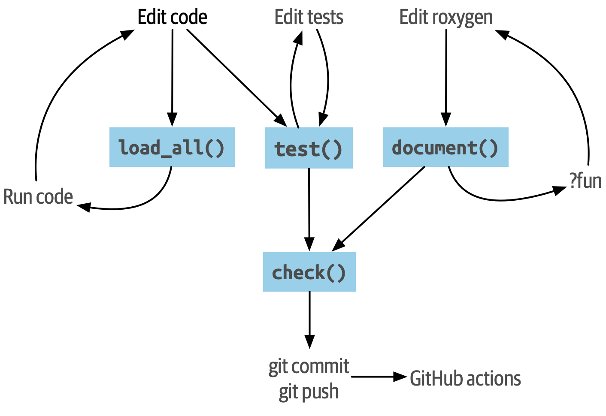

# The Whole Game {#sec-whole-game}

```{r, include = FALSE, R.options = list(tidyverse.quiet = TRUE)}
source("common.R")
library(glue)
library(fs)
library(tidyverse)

# Whenever any chunk changes, we want to re-run _every_ chunk
rmd <- parsermd::parse_rmd("whole-game.Rmd")
chunks <- parsermd::rmd_select(rmd, parsermd::has_type("rmd_chunk"))
knitr::opts_chunk$set(
  cache = TRUE,
  cache.extra = digest::digest(chunks)
)

# By default, knitr saves loaded packages and reloads at the start of the
# the new session. This doesn't work for our toy package because it is
# deleted at the end of this Rmd. So we just hack knitr to not save or load
# the package info
assignInNamespace(
  "cache", ns = "knitr",
  modifyList(knitr:::cache, list(library = function(...) {}))
)

# do you want to see how this sausage is made?
debug <- FALSE

# do we build the toy package? if so, where?
# NA            --> no, don't build it
# "tmp_user"    --> build in ~/tmp/TOYPACKAGE, so it's easy to access after
# "tmp_session" --> build in session temp dir, it's disposable
where <- "tmp_session"
```

*Spoiler alert!*

This chapter runs through the development of a small toy package.
It's meant to paint the Big Picture and suggest a workflow, before we descend into the detailed treatment of the key components of an R package.

To keep the pace brisk, we exploit the modern conveniences in the devtools package and the RStudio IDE. In later chapters, we are more explicit about what those helpers are doing for us.

This chapter is self-contained, in that completing the exercise is not a strict requirement to continue with the rest of the book, however we strongly suggest you follow along and create this toy package with us.

## Load devtools and friends

You can initiate your new package from any active R session.
You don't need to worry about whether you're in an existing or new project or not.
The functions we use ensure that we create a new clean project for the package.

Load the devtools package, which is the public face of a set of packages that support various aspects of package development.
The most obvious of these is the usethis package, which you'll see is also being loaded.

```{r}
library(devtools)
```

Do you have an old version of devtools?
Compare your version against ours and upgrade if necessary.

```{r}
packageVersion("devtools")
```

## Toy package: regexcite

To help walk you through the process, we use various functions from devtools to build a small toy package from scratch, with features commonly seen in released packages:

-   Functions to address a specific need, in this case helpers for work with regular expressions.
-   Version control and an open development process.
    -   This is completely optional in your work, but highly recommended. You'll see how Git and GitHub help us expose all the intermediate stages of our toy package.
-   Access to established workflows for installation, getting help, and checking quality.
    -   Documentation for individual functions via [roxygen2](https://roxygen2.r-lib.org).
    -   Unit testing with [testthat](https://testthat.r-lib.org).
    -   Documentation for the package as a whole via an executable `README.Rmd`.

We call the package **regexcite** and it contains a couple of functions that make common tasks with regular expressions easier.
Please note that these functions are very simple and we're only using them here as a means to guide you through the package development process.
If you're looking for actual helpers for work with regular expressions, there are several proper R packages that address this problem space:

-   [stringr](https://stringr.tidyverse.org) (which uses stringi)
-   [stringi](https://stringi.gagolewski.com/)
-   [rex](https://cran.r-project.org/package=rex)
-   [rematch2](https://cran.r-project.org/package=rematch2)

Again, the regexcite package itself is just a device for demonstrating a typical workflow for package development with devtools.

## Preview the finished product

The regexcite package is tracked during its development with the Git version control system.
This is purely optional and you can certainly follow along without implementing this.
A nice side benefit is that we eventually connect it to a remote repository on GitHub, which means you can see the glorious result we are working towards by visiting regexcite on GitHub: <https://github.com/jennybc/regexcite>.
By inspecting the [commit history](https://github.com/jennybc/regexcite/commits/main) and especially the diffs, you can see exactly what changes at each step of the process laid out below.

<!-- TODO: I think these diffs are extremely useful and would like to surface them better here. -->

## `create_package()`

Call `create_package()` to initialize a new package in a directory on your computer.
`create_package()` will automatically create that directory if it doesn't exist yet (and that is usually the case).
See @sec-workflow101-create-package for more on creating packages.

Make a deliberate choice about where to create this package on your computer.
It should probably be somewhere within your home directory, alongside your other R projects.
It should not be nested inside another RStudio Project, R package, or Git repo.
Nor should it be in an R package library, which holds packages that have already been built and installed.
The conversion of the source package we create here into an installed package is part of what devtools facilitates.
Don't try to do devtools' job for it!

Once you've selected where to create this package, substitute your chosen path into a `create_package()` call like this:

```{r create-package-fake, eval = FALSE}
create_package("~/path/to/regexcite")
```

For the creation of this book we have to work in a temporary directory, because the book is built non-interactively in the cloud.
Behind the scenes, we're executing our own `create_package()` command, but don't be surprised if our output differs a bit from yours.

```{r configure, include = FALSE}
where <- match.arg(
  as.character(where),
  choices = c(NA, "tmp_user", "tmp_session")
)
create <- !is.na(where)

where <- switch(
  where,
  tmp_user = path_home("tmp"),
  tmp_session = path_temp(),
  NULL
)

pkgpath <- path(where, "regexcite")

if (!is.null(where)) {
  if (requireNamespace("regexcite", quietly = TRUE)) {
    remove.packages("regexcite")
    unloadNamespace("regexcite")
  }
  if (dir_exists(pkgpath)) {
    dir_delete(pkgpath)
  }
  dir_create(where)
}
```

```{r create-package, eval = create, echo = debug}
withr::with_options(
  list(usethis.description = NULL),
  create_package(pkgpath, open = FALSE, rstudio = TRUE)
)
```

```{r set-proj-and-wd, include = debug, eval = create}
(owd <- getwd())
local_project(pkgpath, setwd = TRUE)
getwd()

# I normally am not this masochistic, but there is little choice
knitr::opts_knit$set(root.dir = pkgpath)
```

```{r sitrep, include = debug, eval = create}
# can't be in chunk above, because knitr
proj_sitrep()
```

If you're working in RStudio, you should find yourself in a new instance of RStudio, opened into your new regexcite package (and Project).
If you somehow need to do this manually, navigate to the directory and double click on `regexcite.Rproj`.
RStudio has special handling for packages and you should now see a *Build* tab in the same pane as *Environment* and *History*.

You probably need to call `library(devtools)` again, because `create_package()` has probably dropped you into a fresh R session, in your new package.

```{r eval = FALSE}
library(devtools)
```

What's in this new directory that is also an R package and, probably, an RStudio Project?
Here's a listing (locally, you can consult your *Files* pane):

```{r init-show-files, echo = FALSE, eval = create}
dir_info(all = TRUE) %>% 
  select(path, type) %>%
  knitr::kable()
```

::: callout-tip
## RStudio

In the *Files* pane, go to *More (gear symbol) \> Show Hidden Files* to toggle the visibility of hidden files (a.k.a. ["dotfiles"](https://en.wikipedia.org/wiki/Hidden_file_and_hidden_directory#Unix_and_Unix-like_environments)).
A select few are visible all the time, but sometimes you want to see them all.
:::

-   `.Rbuildignore` lists files that we need to have around but that should not be included when building the R package from source. If you aren't using RStudio, `create_package()` may not create this file (nor `.gitignore`) at first, since there's no RStudio-related machinery that needs to be ignored. However, you will likely develop the need for `.Rbuildignore` at some point, regardless of what editor you are using. It is discussed in more detail in @sec-rbuildignore.
-   `.Rproj.user`, if you have it, is a directory used internally by RStudio.
-   `.gitignore` anticipates Git usage and tells Git to ignore some standard, behind-the-scenes files created by R and RStudio. Even if you do not plan to use Git, this is harmless.
-   `DESCRIPTION` provides metadata about your package. We edit this shortly and @sec-description covers the general topic of the `DESCRIPTION` file.
-   `NAMESPACE` declares the functions your package exports for external use and the external functions your package imports from other packages. At this point, it is empty, except for a comment declaring that this is a file you should not edit by hand.
-   The `R/` directory is the "business end" of your package. It will soon contain `.R` files with function definitions.
-   `regexcite.Rproj` is the file that makes this directory an RStudio Project. Even if you don't use RStudio, this file is harmless. Or you can suppress its creation with `create_package(..., rstudio = FALSE)`. More in @sec-workflow101-rstudio-projects.

## `use_git()`

The regexcite directory is an R source package and an RStudio Project.
Now we make it also a Git repository, with `use_git()`.
(By the way, `use_git()` works in any project, regardless of whether it's an R package.)

```{r use-git, eval = create}
use_git()
```

In an interactive session, you will be asked if you want to commit some files here and you should accept the offer.
Behind the scenes, we'll also commit those same files.

```{r gert-begin, eval = create, include = debug}
suppressPackageStartupMessages(library(gert))
git_add(".")
git_commit("Initial commit")
```

So what has changed in the package?
Only the creation of a `.git` directory, which is hidden in most contexts, including the RStudio file browser.
Its existence is evidence that we have indeed initialized a Git repo here.

```{r post-git-file-list, echo = FALSE, eval = create}
dir_info(all = TRUE, regexp = "^[.]git$") %>% 
  select(path, type) %>%
  knitr::kable()
```

If you're using RStudio, it probably requested permission to relaunch itself in this Project, which you should do.
You can do so manually by quitting, then relaunching RStudio by double clicking on `regexcite.Rproj`.
Now, in addition to package development support, you have access to a basic Git client in the *Git* tab of the *Environment/History/Build* pane.

<!-- TODO: good place for a screenshot. -->

Click on History (the clock icon in the Git pane) and, if you consented, you will see an initial commit made via `use_git()`:

```{r inspect-first-commit, echo = FALSE, eval = create}
git_log(max = 1) %>% 
  select(commit, author, message) %>%
  mutate(commit = paste0(substr(commit, 1, 10), "...")) %>%
  knitr::kable()
```

::: callout-tip
## RStudio

RStudio can initialize a Git repository, in any Project, even if it's not an R package, as long you've set up RStudio + Git integration.
Do *Tools \> Version Control \> Project Setup*.
Then choose *Version control system: Git* and *initialize a new git repository for this project*.
:::

## Write the first function

A fairly common task when dealing with strings is the need to split a single string into many parts.
The `strsplit()` function in base R does exactly this.

```{r}
(x <- "alfa,bravo,charlie,delta")
strsplit(x, split = ",")
```

Take a close look at the return value.

```{r}
str(strsplit(x, split = ","))
```

The shape of this return value often surprises people or, at least, inconveniences them.
The input is a character vector of length one and the output is a list of length one.
This makes total sense in light of R's fundamental tendency towards vectorization.
But sometimes it's still a bit of a bummer.
Often you know that your input is morally a scalar, i.e. it's just a single string, and really want the output to be the character vector of its parts.

This leads R users to employ various methods of "unlist"-ing the result:

```{r}
unlist(strsplit(x, split = ","))

strsplit(x, split = ",")[[1]]
```

The second, safer solution is the basis for the inaugural function of regexcite: `strsplit1()`.

```{cat strsplit1-write, eval = create, class.source = "r"}
#| engine.opts = list(file = path("R", "strsplit1.R"))
strsplit1 <- function(x, split) {
  strsplit(x, split = split)[[1]]
}
```

This book does not teach you how to write functions in R.
To learn more about that take a look at the [Functions chapter](https://r4ds.hadley.nz/functions.html) of R for Data Science and the [Functions chapter](https://adv-r.hadley.nz/functions.html) of Advanced R.

::: callout-tip
The name of `strsplit1()` is a nod to the very handy `paste0()`, which first appeared in R 2.15.0 in 2012.
`paste0()` was created to address the extremely common use case of `paste()`-ing strings together *without* a separator.
`paste0()` has been lovingly described as ["statistical computing's most influential contribution of the 21st century"](https://simplystatistics.org/posts/2013-01-31-paste0-is-statistical-computings-most-influential-contribution-of-the-21st-century/).

The `strsplit1()` function was so inspiring that it's now a real function in the stringr package: `stringr::str_split_1()`!
:::

## `use_r()`

Where should you put the definition of `strsplit1()`?
Save it in a `.R` file, in the `R/` subdirectory of your package.
A reasonable starting position is to make a new `.R` file for each user-facing function in your package and name the file after the function.
As you add more functions, you'll want to relax this and begin to group related functions together.
We'll save the definition of `strsplit1()` in the file `R/strsplit1.R`.

The helper `use_r()` creates and/or opens a script below `R/`.
It really shines in a more mature package, when navigating between `.R` files and the associated test file.
But, even here, it's useful to keep yourself from getting too carried away while working in `Untitled4`.

```{r init-strsplit1, eval = create}
use_r("strsplit1")
```

Put the definition of `strsplit1()` **and only the definition of `strsplit1()`** in `R/strsplit1.R` and save it.
The file `R/strsplit1.R` should NOT contain any of the other top-level code we have recently executed, such as the definition of our practice input `x`, `library(devtools)`, or `use_git()`.
This foreshadows an adjustment you'll need to make as you transition from writing R scripts to R packages.
Packages and scripts use different mechanisms to declare their dependency on other packages and to store example or test code.
We explore this further in @sec-r.

## `load_all()` {#sec-whole-game-load-all}

How do we test drive `strsplit1()`?
If this were a regular R script, we might use RStudio to send the function definition to the R Console and define `strsplit1()` in the global environment.
Or maybe we'd call `source("R/strsplit1.R")`.
For package development, however, devtools offers a more robust approach.

Call `load_all()` to make `strsplit1()` available for experimentation.

```{r load-all, eval = create}
load_all()
```

Now call `strsplit1(x)` to see how it works.

```{r, eval = create}
(x <- "alfa,bravo,charlie,delta")
strsplit1(x, split = ",")
```

Note that `load_all()` has made the `strsplit1()` function available, although it does not exist in the global environment.

```{r, eval = create}
exists("strsplit1", where = globalenv(), inherits = FALSE)
```

If you see `TRUE` instead of `FALSE`, that indicates you're still using a script-oriented workflow and sourcing your functions.
Here's how to get back on track:

-   Clean out the global environment and restart R.
-   Re-attach devtools with `library(devtools)` and re-load regexcite with `load_all()`.
-   Redefine the test input `x` and call `strsplit1(x, split = ",")` again. This should work!
-   Run `exists("strsplit1", where = globalenv(), inherits = FALSE)` again and you should see `FALSE`.

`load_all()` simulates the process of building, installing, and attaching the regexcite package.
As your package accumulates more functions, some exported, some not, some of which call each other, some of which call functions from packages you depend on, `load_all()` gives you a much more accurate sense of how the package is developing than test driving functions defined in the global environment.
Also `load_all()` allows much faster iteration than actually building, installing, and attaching the package.
See @sec-workflow101-load-all for more about `load_all()`.

To review what we've done so far:

-   We wrote our first function, `strsplit1()`, to split a string into a character vector (not a list containing a character vector).
-   We used `load_all()` to quickly make this function available for interactive use, as if we'd built and installed regexcite and attached it via `library(regexcite)`.

::: callout-tip
## RStudio

RStudio exposes `load_all()` in the *Build* menu, in the *Build* pane via *More \> Load All*, and in keyboard shortcuts Ctrl + Shift + L (Windows & Linux) or Cmd + Shift + L (macOS).
:::

### Commit `strsplit1()`

If you're using Git, use your preferred method to commit the new `R/strsplit1.R` file.
We do so behind the scenes here and here's the associated diff.

```{r strsplit1-commit, eval = create, include = debug}
git_add(path("R", "strsplit1.R"))
git_commit("Add strsplit1()")
## tags might be useful for making stable links to the package at specific
## evolutionary stages
## possible convention: tag name = chunk label
#tag_name <- knitr::opts_current$get("label")
#tag(repo, tag_name, "initial creation of strsplit1()")
#tag(repo, "strsplit1-init", "initial creation of strsplit1()")
#sha <- (commits(repo)[[1]])@sha
```

```{r add-strsplit1-diff, echo = FALSE, eval = create, comment = ""}
cat(git_diff_patch(ref = "HEAD"))
```

From this point on, we commit after each step.
Remember [these commits](https://github.com/jennybc/regexcite/commits/main) are available in the public repository.

## `check()`

We have informal, empirical evidence that `strsplit1()` works.
But how can we be sure that all the moving parts of the regexcite package still work?
This may seem silly to check, after such a small addition, but it's good to establish the habit of checking this often.

`R CMD check`, executed in the shell, is the gold standard for checking that an R package is in full working order.
`check()` is a convenient way to run this without leaving your R session.

Note that `check()` produces rather voluminous output, optimized for interactive consumption.
We intercept that here and just reveal a summary.
Your local `check()` output will be different.

```{r first-check-fake, eval = FALSE}
check()
```

```{r first-check, eval = create, warning = TRUE, echo = FALSE, comment = ""}
shhh_check(error_on = "never")
```

*It is essential to actually read the output of the check!* Deal with problems early and often.
It's just like incremental development of `.R` and `.Rmd` files.
The longer you go between full checks that everything works, the harder it becomes to pinpoint and solve your problems.

At this point, we expect 1 warning (and 0 errors, 0 notes):

```         
Non-standard license specification:
  `use_mit_license()`, `use_gpl3_license()` or friends to pick a
  license
```

We'll address that soon, by doing exactly what it says.
You can learn more about `check()` in @sec-workflow101-r-cmd-check.

::: callout-tip
## RStudio

RStudio exposes `check()` in the *Build* menu, in the *Build* pane via *Check*, and in keyboard shortcuts Ctrl + Shift + E (Windows & Linux) or Cmd + Shift + E (macOS).
:::

## Edit `DESCRIPTION`

The `DESCRIPTION` file provides metadata about your package and is covered fully in @sec-description.
This is a good time to have a look at regexcite's current `DESCRIPTION`.
You'll see it's populated with boilerplate content, which needs to be replaced.

To add your own metadata, make these edits:

-   Make yourself the author. If you don't have an ORCID, you can omit the `comment = ...` portion.
-   Write some descriptive text in the `Title` and `Description` fields.

::: callout-tip
## RStudio

Use Ctrl + `.` in RStudio and start typing "DESCRIPTION" to activate a helper that makes it easy to open a file for editing.
In addition to a filename, your hint can be a function name.
This is very handy once a package has lots of files.
:::

When you're done, `DESCRIPTION` should look similar to this:

<!-- I'm trying to avoid any syntax highlighting here, while also not trying to do things in a way that's acceptable to O'Reilly who wants "text". -->

```{cat DESCRIPTION-write, eval = create, class.source = "text"}
#| engine.opts = list(file = "DESCRIPTION")
Package: regexcite
Title: Make Regular Expressions More Exciting
Version: 0.0.0.9000
Authors@R: 
    person("Jane", "Doe", , "jane@example.com", role = c("aut", "cre"))
Description: Convenience functions to make some common tasks with string
    manipulation and regular expressions a bit easier.
License: `use_mit_license()`, `use_gpl3_license()` or friends to pick a
    license
Encoding: UTF-8
Roxygen: list(markdown = TRUE)
RoxygenNote: 7.1.2
```

```{r commit-description, eval = create, include = debug}
git_add("DESCRIPTION")
git_commit("Edit DESCRIPTION")
```

## `use_mit_license()`

> [Pick a License, Any License. -- Jeff Atwood](https://blog.codinghorror.com/pick-a-license-any-license/)

We currently have a placeholder in the `License` field of `DESCRIPTION` that's deliberately invalid and suggests a resolution.

```         
License: `use_mit_license()`, `use_gpl3_license()` or friends to pick a
    license
```

To configure a valid license for the package, call `use_mit_license()`.

```{r use-mit-license, eval = create}
use_mit_license()
```

This configures the `License` field correctly for the MIT license, which promises to name the copyright holders and year in a `LICENSE` file.
Open the newly created `LICENSE` file and confirm it looks something like this:

```{r reveal-LICENSE, eval = create, echo = FALSE, comment = ""}
writeLines(readLines("LICENSE"))
```

Like other license helpers, `use_mit_license()` also puts a copy of the full license in `LICENSE.md` and adds this file to `.Rbuildignore`.
It's considered a best practice to include a full license in your package's source, such as on GitHub, but CRAN disallows the inclusion of this file in a package tarball.
You can learn more about licensing in @sec-license.

```{r commit-license, eval = create, include = debug}
git_add(c(".Rbuildignore", "DESCRIPTION", "LICENSE", "LICENSE.md"))
git_commit("Use MIT license")
```

## `document()` {#sec-whole-game-document}

Wouldn't it be nice to get help on `strsplit1()`, just like we do with other R functions?
This requires that your package have a special R documentation file, `man/strsplit1.Rd`, written in an R-specific markup language that is sort of like LaTeX.
Luckily we don't necessarily have to author that directly.

We write a specially formatted comment right above `strsplit1()`, in its source file, and then let a package called [roxygen2](https://roxygen2.r-lib.org) handle the creation of `man/strsplit1.Rd`.
The motivation and mechanics of roxygen2 are covered in @sec-man.

If you use RStudio, open `R/strsplit1.R` in the source editor and put the cursor somewhere in the `strsplit1()` function definition.
Now do *Code \> Insert roxygen skeleton*.
A very special comment should appear above your function, in which each line begins with `#'`.
RStudio only inserts a barebones template, so you will need to edit it to look something like that below.

If you don't use RStudio, create the comment yourself.
Regardless, you should modify it to look something like this:

```{cat strsplit1-with-roxygen-write, eval = create, class.source = "r"}
#| engine.opts = list(file = path("R", "strsplit1.R"))
#' Split a string
#'
#' @param x A character vector with one element.
#' @param split What to split on.
#'
#' @return A character vector.
#' @export
#'
#' @examples
#' x <- "alfa,bravo,charlie,delta"
#' strsplit1(x, split = ",")
strsplit1 <- function(x, split) {
  strsplit(x, split = split)[[1]]
}
```

<!-- TODO: mention how RStudio helps you execute examples here? -->

```{r commit-strsplit1-roxygen-header, eval = create, include = debug}
git_add(path("R", "strsplit1.R"))
git_commit("Add roxygen header to document strsplit1()")
```

But we're not done yet!
We still need to trigger the conversion of this new roxygen comment into `man/strsplit1.Rd` with `document()`:

```{r document-strsplit1, eval = create}
document()
```

::: callout-tip
## RStudio

RStudio exposes `document()` in the *Build* menu, in the *Build* pane via *More \> Document*, and in keyboard shortcuts Ctrl + Shift + D (Windows & Linux) or Cmd + Shift + D (macOS).
:::

You should now be able to preview your help file like so:

```{r eval = FALSE}
?strsplit1
```

You'll see a message like "Rendering development documentation for 'strsplit1'", which reminds that you are basically previewing draft documentation.
That is, this documentation is present in your package's source, but is not yet present in an installed package.
In fact, we haven't installed regexcite yet, but we will soon.
If `?strsplit1` doesn't work for you, you may need to call `load_all()` first, then try again.

Note also that your package's documentation won't be properly wired up until it has been formally built and installed.
This polishes off niceties like the links between help files and the creation of a package index.

### `NAMESPACE` changes

In addition to converting `strsplit1()`'s special comment into `man/strsplit1.Rd`, the call to `document()` updates the `NAMESPACE` file, based on `@export` tags found in roxygen comments.
Open `NAMESPACE` for inspection.
The contents should be:

<!-- OK to use this approach here because I actively do not want a copy button. NAMESPACE should be managed by roxygen and I don't want to tempt anyone to edit it by hand. -->

```{r asis = TRUE, echo = FALSE, comment = "", eval = create}
cat(readLines("NAMESPACE"), sep = "\n")
```

The export directive in `NAMESPACE` is what makes `strsplit1()` available to a user after attaching regexcite via `library(regexcite)`.
Just as it is entirely possible to author `.Rd` files "by hand", you can manage `NAMESPACE` explicitly yourself.
But we choose to delegate this to devtools (and roxygen2).

```{r commit-namespace, eval = create, include = debug}
git_add(c("NAMESPACE", path("man", "strsplit1.Rd")))
git_commit("Run document()")
```

## `check()` again

regexcite should pass `R CMD check` cleanly now and forever more: 0 errors, 0 warnings, 0 notes.

```{r first-clean-check-fake, eval = FALSE}
check()
```

```{r first-clean-check, eval = create, warning = TRUE, echo = FALSE, comment = ""}
shhh_check(error_on = "never")
```

## `install()`

Now that we know we have a minimum viable product, let's install the regexcite package into your library via `install()`:

```{r first-install-fake, eval = FALSE}
install()
```

```{r first-install, eval = create, echo = FALSE, comment = ""}
cat(pretty_install(), sep = "\n")
```

::: callout-tip
## RStudio

RStudio exposes similar functionality in the *Build* menu and in the *Build* pane via *Install and Restart*, and in keyboard shortcuts Ctrl + Shift + B (Windows & Linux) or Cmd + Shift + B (macOS).
:::

After installation is complete, we can attach and use regexcite like any other package.
Let's revisit our small example from the top.
This is also a good time to restart your R session and ensure you have a clean workspace.

```{r, eval = create}
library(regexcite)

x <- "alfa,bravo,charlie,delta"
strsplit1(x, split = ",")
```

Success!

## `use_testthat()`

We've tested `strsplit1()` informally, in a single example.
We can formalize this as a unit test.
This means we express a concrete expectation about the correct `strsplit1()` result for a specific input.

First, we declare our intent to write unit tests and to use the testthat package for this, via `use_testthat()`:

```{r use-testthat, eval = create}
use_testthat()
```

This initializes the unit testing machinery for your package.
It adds `Suggests: testthat` to `DESCRIPTION`, creates the directory `tests/testthat/`, and adds the script `tests/testthat.R`.
You'll notice that testthat is probably added with a minimum version of 3.0.0 and a second DESCRIPTION field, `Config/testthat/edition: 3`.
We'll talk more about those details in @sec-testing-basics.

```{r commit-testthat-init, eval = create, include = debug}
git_add(c("DESCRIPTION", path("tests", "testthat.R")))
git_commit("Add testing infrastructure")
```

However, it's still up to YOU to write the actual tests!

The helper `use_test()` opens and/or creates a test file.
You can provide the file's basename or, if you are editing the relevant source file in RStudio, it will be automatically generated.
For many of you, if `R/strsplit1.R` is the active file in RStudio, you can just call `use_test()`.
However, since this book is built non-interactively, we must provide the basename explicitly:

```{r test-strsplit1, eval = create}
use_test("strsplit1")
```

This creates the file `tests/testthat/test-strsplit1.R`.
If it had already existed, `use_test()` would have just opened it.
You will notice that there is an example test in the newly created file - delete that code and replace it with this content:

```{r include = debug, eval = create}
test_path <- path("tests", "testthat", "test-strsplit1.R")
```

```{cat strsplit1-test-write, eval = create, class.source = "r"}
#| engine.opts = list(file = test_path)
test_that("strsplit1() splits a string", {
  expect_equal(strsplit1("a,b,c", split = ","), c("a", "b", "c"))
})
```

This tests that `strsplit1()` gives the expected result when splitting a string.

```{r commit-strsplit1-test, eval = create, include = debug}
git_add(test_path)
git_commit("Test strsplit1()")
```

Run this test interactively, as you will when you write your own.
If `test_that()` or `strsplit1()` can't be found, that suggests that you probably need to call `load_all()`.

Going forward, your tests will mostly run *en masse* and at arm's length via `test()`:

<!-- TODO: I have no idea why I have to disable crayon here, but if I don't, I guess raw ANSI escapes. Other chunks seem to work fine with downlig. It would also be nice to not see evidence of progress reporting, but the previous approach to turning that off keeps this chunk from showing any output at all :( The previous approach was `R.options = list(testthat.default_reporter = testthat::ProgressReporter$new(update_interval = Inf))`. -->

```{r, include = FALSE}
library(testthat) # suppress package loading messages
```

```{r eval = create, R.options = list(crayon.enabled = FALSE)}
test()
```

::: callout-tip
## RStudio

RStudio exposes `test()` in the *Build* menu, in the *Build* pane via *More \> Test package*, and in keyboard shortcuts Ctrl + Shift + T (Windows & Linux) or Cmd + Shift + T (macOS).
:::

Your tests are also run whenever you `check()` the package.
In this way, you basically augment the standard checks with some of your own, that are specific to your package.
It is a good idea to use the [covr package](https://covr.r-lib.org) to track what proportion of your package's source code is exercised by the tests.
More details can be found in @sec-testing-design-coverage.

## `use_package()`

You will inevitably want to use a function from another package in your own package.
We will need to use package-specific methods for declaring the other packages we need (i.e. our dependencies) and for using these packages in ours.
If you plan to submit a package to CRAN, note that this even applies to functions in packages that you think of as "always available", such as `stats::median()` or `utils::head()`.

One common dilemma when using R's regular expression functions is uncertainty about whether to request `perl = TRUE` or `perl = FALSE`.
And then there are often, but not always, other arguments that alter how patterns are matched, such as `fixed`, `ignore.case`, and `invert`.
It can be hard to keep track of which functions use which arguments and how the arguments interact, so many users never get to the point where they retain these details without rereading the docs.

The stringr package "provides a cohesive set of functions designed to make working with strings as easy as possible".
In particular, stringr uses one regular expression system everywhere (ICU regular expressions) and uses the same interface in every function for controlling matching behaviors, such as case sensitivity.
Some people find this easier to internalize and program around.
Let's imagine you decide you'd rather build regexcite based on stringr (and stringi) than base R's regular expression functions.

First, declare your general intent to use some functions from the stringr namespace with `use_package()`:

```{r use-stringr, eval = create}
use_package("stringr")
```

This adds the stringr package to the `Imports` field of `DESCRIPTION`.
And that is all it does.

```{r commit-stringr-imports, eval = create, include = debug}
git_add("DESCRIPTION")
git_commit("Import stringr")
```

Let's revisit `strsplit1()` to make it more stringr-like.
Here's a new take on it[^whole-game-1]:

[^whole-game-1]: Recall that this example was so inspiring that it's now a real function in the stringr package: `stringr::str_split_1()`!

```{r str-split-one-sneak-peek, eval = FALSE}
str_split_one <- function(string, pattern, n = Inf) {
  stopifnot(is.character(string), length(string) <= 1)
  if (length(string) == 1) {
    stringr::str_split(string = string, pattern = pattern, n = n)[[1]]
  } else {
    character()
  }
}
```

Notice that we:

-   Rename the function to `str_split_one()`, to signal that it is a wrapper around `stringr::str_split()`.
-   Adopt the argument names from `stringr::str_split()`. Now we have `string` and `pattern` (and `n`), instead of `x` and `split`.
-   Introduce a bit of argument checking and edge case handling. This is unrelated to the switch to stringr and would be equally beneficial in the version built on `strsplit()`.
-   Use the `package::function()` form when calling `stringr::str_split()`. This specifies that we want to call the `str_split()` function from the stringr namespace. There is more than one way to call a function from another package and the one we endorse here is explained fully in @sec-dependencies-in-practice.

Where should we write this new function definition?
If we want to keep following the convention where we name the `.R` file after the function it defines, we now need to do some fiddly file shuffling.
Because this comes up fairly often in real life, we have the `rename_files()` function, which choreographs the renaming of a file in `R/` and its associated companion files below `test/`.

```{r}
rename_files("strsplit1", "str_split_one")
```

Remember: the file name work is purely aspirational.
We still need to update the contents of these files!

Here are the updated contents of `R/str_split_one.R`.
In addition to changing the function definition, we've also updated the roxygen header to reflect the new arguments and to include examples that show off the stringr features.

```{cat str-split-one-write, eval = create, class.source = "r"}
#| engine.opts = list(file = path("R", "str_split_one.R"))
#' Split a string
#'
#' @param string A character vector with, at most, one element.
#' @inheritParams stringr::str_split
#'
#' @return A character vector.
#' @export
#'
#' @examples
#' x <- "alfa,bravo,charlie,delta"
#' str_split_one(x, pattern = ",")
#' str_split_one(x, pattern = ",", n = 2)
#'
#' y <- "192.168.0.1"
#' str_split_one(y, pattern = stringr::fixed("."))
str_split_one <- function(string, pattern, n = Inf) {
  stopifnot(is.character(string), length(string) <= 1)
  if (length(string) == 1) {
    stringr::str_split(string = string, pattern = pattern, n = n)[[1]]
  } else {
    character()
  }
}
```

Don't forget to also update the test file!

Here are the updated contents of `tests/testthat/test-str_split_one.R`.
In addition to the change in the function's name and arguments, we've added a couple more tests.

```{cat str-split-one-test-write, eval = create, class.source = "r"}
#| engine.opts = list(file = path("tests", "testthat", "test-str_split_one.R"))
test_that("str_split_one() splits a string", {
  expect_equal(str_split_one("a,b,c", ","), c("a", "b", "c"))
})

test_that("str_split_one() errors if input length > 1", {
  expect_error(str_split_one(c("a,b","c,d"), ","))
})

test_that("str_split_one() exposes features of stringr::str_split()", {
  expect_equal(str_split_one("a,b,c", ",", n = 2), c("a", "b,c"))
  expect_equal(str_split_one("a.b", stringr::fixed(".")), c("a", "b"))
})
```

Before we take the new `str_split_one()` out for a test drive, we need to call `document()`.
Why?
Remember that `document()` does two main jobs:

1.  Converts our roxygen comments into proper R documentation.
2.  (Re)generates `NAMESPACE`.

The second job is especially important here, since we will no longer export `strsplit1()` and we will newly export `str_split_one()`.
Don't be dismayed by the warning about `"Objects listed as exports, but not present in namespace: strsplit1"`.
That always happens when you remove something from the namespace.

```{r document-str-split-one, eval = create}
document()
```

Try out the new `str_split_one()` function by simulating package installation via `load_all()`:

```{r str-split-one-test-drive, eval = create}
load_all()
str_split_one("a, b, c", pattern = ", ")
```

```{r commit-str-split-one, eval = create, include = debug}
git_add(c(
  "NAMESPACE",
  path("man", c("str_split_one.Rd", "strsplit1.Rd")),
  path("R", c("str_split_one.R", "strsplit1.R")),
  path("tests", "testthat", c("test-str_split_one.R", "test-strsplit1.R"))
))
git_commit("Switch to str_split_one()")
```

## `use_github()`

You've seen us making commits during the development process for regexcite.
You can see an indicative history at <https://github.com/jennybc/regexcite>.
Our use of version control and the decision to expose the development process means you can inspect the state of the regexcite source at each developmental stage.
By looking at so-called diffs, you can see exactly how each devtools helper function modifies the source files that constitute the regexcite package.

How would you connect your local regexcite package and Git repository to a companion repository on GitHub?
Here are three approaches:

1.  [`use_github()`](https://usethis.r-lib.org/reference/use_github.html) is a helper that we recommend for the long-term. We won't demonstrate it here because it requires some credential setup on your end. We also don't want to tear down and rebuild the public regexcite package every time we build this book.
2.  Set up the GitHub repo first! It sounds counter-intuitive, but the easiest way to get your work onto GitHub is to initiate there, then use RStudio to start working in a synced local copy. This approach is described in Happy Git's workflows [New project, GitHub first](https://happygitwithr.com/new-github-first.html) and [Existing project, GitHub first](https://happygitwithr.com/existing-github-first.html).
3.  Command line Git can always be used to add a remote repository *post hoc*. This is described in the Happy Git workflow [Existing project, GitHub last](https://happygitwithr.com/existing-github-last.html).

Any of these approaches will connect your local regexcite project to a GitHub repo, public or private, which you can push to or pull from using the Git client built into RStudio.
In @sec-sw-dev-practices, we elaborate on why version control (e.g., Git) and, specifically, hosted version control (e.g. GitHub) is worth incorporating into your package development process.

## `use_readme_rmd()`

Now that your package is on GitHub, the `README.md` file matters.
It is the package's home page and welcome mat, at least until you decide to give it a website (see @sec-website), add a vignette (see @sec-vignettes), or submit it to CRAN (see @sec-release).

The `use_readme_rmd()` function initializes a basic, executable `README.Rmd` ready for you to edit:

```{r use-readme-rmd, eval = create}
use_readme_rmd()
```

In addition to creating `README.Rmd`, this adds some lines to `.Rbuildignore`, and creates a Git pre-commit hook to help you keep `README.Rmd` and `README.md` in sync.

`README.Rmd` already has sections that prompt you to:

-   Describe the purpose of the package.
-   Provide installation instructions. If a GitHub remote is detected when `use_readme_rmd()` is called, this section is pre-filled with instructions on how to install from GitHub.
-   Show a bit of usage.

How to populate this skeleton?
Copy stuff liberally from `DESCRIPTION` and any formal and informal tests or examples you have.
Anything is better than nothing.
This is helpful because people probably won't install your package and comb through individual help files to figure out how to use it.

We like to write the `README` in R Markdown, so it can feature actual usage.
The inclusion of live code also makes it less likely that your `README` grows stale and out-of-sync with your actual package.

To make your own edits, if RStudio has not already done so, open `README.Rmd` for editing.
Make sure it shows some usage of `str_split_one()`.

The `README.Rmd` we use is here: [README.Rmd](https://github.com/jennybc/regexcite/blob/main/README.Rmd) and here's what it contains:

```{r copy-readme-rmd, include = debug, eval = create}
file_copy(
  path(owd, "fixtures", "regexcite-README.Rmd"),
  "README.Rmd",
  overwrite = TRUE
)
```

```{r reveal-README, eval = create, echo = FALSE, comment = ""}
writeLines(readLines("README.Rmd"))
```

Don't forget to render it to make `README.md`!
The pre-commit hook should remind you if you try to commit `README.Rmd`, but not `README.md`, and also when `README.md` appears to be out-of-date.

The very best way to render `README.Rmd` is with `build_readme()`, because it takes care to render with the most current version of your package, i.e. it installs a temporary copy from the current source.

```{r readme-render, eval = create}
build_readme()
```

You can see the rendered `README.md` simply by [visiting regexcite on GitHub](https://github.com/jennybc/regexcite#readme).

Finally, don't forget to do one last commit.
And push, if you're using GitHub.

```{r commit-rendered-readme, eval = create, include = debug}
git_add(c(".Rbuildignore", "README.Rmd", "README.md"))
git_commit("Write README.Rmd and render")
```

```{r final-push, include = FALSE, eval = FALSE}
# execute manually if you want to update the regexcite repo on github
# pre-requisite:
#   render of this with no existing cache and `where <- "tmp_user"`
library(gert)
git_remote_add("https://github.com/jennybc/regexcite.git")
git_push(force = TRUE)
```

## The end: `check()` and `install()`

Let's run `check()` again to make sure all is still well.

```{r final-check-fake, eval = FALSE}
check()
```

```{r final-check, eval = create, warning = TRUE, echo = FALSE, comment = ""}
shhh_check(error_on = "never")
```

regexcite should have no errors, warnings or notes.
This would be a good time to re-build and install it properly.
And celebrate!

```{r final-install-fake, eval = FALSE}
install()
```

```{r final-install, eval = create, echo = FALSE, comment = ""}
cat(pretty_install(reload = FALSE, upgrade = FALSE), sep = "\n")
```

Feel free to visit the [regexcite package](https://github.com/jennybc/regexcite) on GitHub, which appears exactly as developed here.
The commit history reflects each individual step, so use the diffs to see the addition and modification of files, as the package evolved.
The rest of this book goes in greater detail for each step you've seen here and much more.

```{r cleanup, include = debug, eval = create}
pkgload::unload("regexcite")
remove.packages("regexcite")

# being kind to someone working interactively and locally
if (is.null(getOption("knitr.in.progress"))) {
  withr::deferred_run()
}

knitr::opts_knit$set(root.dir = owd)
```

```{r cleanup-confirm, include = debug, eval = create}
getwd()
```

## Review

This chapter is meant to give you a sense of the typical package development workflow, summarized as a diagram in @fig-package-dev-workflow.
Everything you see here has been touched on in this chapter, with the exception of GitHub Actions, which you will learn more about in @sec-sw-dev-practices-gha.

```{r}
#| label: fig-package-dev-workflow
#| echo: false
#| out-width: ~
#| fig-cap: >
#|   The devtools package development workflow.
#| fig-alt: > 
#|   Diagram featuring 4 key functions in the devtools workflow: load_all(),
#|   test(), document(), and check().
#|   Each is part of one or more loops indicated by arrows, depicting the
#|   typical process of editing code or tests or documentation, then test
#|   driving that code, running tests, or previewing documentation.
#|   check() connects externally to `git commit`, `git push`, and GitHub
#|   Actions.

```

Here is a review of the key functions you've seen in this chapter, organized roughly by their role in the development process.

These functions setup parts of the package and are typically called once per package:

-   `create_package()`
-   `use_git()`
-   `use_mit_license()`
-   `use_testthat()`
-   `use_github()`
-   `use_readme_rmd()`

You will call these functions on a regular basis, as you add functions and tests or take on dependencies:

-   `use_r()`
-   `use_test()`
-   `use_package()`

You will call these functions multiple times per day or per hour, during development:

-   `load_all()`
-   `document()`
-   `test()`
-   `check()`
